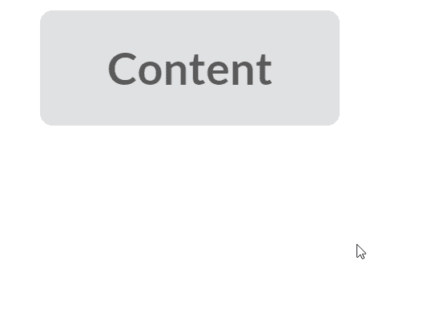

# 反应语义用户界面弹出模块

> 原文:[https://www . geeksforgeeks . org/reactjs-semantic-ui-popup-module/](https://www.geeksforgeeks.org/reactjs-semantic-ui-popup-module/)

语义用户界面是一个现代框架，用于为网站开发无缝设计，它给用户一个轻量级的组件体验。它使用预定义的 CSS、JQuery 语言来整合到不同的框架中。

在本文中，我们将了解如何在 ReactJS 语义用户界面中使用弹出模块。弹出模块用于显示将在页面顶部弹出的内容。

**属性:**

*   **表头:**我们可以用弹出有表头的内容。
*   **触发:**我们可以基于触发的事件调用一个函数。

**状态:**

*   **禁用:**使用该状态可以禁用弹出窗口。
*   **锁定:**弹出窗口不会自动重新定位。

**语法:**

```jsx
<popup trigger={<Button>Content</Button>} />
```

**创建反应应用程序并安装模块:**

*   **步骤 1:** 使用以下命令创建一个反应应用程序。

    ```jsx
    npx create-react-app foldername
    ```

*   **步骤 2:** 创建项目文件夹(即文件夹名)后，使用以下命令移动到该文件夹。

    ```jsx
    cd foldername
    ```

*   **第三步:**在给定的目录下安装语义 UI。

    ```jsx
     npm install semantic-ui-react semantic-ui-css
    ```

**项目结构**:如下图。


**运行应用程序的步骤:**使用以下命令从项目的根目录运行应用程序。

```jsx
npm start
```

**示例 1:** 这是展示如何使用 ReactJS 语义 UI 弹出模块来使用弹出模块的基本示例。

## App.js

```jsx
import React from "react";
import { Button, Popup } from "semantic-ui-react";

const styleLink = document.createElement("link");
styleLink.rel = "stylesheet";
styleLink.href =
"https://cdn.jsdelivr.net/npm/semantic-ui/dist/semantic.min.css";
document.head.appendChild(styleLink);

function btt() {
  return (
    <div
      style={{
        display: "block",
        width: 700,
        padding: 30,
      }}
    >
      <div>
        <br />
        <Popup content="GeeksforGeeks" 
               trigger={<Button icon="circle" />} />
      </div>
    </div>
  );
}
export default btt;
```

**输出:**


**示例 2:** 在本例中，我们通过使用 ReactJS 语义 UI 弹出模块，在弹出模块中添加了文本而不是图标。

## App.js

```jsx
import React from "react";
import { Button, Popup } from "semantic-ui-react";

const styleLink = document.createElement("link");
styleLink.rel = "stylesheet";
styleLink.href =
  "https://cdn.jsdelivr.net/npm/semantic-ui/dist/semantic.min.css";
document.head.appendChild(styleLink);

function btt() {
  return (
    <div
      style={{
        display: "block",
        width: 700,
        padding: 30,
      }}
    >
      <div>
        <br />
        <Popup content="GeeksforGeeks" 
               trigger={<Button>Content</Button>} />
      </div>
    </div>
  );
}

export default btt;
```

**输出:**



**参考:**T2】https://react.semantic-ui.com/modules/popup