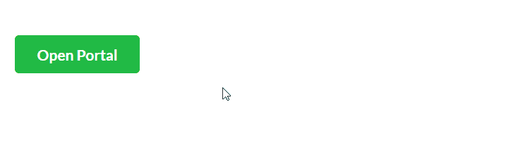

# 反应语义用户界面入口插件

> 原文:[https://www . geeksforgeeks . org/reactjs-semantic-ui-portal-addons/](https://www.geeksforgeeks.org/reactjs-semantic-ui-portal-addons/)

语义用户界面是一个现代框架，用于为网站开发无缝设计。它为用户提供了轻量级的组件体验。它使用预定义的 CSS 和 JQuery 语言将它们合并到不同的框架中。

在本文中，我们将了解如何在 ReactJS 语义用户界面中使用门户插件。门户插件用于在页面的任何地方呈现它们。

**属性:**

*   **受控:**受控属性用于制作受控门户。受控属性基本上是用来控制 React JS 中的组件的。
*   **变异** : 变异属性用于提高元素的品质，如颜色、 大小、等。 变异是冲突。它们 用于修改元素。
*   **内容:**内容为属性用于描述表头、菜单等。content 属性用于扩展元素。
*   **行为:** 行为是语义界面中用于设置验证的属性，向 获取 API 请求。

**语法:**

```jsx
<Portal>Children content</Portal>
```

**创建反应应用程序并安装模块:**

*   **步骤 1:** 使用以下命令创建一个反应应用程序。

    ```jsx
    npx create-react-app foldername
    ```

*   **步骤 2:** 创建项目文件夹(即文件夹名称)后，使用以下命令移动到该文件夹。

    ```jsx
    cd foldername
    ```

*   **第三步:**在给定的目录下安装语义 UI。

```jsx
 npm install semantic-ui-react semantic-ui-css
```

**项目结构**:如下图。


**运行应用程序的步骤:**使用以下命令从项目的根目录运行应用程序。

```jsx
npm start
```

**示例 1:** 这是展示如何使用门户插件的基本示例。

## App.js

```jsx
import React, { Component } from 'react'
import { Button, Grid, Header, Segment, Portal } from 'semantic-ui-react'

const styleLink = document.createElement("link");
styleLink.rel = "stylesheet";
styleLink.href = 
"https://cdn.jsdelivr.net/npm/semantic-ui/dist/semantic.min.css";
document.head.appendChild(styleLink);

export default class PortalExamplePortal extends Component {
  state = {

    open: false,
  }

  Open = () => {
    this.setState({ open: true })

  }

  Close = () => {
    this.setState({ open: false })

  }

  render() {
    const {  open } = this.state

    return (
      <div id='gfg'>
      <Grid columns={2}>
        <Grid.Column>
          <Portal
            closeOnTriggerClick
            openOnTriggerClick
            trigger={
              <Button
                content={open ? 'Close Portal' : 'Open Portal'}
                negative={open}
                positive={!open}
              />
            }
            onOpen={this.Open}
            onClose={this.Close}
          >
            <Segment
              style={{
                left: '25%',
                position: 'fixed',
                top: '2%',
                zIndex: 1000,
              }}
            >
              <Header><h1>GeeksforGeeks</h1></Header>
              <p>Computer Science Portal</p>              
            </Segment>
          </Portal>
        </Grid.Column>
      </Grid>
      </div>
    )
  }
}
```

## index.css

```jsx
#gfg {
  margin: 40px;
}
```

**输出:**



**参考:**T2】https://react.semantic-ui.com/addons/portal