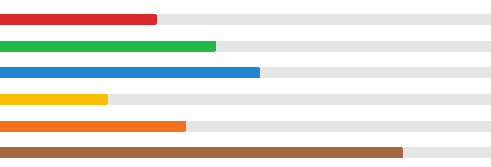
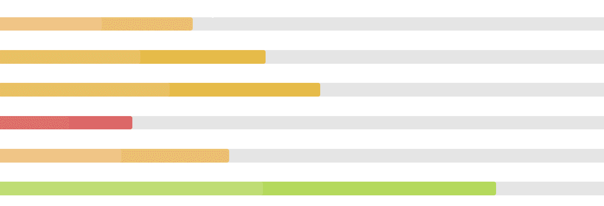

# 重新获取语义用户界面进度模块

> 原文:[https://www . geeksforgeeks . org/reactjs-semantic-ui-progress-module/](https://www.geeksforgeeks.org/reactjs-semantic-ui-progress-module/)

语义用户界面是一个现代框架，用于为网站开发无缝设计，它给用户一个轻量级的组件体验。它使用预定义的 CSS、JQuery 语言来整合到不同的框架中。

在本文中，我们将了解如何在 ReactJS 语义用户界面中使用进度模块。进度模块用于显示工作进度。

**属性:**

*   **表示:**给出当前进度。
*   **自动成功:**进度完成时，触发成功状态。

**状态:**

*   **激活:**进度条使用此状态激活。
*   **成功:**我们可以使用进度条来显示成功状态。
*   **警告:**我们可以使用进度条来显示警告状态。
*   **错误:**我们可以使用进度条来显示错误状态。
*   **禁用:**可以使用该状态创建禁用的进度条。

**语法:**

```
<progress percent={50} />
```

**创建反应应用程序并安装模块:**

*   **步骤 1:** 使用以下命令创建一个反应应用程序。

    ```
    npx create-react-app foldername
    ```

*   **步骤 2:** 创建项目文件夹(即文件夹名)后，使用以下命令移动到该文件夹。

    ```
    cd foldername
    ```

*   **第三步:**在给定的目录下安装语义 UI。

    ```
    npm install semantic-ui-react semantic-ui-css
    ```

**项目结构**:如下图。


**运行应用程序的步骤:**使用以下命令从项目的根目录运行应用程序。

```
npm start
```

**示例 1:** 这是展示如何使用 ReactJS 语义 UI 进度模块使用进度元素的基本示例。

## App.js

```
import React from 'react'
import { Progress } from 'semantic-ui-react'

const styleLink = document.createElement("link");
styleLink.rel = "stylesheet";
styleLink.href = 
"https://cdn.jsdelivr.net/npm/semantic-ui/dist/semantic.min.css";
document.head.appendChild(styleLink);

const btt = () => 
<div>
  <br/>
    <Progress percent={32} color='red' />
    <Progress percent={44} color='green' />
    <Progress percent={53} color='blue' />
    <Progress percent={22} color='yellow' />
    <Progress percent={38} color='orange' />
    <Progress percent={82} color='brown' />
</div>

export default btt
```

**输出:**



**示例 2:** 在本例中，我们使用 ReactJS 语义 UI 进度模块显示进度元素中的指示属性。

## App.js

```
import React from 'react'
import { Progress } from 'semantic-ui-react'

const styleLink = document.createElement("link");
styleLink.rel = "stylesheet";
styleLink.href = 
"https://cdn.jsdelivr.net/npm/semantic-ui/dist/semantic.min.css";
document.head.appendChild(styleLink);

const btt = () => 
<div>
  <br/>
    <Progress percent={32} color='red' indicating/>
    <Progress percent={44} color='green' indicating/>
    <Progress percent={53} color='blue' indicating/>
    <Progress percent={22} color='yellow' indicating/>
    <Progress percent={38} color='orange' indicating/>
    <Progress percent={82} color='brown' indicating/>
</div>

export default btt
```

**输出:**



**参考:**T2】https://react.semantic-ui.com/modules/progress