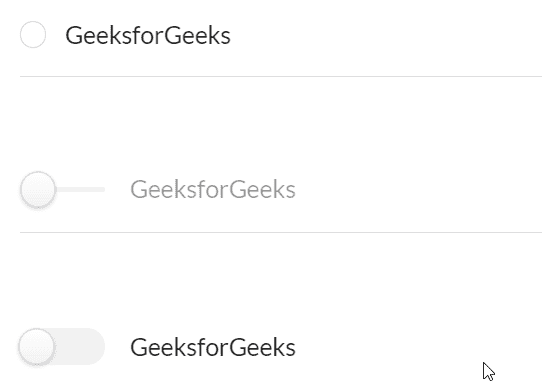
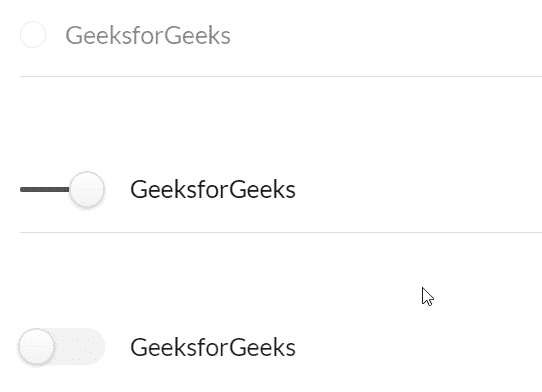

# 反应语义用户界面无线电插件

> 原文:[https://www . geeksforgeeks . org/reactjs-semantic-ui-radio-addons/](https://www.geeksforgeeks.org/reactjs-semantic-ui-radio-addons/)

语义用户界面是一个现代框架，用于为网站开发无缝设计，它给用户一个轻量级的组件体验。它使用预定义的 CSS、JQuery 语言来整合到不同的框架中。

在本文中，我们将了解如何在 ReactJS 语义用户界面中使用 Radion 插件。单选按钮用于制作单选按钮。

**属性:**

*   **切换:**通过这个属性，我们可以使用单选作为切换。
*   **滑块:**通过这个属性，我们可以使用 radio 作为滑块。
*   **单选按钮组:**我们可以使用这个属性将一个单选按钮组合在一起。

**状态:**

*   **只读:**在这种状态下，收音机将是只读的。
*   **已检查:**在此状态下，收音机将被预先检查。
*   **禁用:**在这种状态下，可以禁用收音机。
*   **远程控制:**在这种状态下，可以远程控制收音机。

变化:

*   **已安装:**收音机安装在衬垫内。

**语法:**

```jsx
<Radio />
```

**创建反应应用程序并安装模块:**

*   **步骤 1:** 使用以下命令创建一个反应应用程序。

    ```jsx
    npx create-react-app foldername
    ```

*   **步骤 2:** 创建项目文件夹(即文件夹名)后，使用以下命令移动到该文件夹。

    ```jsx
    cd foldername
    ```

*   **第三步:**在给定的目录下安装语义 UI。

    ```jsx
    npm install semantic-ui-react semantic-ui-css
    ```

**项目结构**:如下图。


**运行应用程序的步骤:**使用以下命令从项目的根目录运行应用程序。

```jsx
npm start
```

**示例 1:** 在这个示例中，我们展示了如何使用 ReactJS 语义 UI 无线电插件来使用基本的无线电插件。

## App.js

```jsx
import React from 'react'
import { Radio, Divider} from 'semantic-ui-react'

const styleLink = document.createElement("link");
styleLink.rel = "stylesheet";
styleLink.href = 
"https://cdn.jsdelivr.net/npm/semantic-ui/dist/semantic.min.css";
document.head.appendChild(styleLink);

const Btt = () => (
<div>

<div style={{
            display: 'block', width: 700, padding: 30, border: 5
    }}>
  <br />
  <Radio label='GeeksforGeeks' />
  <Divider />
  <br/>
  <br/>
  <Radio slider label='GeeksforGeeks' />
  <Divider />
  <br/>
  <br/>
  <Radio toggle label='GeeksforGeeks' />

</div>
</div>
)
export default Btt
```

**输出:**



**示例 2:** 在本例中，我们显示了无线电插件 ReactJS Semantic UI 无线电插件中的禁用、选中和只读状态。

## App.js

```jsx
import React from 'react'
import { Radio, Divider} from 'semantic-ui-react'

const styleLink = document.createElement("link");
styleLink.rel = "stylesheet";
styleLink.href = 
"https://cdn.jsdelivr.net/npm/semantic-ui/dist/semantic.min.css";

document.head.appendChild(styleLink);

const Btt = () => (
<div>

<div style={{
            display: 'block', width: 700, padding: 30, border: 5
    }}>
  <br />
  <Radio disabled label='GeeksforGeeks' />
  <Divider/>
  <br/>
  <br/>
  <Radio defaultChecked slider label='GeeksforGeeks' />
  <Divider />
  <br/>
  <br/>
  <Radio readOnly toggle label='GeeksforGeeks' />

</div>
</div>
)
export default Btt
```

**输出:**



**参考:**T2】https://react.semantic-ui.com/addons/radio