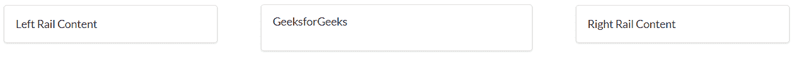
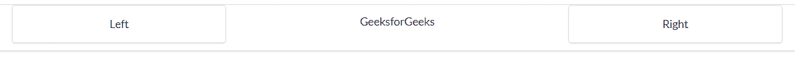

# 反应语义用户界面轨道元素

> 原文:[https://www . geeksforgeeks . org/reactjs-semantic-ui-rail-element/](https://www.geeksforgeeks.org/reactjs-semantic-ui-rail-element/)

语义用户界面是一个现代框架，用于为网站开发无缝设计，它给用户一个轻量级的组件体验。它使用预定义的 CSS、JQuery 语言来整合到不同的框架中。

在本文中，我们将了解如何在 ReactJS 语义用户界面中使用 rail 元素。

Rail 元素用于显示边界之外的伴随内容。

**属性:**

*   **内部:** 轨道可以自行附着在集装箱内部。
*   **分割:** 轨道可以在自身和集装箱之间产生分割。

**创建反应应用程序并安装模块:**

*   **步骤 1:** 使用以下命令创建一个 React 应用程序。

    ```jsx
    npx create-react-app foldername
    ```

*   **步骤 2:** 创建项目文件夹(即文件夹名)后，使用以下命令移动到该文件夹。

    ```jsx
    cd foldername
    ```

*   **步骤 3:** 创建 ReactJS 应用程序后，使用以下命令安装所需的****模块:

    ```jsx
    npm i semantic-ui-react
    ```**** 

******项目结构**:如下图。****

********

******运行应用程序的步骤:**使用以下命令从项目的根目录运行应用程序。****

```jsx
**npm start**
```

******例 1:******

## ****App.js****

```jsx
**import React from 'react'
import {Rail, Segment,Grid, List} from 'semantic-ui-react'

const styleLink = document.createElement("link");
styleLink.rel = "stylesheet";
styleLink.href = 
"https://cdn.jsdelivr.net/npm/semantic-ui/dist/semantic.min.css";
document.head.appendChild(styleLink);

const Btt = () =>( 
<div>
<Grid centered columns={3}>
    <Grid.Column>
        <br/>
      <Segment>
        <List>
            <List.Item>GeeksforGeeks</List.Item>
        </List>

        <Rail position='left'>
          <Segment>Left Rail Content</Segment>
        </Rail>

        <Rail position='right'>
          <Segment>Right Rail Content</Segment>
        </Rail>

      </Segment>
    </Grid.Column>
</Grid>
</div>
)

export default Btt    **
```

******输出:******

********

******例 2:******

## ****App.js****

```jsx
**import React from 'react'
import { Rail, Segment, List } from 'semantic-ui-react'

const styleLink = document.createElement("link");
styleLink.rel = "stylesheet";
styleLink.href = 
"https://cdn.jsdelivr.net/npm/semantic-ui/dist/semantic.min.css";
document.head.appendChild(styleLink);

const Btt = () => (
    <div>
        <br />
        <Segment textAlign='center'>

            <List>
                <List.Item>GeeksforGeeks</List.Item>
            </List>

            <Rail internal position='left'>
                <Segment>Left</Segment>
            </Rail>

            <Rail internal position='right'>
                <Segment>Right</Segment>
            </Rail>
        </Segment>
    </div>
)

export default Btt**
```

******输出:******

********

******参考:**T2】https://react.semantic-ui.com/elements/rail****