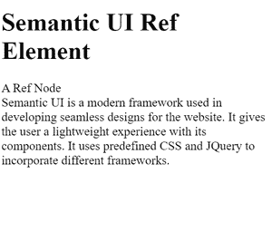

# 反应语义用户界面引用插件

> 原文:[https://www . geeksforgeeks . org/reactjs-semantic-ui-ref-addons/](https://www.geeksforgeeks.org/reactjs-semantic-ui-ref-addons/)

语义用户界面是一个现代框架，用于为网站开发无缝设计。它为用户提供了轻量级的组件体验。它使用预定义的 CSS 和 JQuery 来合并不同的框架。

在本文中，我们将学习如何在 ReactJS 语义 UI 中使用引用插件。Ref Addons 用于制造功能组件和类组件。我们可以在 useRef 方法中使用 innerRef 属性

**属性:**

*   **Forward Ref:** 它使用 Forward Ref 方法，该方法允许父组件将 Ref 传递给其子组件。
*   **内部引用:**引用插件中的内部引用属性用于类内组件和功能组件，并返回 DOM 节点。
*   **文本区域:**此属性用作默认文本区域。它用于覆盖表单组件。文本区域用于由用户输入输入字段。
*   **菜单:**菜单是语义用户界面中的一个属性，用于在用户导航元素时显示操作。菜单在内容道具中的主要用途。

**语法:**

```
<Ref>Children content</Ref>
```

**创建反应应用程序并安装模块:**

*   **步骤 1:** 使用以下命令创建一个反应应用程序。

    ```
    npx create-react-app foldername
    ```

*   **步骤 2:** 创建项目文件夹(即文件夹名)后，使用以下命令移动到该文件夹。

    ```
    cd foldername
    ```

*   **第三步:**在给定的目录下安装语义 UI。

    ```
     npm install semantic-ui-react semantic-ui-css
    ```

**项目结构**:如下图。


**示例:**这是展示如何使用 Ref 插件的基本示例。

## App.js

```
import React from "react";
import { Grid, Ref, Segment } from "semantic-ui-react";

function RefExampleRef() {
  const objectRef = React.useRef(null);

  return (
    <div id="gfg">
      <Grid>
        <Grid.Column width={6}>
          <Segment.Group>
            <Ref>
              <h1>Semantic UI Ref Element</h1>
            </Ref>
          </Segment.Group>
          <Segment.Group>
            <Ref>
              <Segment>A Ref Node </Segment>
            </Ref>

            <Ref innerRef={objectRef}>
              <Segment>
                Semantic UI is a modern framework 
                used in developing seamless
                designs for the website. It gives 
                the user a lightweight experience 
                with its components. It uses 
                predefined CSS and JQuery to 
                incorporate different frameworks.
              </Segment>
            </Ref>
          </Segment.Group>
        </Grid.Column>
      </Grid>
    </div>
  );
}

export default RefExampleRef;
```

## index.css

```
#gfg {
    margin: 40px;
}
```

**运行应用程序的步骤:**使用以下命令从项目的根目录运行应用程序。

```
npm start
```

**输出:**



**参考:**T2】https://react.semantic-ui.com/addons/ref