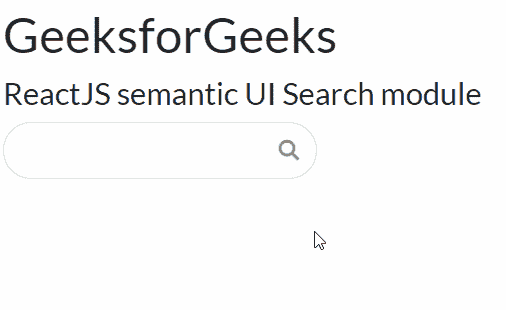

# ReactJS 语义 UI 搜索模块

> 原文:[https://www . geeksforgeeks . org/reactjs-semantic-ui-search-module/](https://www.geeksforgeeks.org/reactjs-semantic-ui-search-module/)

语义用户界面是一个现代框架，用于为网站开发无缝设计。它为用户提供了轻量级的组件体验。它使用预定义的 CSS 和 JQuery 将它们合并到不同的框架中。

在本文中，我们将学习如何在 ReactJS 语义用户界面中使用搜索模块。搜索模块帮助用户搜索并获取查询。

**属性:**

*   **标准(自定义渲染):**自定义渲染用于自定义渲染，并显示渲染结果集。
*   **类别:**类别属性用于显示远程内容的类别。
*   **类别(自定义渲染):**类别自定义渲染有助于使用自定义渲染搜索类别。

**语法:**

```jsx
<Search />
```

**创建反应应用程序并安装模块:**

*   **步骤 1:** 使用以下命令创建一个反应应用程序。

    ```jsx
    npx create-react-app foldername
    ```

*   **步骤 2:** 创建项目文件夹(即文件夹名)后，使用以下命令移动到该文件夹。

    ```jsx
    cd foldername
    ```

*   **第三步:**在给定的目录下安装语义 UI。

    ```jsx
     npm install semantic-ui-react semantic-ui-css
    ```

**项目结构**:如下图。


**运行应用程序的步骤:**使用以下命令从项目的根目录运行应用程序。

```jsx
npm start
```

**示例 1:** 这是展示如何使用搜索模块的基本示例。

## App.js

```jsx
import React from 'react'
import { Search } from 'semantic-ui-react'

const styleLink = document.createElement("link");
styleLink.rel = "stylesheet";
styleLink.href = 
"https://cdn.jsdelivr.net/npm/semantic-ui/dist/semantic.min.css";
document.head.appendChild(styleLink);

const btt = () => (
 <div id='gfg'>
   <h1>GeeksforGeeks</h1>
   <h4>ReactJS semantic UI Search module</h4>
    <Search/>
 </div>
)
export default btt
```

**输出:**现在打开浏览器，转到***http://localhost:3000/***，会看到如下输出:



**示例 2:** 在本例中，我们在下拉列表中显示了大小和加载属性。

## App.js

```jsx
import React from 'react'
import { Search } from 'semantic-ui-react'

const styleLink = document.createElement("link");
styleLink.rel = "stylesheet";
styleLink.href = 
"https://cdn.jsdelivr.net/npm/semantic-ui/dist/semantic.min.css";
document.head.appendChild(styleLink);

const btt = () => (
 <div id='gfg'>
   <h1>GeeksforGeeks</h1>
   <h4>ReactJS semantic UI Search module</h4>
    <Search loading size='massive'/>
 </div>
)
export default btt</div>
```

**输出:**现在打开浏览器，转到***http://localhost:3000/***，会看到如下输出:


**参考:**T2】https://react.semantic-ui.com/modules/search