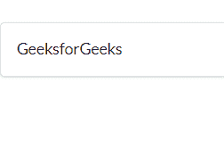
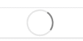

# 反应语义用户界面片段元素

> 原文:[https://www . geeksforgeeks . org/reactjs-semantic-ui-segment-element/](https://www.geeksforgeeks.org/reactjs-semantic-ui-segment-element/)

语义用户界面是一个现代框架，用于为网站开发无缝设计，它给用户一个轻量级的组件体验。它使用预定义的 CSS、JQuery 语言来整合到不同的框架中。

在本文中，我们将了解如何在 ReactJS Semantic UI 中使用段元素。segment 元素用于创建相关内容的分组。

**属性:**

*   **占位符段:**段可用于为有条件显示的内容预留空间。
*   **凸起:**一个片段可以被格式化为凸起在页面之上
*   **堆叠:** 一个片段可以被格式化以显示它包含多个页面。
*   **堆积:** 一个片段可以被格式化为看起来像一堆页面。
*   **垂直段:** 垂直段将内容格式化为垂直组的一部分。

**状态:**

*   **禁用:**禁用段。
*   **装车:**段正在装车。

**语法:**

```jsx
<segment content='content' />
```

**创建反应应用程序并安装模块:**

*   **步骤 1:** 使用以下命令创建一个 React 应用程序。

    ```jsx
    npx create-react-app foldername
    ```

*   **步骤 2:** 创建项目文件夹(即文件夹名)后，使用以下命令移动到该文件夹。

    ```jsx
    cd foldername
    ```

*   **第三步:**在给定的目录下安装语义 UI。

    ```jsx
     npm install semantic-ui-react semantic-ui-css
    ```

**项目结构**:如下图。


**运行应用程序的步骤:**使用以下命令从项目的根目录运行应用程序。

```jsx
npm start
```

**示例 1:** 在本例中，我们将使用一个简单的片段组件，通过使用 Semantic UI Segment 元素来创建一段内容。

## App.js

```jsx
import React from 'react'
import { Segment } from 'semantic-ui-react'

const styleLink = document.createElement("link");
styleLink.rel = "stylesheet";
styleLink.href = 
"https://cdn.jsdelivr.net/npm/semantic-ui/dist/semantic.min.css";
document.head.appendChild(styleLink);

const Btt = () => (
<div>
    <br />
    <Segment>GeeksforGeeks</Segment>
</div>
)

export default Btt
```

**输出:**



**示例 2:** 在本例中，我们将使用一个带有加载状态的 segment 组件来显示 segment 的内容正在使用语义 UI Segment 元素进行加载。

## App.js

```jsx
import React from 'react'
import { Segment } from 'semantic-ui-react'

const styleLink = document.createElement("link");
styleLink.rel = "stylesheet";
styleLink.href = 
"https://cdn.jsdelivr.net/npm/semantic-ui/dist/semantic.min.css";
document.head.appendChild(styleLink);

const Btt = () => (
<div>
    <br />
    <Segment loading>loading</Segment>
</div>
)

export default Btt
```

**输出:**



**参考:**T2】https://react.semantic-ui.com/elements/segment