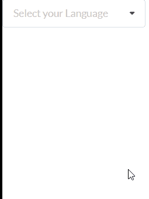

# 反应语义用户界面选择插件

> 原文:[https://www . geeksforgeeks . org/reactjs-semantic-ui-select-addons/](https://www.geeksforgeeks.org/reactjs-semantic-ui-select-addons/)

语义用户界面是一个现代框架，用于为网站开发无缝设计，它给用户一个轻量级的组件体验。它使用预定义的 CSS、JQuery 语言来整合到不同的框架中。

在本文中，我们将看到如何在 ReactJS 语义用户界面中使用选择插件。选择插件用于制作一个选择元素，可以用来从插件中选择元素。

**语法:**

```
<Select />
```

**创建反应应用程序并安装模块:**

*   **步骤 1:** 使用以下命令创建一个反应应用程序。

    ```
    npx create-react-app foldername
    ```

*   **步骤 2:** 创建项目文件夹(即文件夹名)后，使用以下命令移动到该文件夹。

    ```
    cd foldername
    ```

*   **第三步:**在给定的目录下安装语义 UI。

    ```
    npm install semantic-ui-react semantic-ui-css
    ```

**项目结构**:如下图。


**运行应用程序的步骤:**使用以下命令从项目的根目录运行应用程序。

```
npm start
```

**示例:**这是展示如何使用 ReactJS 语义 UI 选择插件来使用选择插件的基本示例。

## App.js

```
import React from 'react'
import { Select } from 'semantic-ui-react'

const styleLink = document.createElement("link");
styleLink.rel = "stylesheet";
styleLink.href = 
"https://cdn.jsdelivr.net/npm/semantic-ui/dist/semantic.min.css";
document.head.appendChild(styleLink);

const gfg = [
    { key: 'h5', value: 'h5', text: 'HTML5' },
    { key: 'js', value: 'js', text: 'JavaScript' },
    { key: 'aj', value: 'aj', text: 'AngularJS' },
    { key: 'rj', value: 'rj', text: 'ReactJS' },
    { key: 'nj', value: 'nj', text: 'NodeJS' },
    { key: 'ja', value: 'ja', text: 'Java' },
  ]
  const btt = () => (
    <Select placeholder='Select your Language' options={gfg} />
  )

  export default btt
```

**输出:**



**参考:**T2】https://react.semantic-ui.com/addons/select