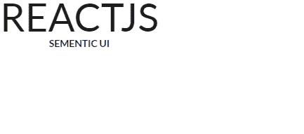
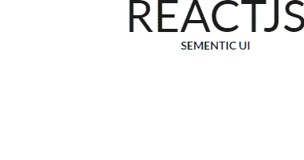

# 反应语义用户界面统计视图

> 原文:[https://www . geeksforgeeks . org/reactjs-semantic-ui-statistics-view/](https://www.geeksforgeeks.org/reactjs-semantic-ui-statistics-views/)

语义用户界面是一个现代框架，用于为网站开发无缝设计，它给用户一个轻量级的组件体验。它使用预定义的 CSS、JQuery 语言来整合到不同的框架中。

在本文中，我们将了解如何在 ReactJS 语义用户界面中使用统计视图。统计视图用于显示页面或元素的统计信息。

**属性:**

*   **统计组:**我们可以利用这个属性进行一组统计。

**语法:**

```
<Statistic />
```

**创建反应应用程序并安装模块:**

*   **步骤 1:** 使用以下命令创建一个反应应用程序。

    ```
    npx create-react-app foldername
    ```

*   **步骤 2:** 创建项目文件夹(即文件夹名)后，使用以下命令移动到该文件夹。

    ```
    cd foldername
    ```

*   **第三步:**在给定的目录下安装语义 UI。

    ```
     npm install semantic-ui-react semantic-ui-css
    ```

**项目结构**:如下图。


**运行应用程序的步骤:**使用以下命令从项目的根目录运行应用程序。

```
npm start
```

**示例 1:** 这是展示如何使用 ReactJS 语义 UI 统计视图来使用统计视图的基本示例。

## App.js

```
import React from 'react'
import { Statistic } from 'semantic-ui-react'

const styleLink = document.createElement("link");
styleLink.rel = "stylesheet";
styleLink.href = 
"https://cdn.jsdelivr.net/npm/semantic-ui/dist/semantic.min.css";
document.head.appendChild(styleLink);

const btt = () => (
  <Statistic>
    <Statistic.Value>ReactJS</Statistic.Value>
    <Statistic.Label>Sementic UI</Statistic.Label>
  </Statistic>
)

export default btt
```

**输出:**



**示例 2:** 在本例中，我们使用了 ReactJS 语义 UI 统计视图，在统计数据中使用了浮动变量。

## App.js

```
import React from 'react'
import { Statistic } from 'semantic-ui-react'

const styleLink = document.createElement("link");
styleLink.rel = "stylesheet";
styleLink.href = 
"https://cdn.jsdelivr.net/npm/semantic-ui/dist/semantic.min.css";
document.head.appendChild(styleLink);

const btt = () => (
  <Statistic floated='right'>
    <Statistic.Value>ReactJS</Statistic.Value>
    <Statistic.Label>Sementic UI</Statistic.Label>
  </Statistic>
)

export default btt
```

**输出:**



**参考:**T2】https://react.semantic-ui.com/views/statistic