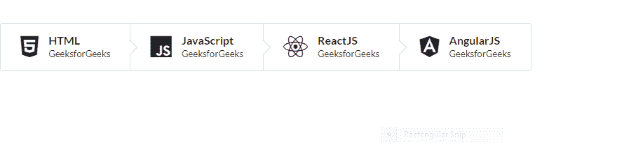
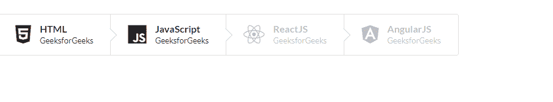

# 反应语义用户界面步骤元素

> 原文:[https://www . geeksforgeeks . org/reactjs-semantic-ui-step-element/](https://www.geeksforgeeks.org/reactjs-semantic-ui-step-element/)

语义用户界面是一个现代框架，用于为网站开发无缝设计，它给用户一个轻量级的组件体验。它使用预定义的 CSS、JQuery 语言来整合到不同的框架中。

在本文中，我们将了解如何在 ReactJS 语义用户界面中使用 step 元素。Step 元素用于跟踪一系列流程的完成情况。

**状态:**

*   **禁用:**此状态表示无法选择 a 步骤。
*   **激活:**步可以高亮显示为当前激活的。
*   **完成:**该状态用于表示已经被用户完成的步骤。

**语法:**

```
<step>
  <step.content/>
</step>
```

**创建反应应用程序并安装模块:**

*   **步骤 1:** 使用以下命令创建一个反应应用程序。

    ```
    npx create-react-app foldername
    ```

*   **步骤 2:** 创建项目文件夹(即文件夹名)后，使用以下命令移动到该文件夹。

    ```
    cd foldername
    ```

*   **第三步:**在给定的目录下安装语义 UI。

    ```
     npm install semantic-ui-react semantic-ui-css
    ```

**项目结构**:如下图。


**运行应用程序的步骤:**使用以下命令从项目的根目录运行应用程序。

```
npm start
```

**示例 1:** 在本例中，我们将使用图标和步骤元素，通过使用 ReactJS 语义 UI 步骤元素来显示活动的完成状态。

## App.js

```
import React from 'react'
import { Icon, Step } from 'semantic-ui-react'

const styleLink = document.createElement("link");
styleLink.rel = "stylesheet";
styleLink.href = 
"https://cdn.jsdelivr.net/npm/semantic-ui/dist/semantic.min.css";
document.head.appendChild(styleLink);

const Btt = () => (
<div>
    <br/>
    <Step.Group>
    <Step>
      <Icon name='html5'/>
      <Step.Content>
        <Step.Title>HTML</Step.Title>
        <Step.Description>GeeksforGeeks</Step.Description>
      </Step.Content>
    </Step>

    <Step>
      <Icon name='js'/>
      <Step.Content>
        <Step.Title>JavaScript</Step.Title>
        <Step.Description>GeeksforGeeks</Step.Description>
      </Step.Content>
    </Step>

    <Step>
      <Icon name='react'/>
      <Step.Content>
        <Step.Title>ReactJS</Step.Title>
        <Step.Description>GeeksforGeeks</Step.Description>
      </Step.Content>
    </Step>

    <Step>
      <Icon name='angular'/>
      <Step.Content>
        <Step.Title>AngularJS</Step.Title>
        <Step.Description>GeeksforGeeks</Step.Description>
      </Step.Content>
    </Step>
    </Step.Group>

</div>
)

export default Btt
```

**输出:**



**示例 2:** 在本例中，我们将使用图标和禁用状态的 step 元素，以便 step 可以显示它不能通过使用 ReactJS 语义 UI Step 元素来选择。

## App.js

```
import React from 'react'
import { Icon, Step } from 'semantic-ui-react'

const styleLink = document.createElement("link");
styleLink.rel = "stylesheet";
styleLink.href = 
"https://cdn.jsdelivr.net/npm/semantic-ui/dist/semantic.min.css";
document.head.appendChild(styleLink);

const Btt = () => (
<div>
    <br/>
    <Step.Group>
    <Step>
      <Icon name='html5'/>
      <Step.Content>
        <Step.Title>HTML</Step.Title>
        <Step.Description>GeeksforGeeks</Step.Description>
      </Step.Content>
    </Step>

    <Step>
      <Icon name='js'/>
      <Step.Content>
        <Step.Title>JavaScript</Step.Title>
        <Step.Description>GeeksforGeeks</Step.Description>
      </Step.Content>
    </Step>

    <Step disabled>
      <Icon name='react'/>
      <Step.Content>
        <Step.Title>ReactJS</Step.Title>
        <Step.Description>GeeksforGeeks</Step.Description>
      </Step.Content>
    </Step>

    <Step disabled>
      <Icon name='angular'/>
      <Step.Content>
        <Step.Title>AngularJS</Step.Title>
        <Step.Description>GeeksforGeeks</Step.Description>
      </Step.Content>
    </Step>
    </Step.Group>

</div>
)

export default Btt
```

**输出:**



**参考:**T2】https://react.semantic-ui.com/elements/step