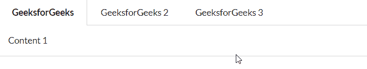
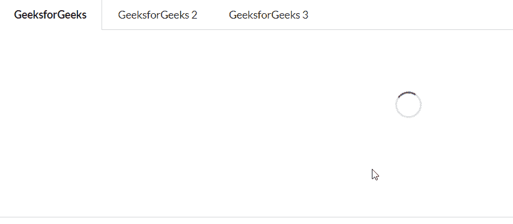

# 重新获取语义用户界面标签模块

> 原文:[https://www . geeksforgeeks . org/reactjs-semantic-ui-tab-module/](https://www.geeksforgeeks.org/reactjs-semantic-ui-tab-module/)

语义用户界面是一个现代框架，用于为网站开发无缝设计，它给用户一个轻量级的组件体验。它使用预定义的 CSS、JQuery 语言来整合到不同的框架中。

在本文中，我们将了解如何在 ReactJS Semantic UI 中使用 Tab Module，Tab Module 与一个菜单一起使用，该菜单的内容可以在特定的选项卡单击中显示。

**属性:**

*   **指向菜单:** 菜单可以指向其标签窗格。
*   **二级菜单:** 根据内容调整的二级菜单。
*   **文本菜单:**我们可以为文本内容设置格式标签菜单。

**状态:**

*   **加载:**此状态用于加载一个标签

**语法:**

```jsx
const tab= [
  {
    menuItem: 'Title', render: () => <Tab.Pane>Content</Tab.Pane>,
  };
]

const tab1 = () => <Tab panes={tab} />

export default tab1
```

**创建反应应用程序并安装模块:**

*   **步骤 1:** 使用以下命令创建一个反应应用程序。

    ```jsx
    npx create-react-app foldername
    ```

*   **步骤 2:** 创建项目文件夹(即文件夹名)后，使用以下命令移动到该文件夹。

    ```jsx
    cd foldername
    ```

*   **第三步:**在给定的目录下安装语义 UI。

    ```jsx
     npm install semantic-ui-react semantic-ui-css
    ```

**项目结构**:如下图。


**运行应用程序的步骤:**使用以下命令从项目的根目录运行应用程序。

```jsx
npm start
```

**示例 1:** 这是展示如何使用 ReactJS 语义 UI 标签模块使用标签模块的基本示例。

## App.js

```jsx
import React from "react";
import { Tab } from "semantic-ui-react";

const styleLink = document.createElement("link");
styleLink.rel = "stylesheet";
styleLink.href =
  "https://cdn.jsdelivr.net/npm/semantic-ui/dist/semantic.min.css";
document.head.appendChild(styleLink);

<br />;

const gfg = [
  { menuItem: "GeeksforGeeks", render: () => <Tab.Pane>Content 1</Tab.Pane> },
  { menuItem: "GeeksforGeeks 2", render: () => <Tab.Pane>Content 2</Tab.Pane> },
  { menuItem: "GeeksforGeeks 3", render: () => <Tab.Pane>Content 3</Tab.Pane> },
];

const btt = () => <Tab panes={gfg} />;

export default btt;
```

**输出:**



**示例 2:** 在本例中，我们使用 ReactJS 语义 UI 标签模块展示了标签模块中的加载状态。

## App.js

```jsx
import React from "react";
import { Tab } from "semantic-ui-react";

const styleLink = document.createElement("link");
styleLink.rel = "stylesheet";
styleLink.href =
  "https://cdn.jsdelivr.net/npm/semantic-ui/dist/semantic.min.css";
document.head.appendChild(styleLink);

<br />;

const gfg = [
  {
    menuItem: "GeeksforGeeks",
    render: () => <Tab.Pane loading>Content 1</Tab.Pane>,
  },
  {
    menuItem: "GeeksforGeeks 2",
    render: () => <Tab.Pane loading>Content 2</Tab.Pane>,
  },
  {
    menuItem: "GeeksforGeeks 3",
    render: () => <Tab.Pane loading>Content 3</Tab.Pane>,
  },
];

const btt = () => <Tab panes={gfg} />;

export default btt;
```

**输出:**



**参考:**T2】https://react.semantic-ui.com/modules/tab