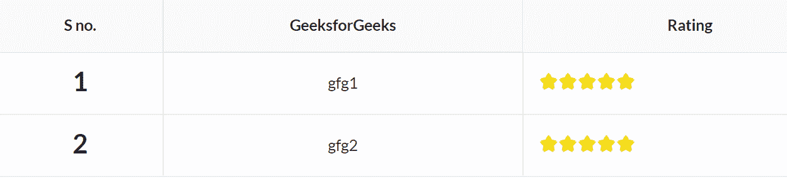
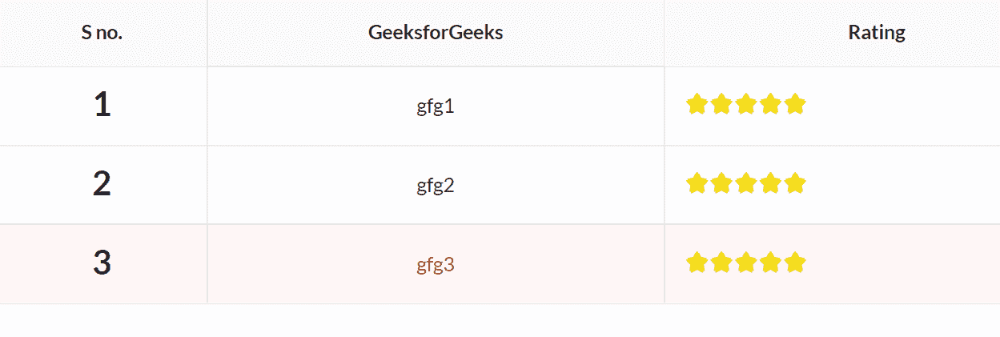

# 反应语义用户界面表集合

> 原文:[https://www . geeksforgeeks . org/reactjs-semantic-ui-table-collections/](https://www.geeksforgeeks.org/reactjs-semantic-ui-table-collections/)

语义用户界面是一个现代框架，用于为网站开发无缝设计，它给用户一个轻量级的组件体验。它使用预定义的 CSS、JQuery 语言来整合到不同的框架中。

在本文中，我们将了解如何在 ReactJS Semantic UI 中使用表集合。

表格是用来制作包含一些信息的表格。

**类型:**

*   **定义:**表格可以被格式化以强调定义行内容的第一列。
*   **结构化:**表格可以格式化，以结构化格式显示复杂数据。

**状态:**

*   **正/负:**使用该状态会让用户知道单元格或行值的好坏。
*   **错误:** C 使用该状态的用户可以很容易地检测到或看到可能有错误的单元格或行值。
*   **警告:**该状态将让用户知道是否有任何单元格或行显示任何警告。
*   **激活:**该状态将使用户当前选择的行激活。
*   **禁用:**该状态用于禁用表中的任何单元格或行。

**语法:**

```
<Table>
  <Table.Header>
    <Table.Row>
      content
    </Table.Row>
  </Table.Header>

  <Table.Body>
    <Table.Row>
      content
    </Table.Row>
  </Table.Body>  
</Table>
```

**创建反应应用程序并安装模块:**

*   **步骤 1:** 使用以下命令创建一个反应应用程序。

    ```
    npx create-react-app foldername
    ```

*   **步骤 2:** 创建项目文件夹(即文件夹名)后，使用以下命令移动到该文件夹。

    ```
    cd foldername
    ```

*   **第三步:**在给定的目录下安装语义 UI。

    ```
     npm install semantic-ui-react semantic-ui-css
    ```

**项目结构**:如下图。


**运行应用程序的步骤:**使用以下命令从项目的根目录运行应用程序。

```
npm start
```

**示例 1:** 在本例中，我们将使用 ReactJS 语义 UI Table 集合，使用表格、标题和评级元素来显示基本表格。

## App.js

```
import React from 'react'
import { Header, Table, Rating } from 'semantic-ui-react'

const styleLink = document.createElement("link");
styleLink.rel = "stylesheet";
styleLink.href = 
"https://cdn.jsdelivr.net/npm/semantic-ui/dist/semantic.min.css";
document.head.appendChild(styleLink);

const btt = () => (
    <Table celled padded>
        <Table.Header>
            <Table.Row>
                <Table.HeaderCell textAlign='center'>
                 S no.
                </Table.HeaderCell>
                <Table.HeaderCell textAlign='center'>
                 GeeksforGeeks
                </Table.HeaderCell>
                <Table.HeaderCell textAlign='center'>
                 Rating
                </Table.HeaderCell>
            </Table.Row>
        </Table.Header>

        <Table.Body>
            <Table.Row>
            <Table.Cell>
            <Header as='h2' textAlign='center'>
            1
            </Header>
                </Table.Cell>
                <Table.Cell singleLine textAlign='center'>
                  gfg1
                </Table.Cell>
                <Table.Cell>
                <Rating icon='star' defaultRating={5} maxRating={5}/>
                </Table.Cell>
            </Table.Row>
            <Table.Row>
            <Table.Cell>
            <Header as='h2' textAlign='center'>
            2
            </Header>
                </Table.Cell>
                <Table.Cell singleLine textAlign='center'>gfg2
                </Table.Cell>
                <Table.Cell>
                <Rating icon='star' defaultRating={5} maxRating={5} />
                </Table.Cell>
            </Table.Row>
        </Table.Body>
    </Table>
)

export default btt
```

**输出:**



**示例 2:** 在本例中，我们将使用 ReactJS 语义 UI Table 集合，使用表格、标题和评级元素来显示带有错误状态的表格。

## App.js

```
import React from 'react'
import { Header, Table, Rating } from 'semantic-ui-react'

const styleLink = document.createElement("link");
styleLink.rel = "stylesheet";
styleLink.href = 
"https://cdn.jsdelivr.net/npm/semantic-ui/dist/semantic.min.css";
document.head.appendChild(styleLink);

const btt = () => (
    <Table celled padded>
        <Table.Header>
            <Table.Row>
                <Table.HeaderCell textAlign='center'>S no.
                </Table.HeaderCell>
                <Table.HeaderCell textAlign='center'>
                  GeeksforGeeks
                </Table.HeaderCell>
                <Table.HeaderCell textAlign='center'>Rating
                </Table.HeaderCell>
            </Table.Row>
        </Table.Header>

        <Table.Body>
            <Table.Row>
            <Table.Cell>
            <Header as='h2' textAlign='center'>
            1
            </Header>
                </Table.Cell>
                <Table.Cell singleLine textAlign='center'>gfg1
                </Table.Cell>
                <Table.Cell>
                <Rating icon='star' defaultRating={5} maxRating={5}/>
                </Table.Cell>
            </Table.Row>
            <Table.Row>
            <Table.Cell>
            <Header as='h2' textAlign='center'>
            2
            </Header>
                </Table.Cell>
                <Table.Cell singleLine textAlign='center'>gfg2
                </Table.Cell>
                <Table.Cell>
                <Rating icon='star' defaultRating={5} maxRating={5} />
                </Table.Cell>
            </Table.Row>
        </Table.Body>
        <Table.Body>
            <Table.Row error>
            <Table.Cell>
            <Header as='h2' textAlign='center'>
            3
            </Header>
                </Table.Cell>
                <Table.Cell singleLine textAlign='center'>gfg3
                </Table.Cell>
                <Table.Cell>
                <Rating icon='star' defaultRating={5} maxRating={5}/>
                </Table.Cell>
            </Table.Row>
        </Table.Body>
    </Table>

)

export default btt
```

**输出:**



**参考:**T2】https://react.semantic-ui.com/collections/table