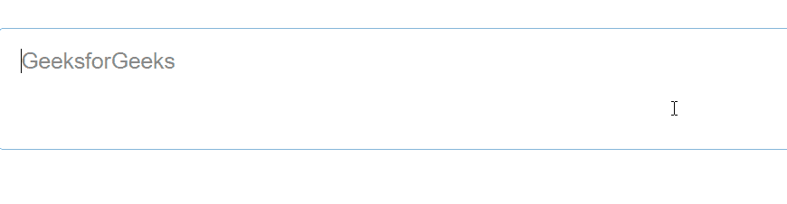
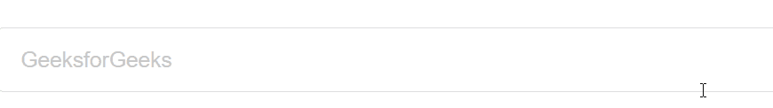

# 反应语义用户界面文本区插件

> 原文:[https://www . geeksforgeeks . org/reactjs-semantic-ui-textarea-addons/](https://www.geeksforgeeks.org/reactjs-semantic-ui-textarea-addons/)

语义用户界面是一个现代框架，用于为网站开发无缝设计，它给用户一个轻量级的组件体验。它使用预定义的 CSS、JQuery 语言来整合到不同的框架中。

在本文中，我们将了解如何在 ReactJS 语义用户界面中使用文本区插件。Textarea Addons 用于制作一个字段，用户可以在其中输入一些文本。

用法

*   **最小高度:**文本区域的最小高度。
*   **行数:**我们可以用最少的行数做一个文本区。

**语法:**

```jsx
<Textarea />
```

**创建反应应用程序并安装模块:**

*   **步骤 1:** 使用以下命令创建一个反应应用程序。

    ```jsx
    npx create-react-app foldername
    ```

*   **步骤 2:** 创建项目文件夹(即文件夹名)后，使用以下命令移动到该文件夹。

    ```jsx
    cd foldername
    ```

*   **第三步:**在给定的目录下安装语义 UI。

    ```jsx
     npm install semantic-ui-react semantic-ui-css
    ```

**项目结构**:如下图。


**运行应用程序的步骤:**使用以下命令从项目的根目录运行应用程序。

```jsx
npm start
```

**示例 1:** 这是展示如何使用 ReactJS 语义 UI Textarea 插件来使用 Textarea 插件的基本示例。

## App.js

```jsx
import React from 'react'
import { TextArea, Form } from 'semantic-ui-react'

const styleLink = document.createElement("link");
styleLink.rel = "stylesheet";
styleLink.href = 
"https://cdn.jsdelivr.net/npm/semantic-ui/dist/semantic.min.css";
document.head.appendChild(styleLink);

const btt = () => (
<div>
  <br/>
  <Form>
    <TextArea placeholder='GeeksforGeeks' />
  </Form>
</div>
)

  export default btt
```

**输出:**



**示例 2:** 在本例中，我们已经使用 ReactJS 语义 UI textarea 插件更改了 Textarea 中的行的大小。

## App.js

```jsx
import React from 'react'
import { TextArea, Form } from 'semantic-ui-react'

const styleLink = document.createElement("link");
styleLink.rel = "stylesheet";
styleLink.href = "https://cdn.jsdelivr.net/npm/semantic-ui/dist/semantic.min.css";
document.head.appendChild(styleLink);

const btt = () => (
<div>
  <br/>
  <Form>
    <TextArea rows={1} placeholder='GeeksforGeeks' />
  </Form>
</div>
)

  export default btt
```

**输出:**



**参考:**T2】https://react.semantic-ui.com/addons/text-area