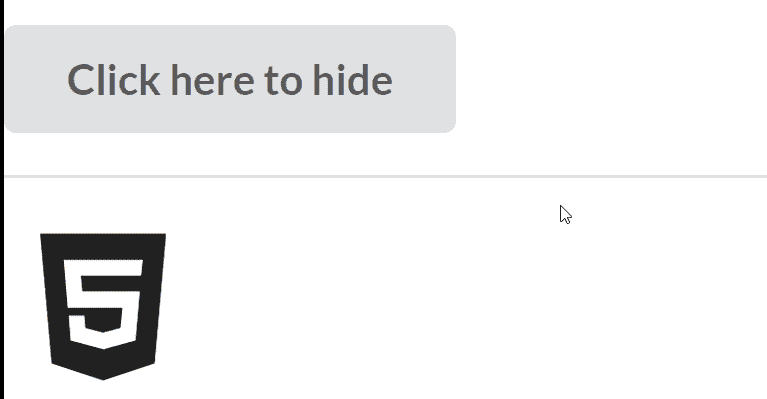
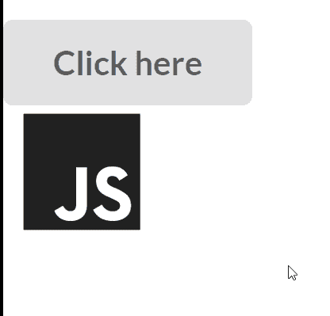

# 反应语义用户界面转换模块

> 原文:[https://www . geeksforgeeks . org/reactjs-semantic-ui-transition-module/](https://www.geeksforgeeks.org/reactjs-semantic-ui-transition-module/)

语义用户界面是一个现代框架，用于为网站开发无缝设计，它给用户一个轻量级的组件体验。它使用预定义的 CSS、JQuery 语言来整合到不同的框架中。

在本文中，我们将了解如何在 ReactJS 语义用户界面中使用转换模块。Transition Module 用于给我们的组件添加一些动画和过渡，我们也可以使用它们来移入或移出视图。

**属性:**

*   **过渡组:**我们可以用这个把过渡应用到一个组的孩子身上。

**探险者:**

*   **方向动画:**我们可以让元素往不同的方向动画。
*   **静态动画:**静态动画是单向的，可以通过切换可见属性来动画化元素。

**语法:**

```
<Transition />
```

**创建反应应用程序并安装模块:**

*   **步骤 1:** 使用以下命令创建一个反应应用程序。

    ```
    npx create-react-app foldername
    ```

*   **步骤 2:** 创建项目文件夹(即文件夹名)后，使用以下命令移动到该文件夹。

    ```
    cd foldername
    ```

*   **第三步:**在给定的目录下安装语义 UI。

    ```
     npm install semantic-ui-react semantic-ui-css
    ```

**项目结构**:如下图。


**运行应用程序的步骤:**使用以下命令从项目的根目录运行应用程序。

```
npm start
```

**示例 1:** 这是一个基本示例，展示了如何使用 ReactJS 语义 UI 转换模块来使用转换插件。

## App.js

```
import React, {Component}from 'react'
import { Button, Divider, Icon, Transition } from 'semantic-ui-react'

const styleLink = document.createElement("link");
styleLink.rel = "stylesheet";
styleLink.href = 
"https://cdn.jsdelivr.net/npm/semantic-ui/dist/semantic.min.css";
document.head.appendChild(styleLink);

<br/>

export default class gfg extends Component {
  state = { visible: true }

  gfg1 = () =>
    this.setState((prevState) => ({ visible: !prevState.visible }))

  render() {
    const { visible } = this.state

    return (
      <div>
        <Button
          content={visible ? 'Click here to hide' : 'Click here to show'}
          onClick={this.gfg1}
        />
        <Divider />
        <Transition visible={visible} animation='scale' duration={700}>
          <Icon size='huge' name='html5' />
        </Transition>
      </div>
    )
  }
}
```

**输出:**



**示例 2:** 在本例中，我们使用 ReactJS 语义 UI 过渡模块将动画更改为在过渡插件中抖动。

## App.js

```
import React, {Component}from 'react'
import { Button, Icon, Transition } from 'semantic-ui-react'

const styleLink = document.createElement("link");
styleLink.rel = "stylesheet";
styleLink.href = 
"https://cdn.jsdelivr.net/npm/semantic-ui/dist/semantic.min.css";
document.head.appendChild(styleLink);

<br/>

export default class gfg extends Component {
  state = { visible: true }

  gfg1 = () =>
    this.setState((btt) => ({ visible: !btt.visible }))

  render() {
    const { visible } = this.state

    return (
      <div>
        <Button
          content={visible ? 'Click here' : 'Click here'}
          onClick={this.gfg1}
        />
        <br/>
        <Transition visible={visible} animation='jiggle' duration={250}>
          <Icon size='huge' name='js' />
        </Transition>
      </div>
    )
  }
}
```

**输出:**



**参考:**T2】https://react.semantic-ui.com/modules/transition