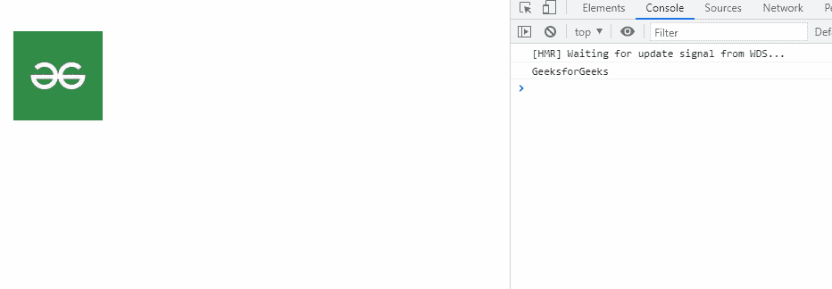
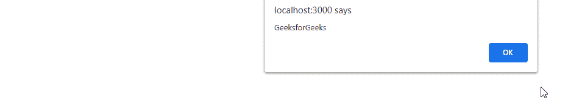

# 反应语义用户界面可见性行为

> 原文:[https://www . geeksforgeeks . org/reactjs-semantic-ui-visibility-behaviors/](https://www.geeksforgeeks.org/reactjs-semantic-ui-visibility-behaviors/)

语义用户界面是一个现代框架，用于为网站开发无缝设计，它给用户一个轻量级的组件体验。它使用预定义的 CSS、JQuery 语言来整合到不同的框架中。

在本文中，我们将学习如何在 ReactJS Semantic UI 中使用可见性行为。可见性行为与模板一起用于回调函数。

**语法:**

```jsx
<Visibility function/>
```

**创建反应应用程序并安装模块:**

*   **步骤 1:** 使用以下命令创建一个反应应用程序。

    ```jsx
    npx create-react-app foldername
    ```

*   **步骤 2:** 创建项目文件夹(即文件夹名)后，使用以下命令移动到该文件夹。

    ```jsx
    cd foldername
    ```

*   **第三步:**在给定的目录下安装语义 UI。

    ```jsx
     npm install semantic-ui-react semantic-ui-css
    ```

**项目结构:**如下图。


**项目结构:**

**运行应用程序的步骤:**使用以下命令从项目的根目录运行应用程序。

```jsx
npm start
```

**示例 1:** 这是展示如何使用可见性模块的基本示例。

## App.js

```jsx
import React, { Component } from 'react'
import {Grid, Image, Visibility} from 'semantic-ui-react'

export default class VisibilityExampleFireOnMount extends Component {

  OnScreen = () => alert('on')

  render() {
    return (
      <Grid columns={2}>
        <Grid.Column>
          <Visibility
            fireOnMount
            onOnScreen={this.OnScreen}
          >

          </Visibility>
        </Grid.Column>

         <Image id='gfg' src=
'https://media.geeksforgeeks.org/wp-content/uploads/20210604014825/QNHrwL2q-100x100.jpg' >
         </Image>          

       </Grid>
    )
  }
}
```

**输出:**



**示例 2:** 在本例中，我们显示了警报中的可见性行为。

## App.js

```jsx
import React, { Component } from 'react'
import {Grid, Image, Visibility} from 'semantic-ui-react'

export default class VisibilityExampleFireOnMount extends Component {

  OnScreen = () => alert('GeeksforGeeks')

  render() {
    return (
      <Grid columns={2}>
        <Grid.Column>
          <Visibility
            fireOnMount
            onOnScreen={this.OnScreen}
          >

          </Visibility>
        </Grid.Column>

         <Image id='gfg' src=
'https://media.geeksforgeeks.org/wp-content/uploads/20210604014825/QNHrwL2q-100x100.jpg' >
         </Image>          

       </Grid>
    )
  }
}
```

**输出:**



**参考:**T2】https://react.semantic-ui.com/behaviors/visibility