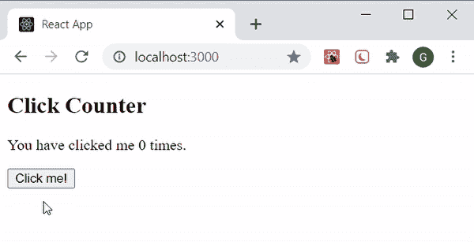

# 反应性 setState()

> 哎哎哎:# t0]https://www . geeksforgeeks . org/reacjs-setstate/

所有的 React 组件都可以有一个[](https://www.geeksforgeeks.org/what-is-usestate-in-react/)<u>与之关联。组件的状态可能会因用户执行的操作的响应或系统触发的事件而改变。每当状态改变时，React 会将组件重新呈现给浏览器。在更新状态值之前，我们需要构建一个初始状态设置。完成后，我们使用**设置状态()方法**来更改状态对象。它确保组件已经更新，并要求重新呈现组件。</u>

<u>**语法:**我们可以使用 setState()直接改变组件的状态，也可以通过箭头函数改变组件的状态。</u>

```
setState({ stateName : updatedStateValue })

// OR
setState((prevState) => ({ 
   stateName: prevState.stateName + 1 
}))
```

<u>**创建反应应用程序:**</u>

*   <u>**步骤 1:** 使用以下命令创建一个反应应用程序:</u>

    ```
    npx create-react-app foldername
    ```

*   <u>**步骤 2:** 创建项目文件夹(即文件夹名)后，使用以下命令移动到该文件夹:</u>

     <u>```
    cd foldername
    ```</u> 

<u>**例 1:** 更新单属性。</u>

<u>我们在**构造函数**中设置初始状态值，并创建另一个函数**更新状态()**来更新状态。现在当我们点击按钮时，后者被触发为 [**<u>onClick 事件</u>**](https://www.geeksforgeeks.org/javascript-events/) ，该事件改变状态值。我们在**更新状态()函数**中通过写:</u>

```
this.setState({greeting : 'GeeksForGeeks welcomes you !!'}) 
```

<u>如您所见，我们正在向 setState()传递一个对象。该对象包含我们想要更新的状态部分，在本例中，是**问候**的值。React 接受这个值，并将其合并到需要它的对象中。这就像按钮组件询问它应该使用什么来更新问候语的值，setState()会给出一个答案。</u>

## <u>App.js</u>

```
import React, { Component } from 'react'

class App extends Component { 
  constructor(props){ 
    super(props) 

    // Set initial state 
    this.state = {greeting : 
          'Click the button to receive greetings'} 

    // Binding this keyword 
    this.updateState = this.updateState.bind(this) 
  } 

  updateState(){ 
    // Changing state 
    this.setState({greeting : 
                 'GeeksForGeeks welcomes you !!'}) 
  } 

  render(){ 
    return ( 
      <div> 
       <h2>Greetings Portal</h2>   
       <p>{this.state.greeting}</p>

        {/* Set click handler */} 
        <button onClick={this.updateState}> 
          Click me!
        </button> 
      </div> 
    ) 
  } 
} 

export default App;
```

<u>**运行应用程序的步骤:**从项目的根目录使用以下命令运行应用程序:</u>

```
npm start
```

<u>**输出:**现在打开浏览器，转到***http://localhost:3000/***，会看到如下输出:</u>

<u></u>

<u>**例 2:** 更新多个属性。</u>

<u>组件的状态对象可能包含多个属性，React 允许使用 setState()函数仅更新这些属性的子集，以及使用多个 setState()方法独立更新每个属性值。</u>

<u>我们通过初始化三个不同的属性来设置我们的初始状态，然后我们创建一个函数 **updateState()** ，每当调用它时，它都会更新它的值。这个函数再次作为 [**<u>onClick 事件</u>**](https://www.geeksforgeeks.org/javascript-events/) 被触发，我们同时获得我们状态的更新值。</u>

## <u>App.js</u>

```
import React, { Component } from 'react'

class App extends Component { 
  constructor(props){ 
    super(props) 

    // Set initial state 
    this.state = {
      test: "Nil",
      questions: "0",
      students: "0"
    } 

    // Binding this keyword 
    this.updateState = this.updateState.bind(this) 
  } 

  updateState(){ 
    // Changing state 
    this.setState({
      test: 'Programming Quiz',
      questions: '10',
      students: '30'
    }) 
  } 

  render(){ 
    return ( 
      <div> 
        <h2>Test Portal</h2>      
        <p>{this.state.test}</p>

        <p>{this.state.questions}</p>

        <p>{this.state.students}</p>
        {/* Set click handler */} 
        <button onClick={this.updateState}> 
          Click me!
        </button> 
      </div> 
    ) 
  } 
} 

export default App;
```

<u>**运行应用程序的步骤:**从项目的根目录使用以下命令运行应用程序:</u>

```
npm start
```

<u>**输出:**现在打开浏览器，转到***http://localhost:3000/***，会看到如下输出:</u>

<u></u>

<u>**示例 3:** 使用道具更新状态值。</u>

<u>我们设置了一个字符串数组**测试主题**作为我们组件的道具。创建了一个函数**列表主题**，将所有字符串映射为我们州的列表项目**主题**。功能**更新状态**被触发，并将主题设置为列表项。当我们点击按钮时，我们得到更新的状态值。众所周知，这种方法可以非常容易地处理复杂的数据和更新状态。</u>

## <u>App.js</u>

```
import React, { Component } from 'react'

class App extends Component {
  static defaultProps = { 
    testTopics : [ 
      'React JS', 'Node JS', 'Compound components',  
      'Lifecycle Methods', 'Event Handlers', 
      'Router', 'React Hooks', 'Redux', 
      'Context'
    ] 
  } 

  constructor(props){ 
    super(props) 

    // Set initial state 
    this.state = {
      testName: "React js Test",
      topics: ''
    } 

    // Binding this keyword 
    this.updateState = this.updateState.bind(this) 
  } 

  listOfTopics(){ 
    return ( 
      <ul> 
        {this.props.testTopics.map(topic => ( 
          <li>{topic}</li> 
        ))} 
      </ul> 
    )  
  } 

  updateState(){ 

    // Changing state 
    this.setState({
      testName: 'Test topics are:',
      topics: this.listOfTopics()
    }) 
  } 

  render(){ 
    return ( 
      <div> 
        <h2>Test Information</h2> 
        <p>{this.state.testName}</p>
        <p>{this.state.topics}</p>
        {/* Set click handler */} 
        <button onClick={this.updateState}> 
          Click me!
        </button> 
      </div> 
    ) 
  } 
} 

export default App;
```

<u>**运行应用程序的步骤:**从项目的根目录使用以下命令运行应用程序:</u>

```
npm start
```

<u>**输出:**现在打开浏览器，转到***http://localhost:3000/***，会看到如下输出:</u>

<u></u>

<u>**例 4。**使用之前的值更新状态。</u>

<u>我们创建一个值为 0 的初始状态**计数**。函数 **updateState()** 每次被调用时都会将状态的当前值增加 1。这次我们在一个箭头函数中使用 setState()方法，通过传递 **prevState** 作为参数。状态的当前值通过 **prevState.stateName** 访问，只要我们按下按钮，该值就会增加 1。当我们在状态中设置一个值时，这个方法非常有用，因为它依赖于它以前的值。**例如**，切换一个布尔值(真/假)或增加/减少一个数字。</u>

## <u>App.js</u>

```
import React, { Component } from 'react'

class App extends Component {

  constructor(props){ 
    super(props) 

    // Set initial state 
    this.state = {
       count: 0
    } 

    // Binding this keyword 
    this.updateState = this.updateState.bind(this) 
  } 

  updateState(){ 
    // Changing state 
    this.setState((prevState) => {
      return { count: prevState.count + 1}
    })  
  }

  render(){ 
    return ( 
      <div> 
        <h2>Click Counter</h2>           
        <p>You have clicked me {this.state.count} times.</p>
        {/* Set click handler */} 
        <button onClick={this.updateState}> 
          Click me!
        </button> 
      </div> 
    ) 
  } 
} 

export default App;
```

<u>**运行应用程序的步骤:**从项目的根目录使用以下命令运行应用程序:</u>

```
npm start
```

<u>**输出:**现在打开浏览器，转到***http://localhost:3000/***，会看到如下输出:</u>

<u></u>