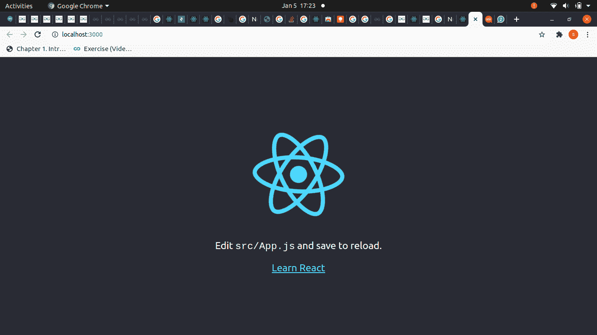

# ReactJS |设置开发环境

> 原文:[https://www . geeksforgeeks . org/reactjs-setting-development-environment/](https://www.geeksforgeeks.org/reactjs-setting-development-environment/)

要运行任何 React 应用程序，我们必须在电脑上安装 NodeJS。所以，第一步就是安装 NodeJS。

**第一步**:安装 NodeJS。您可以访问 NodeJS 的[官方下载链接](https://nodejs.org/en/download/current/)下载并安装最新版本的 NodeJS。一旦我们在个人电脑上设置了节点，接下来我们需要做的就是设置反应样板。

**第二步**:为旧版本和最新版本设置反应环境，根据你的节点版本跟随任何人。

**对于包含节点< 8.10 和 npm < 5.6 的旧版本:**设置反应样板。我们将在全球范围内安装样板。在您的终端或命令提示符下运行以下命令来安装反应样板。

```
npm install -g create-react-app
```

运行上述命令并成功安装样板后，您的终端将显示一些输出，如下图所示:


现在，在成功安装样板文件之后，我们接下来要做的是创建我们的 React 应用程序。我们可以使用创建-反应-应用程序命令来创建一个要反应的应用程序。

**对于包含 Node**[](https://nodejs.org/en/)****>= 8.10 和 npm > =5.6:** 为了使用提供良好开发体验的 JavaScript 最新特性，机器应该包含 Node [](https://nodejs.org/en/)> =8.10 和 npm > =5.6 的版本。**

**运行以下命令创建一个新项目**

```
npx create-react-app my-app
```

**上述命令将创建应用名称 my-app，如下图所示:** 

****

**您可以通过键入命令 cd my-app 来运行该项目。**

```
cd my-app
npm start
```

**它将在终端中为您提供如下图所示的输出:**

****

**现在，您可以在浏览器中查看您的应用，如下图所示:**

****

****第三步**:创建一个 React app。现在要创建一个应用程序，我们将使用我们安装的样板。下面的命令将创建一个名为 myapp 的应用程序。**

```
create-react-app myapp
```

**上面的语句将在当前目录中创建一个名为 *myapp* 的新目录，其中包含一堆成功运行 React 应用程序所需的文件。**

**我们来看看上面命令创建的目录:** 

****

**在上面的目录中，您可以看到许多文件。我们将在基础课程中处理的主要文件是*index.html*和 *index.js* 。index.html 文件将有一个 id =“root”的 div 元素，其中的所有内容都将被呈现，我们所有的 React 代码都将在 index.js 文件中。**

**现在，我们已经成功地建立了开发环境。最后剩下的就是**启动开发服务器**。**

****第四步**:启动开发服务器。要启动开发服务器，进入当前目录“myapp”并执行以下命令:** 

```
npm start
```

**成功运行上述命令后，您的编译器将显示以下消息:** 

****

**您可以访问上面消息中显示的网址，查看您在应用程序中所做的更改。默认情况下，上面的网址会显示下面的页面:** 

****

**仅此而已！我们已经建立并准备好了开发环境。现在，我们将开始学习 ReactJS 的开发，以利用它。**