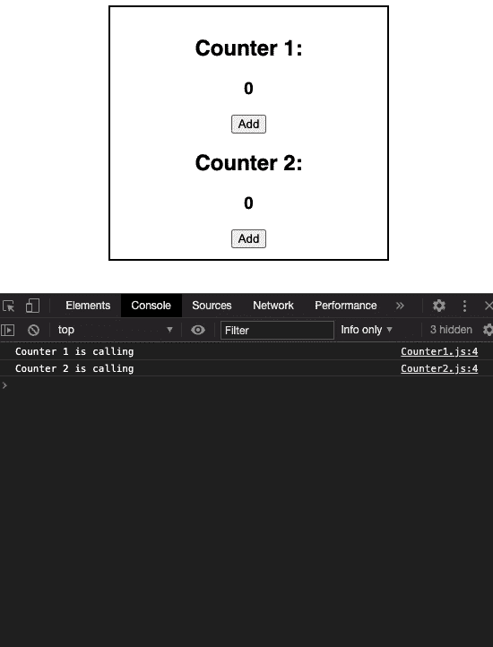
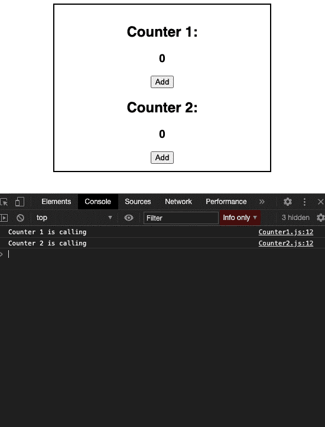

# 反应组件更新()方法

> 原文:[https://www . geeksforgeeks . org/reactjs-should component update-method/](https://www.geeksforgeeks.org/reactjs-shouldcomponentupdate-method/)

**shouldComponentUpdate** 方法允许我们退出复杂的 react update 生命周期，以避免在每次重新渲染时反复调用它。它只在传递给它的道具改变时更新组件。

**shouldComponentUpdate** 方法主要用于优化性能和增加网站的响应性，但不要依赖它来防止渲染，因为它可能会导致错误。

**语法:**

```
shouldComponentUpdate(nextProps, nextState)
```

**返回值:**默认情况下返回真，如果返回假，则 **render()** 、 **componentWillUpdate()** 和**component update()**方法不会被调用。

**示例:**在本例中，我们将构建一个计数器应用程序，该应用程序仅在其道具值发生变化时进行渲染。

**App.js**

## java 描述语言

```
import React, { useState } from "react";
import Counter1 from "./Counter1";
import Counter2 from "./Counter2";

const App = () => {

// Using useState hooks for defining state
  const [counter1, setCounter1] = useState(0);

  const increase1 = () => {
    setCounter1(counter1 + 1);
  };
  const [counter2, setCounter2] = useState(0);

  const increase2 = () => {
    setCounter2(counter2 + 1);
  };

  return (
    <div className="container">
      <div>
        <Counter1 value={counter1} onClick={increase1} />
      </div>
      <div>
        <Counter2 value={counter2} onClick={increase2} />
      </div>
    </div>
  );
};

export default App;
```

**不使用 shouldComponentUpdate()方法:**

*   **Counter1.js**

    ## java 描述语言

    ```
    import React, { Component } from "react";

    class Counter1 extends Component {
      render() {
        console.log("Counter 1 is calling");
        return (
          <div>
            <h2>Counter 1:</h2>
            <h3>{this.props.value}</h3>
            <button onClick={this.props.onClick}>Add</button>
          </div>
        );
      }
    }

    export default Counter1;
    ```

*   **Counter2.js**

    ## java 描述语言

    ```
    import React, { Component } from "react";

    class Counter2 extends Component {
      render() {
        console.log("Counter 2 is calling");
        return (
          <div>
            <h2>Counter 2:</h2>
            <h3>{this.props.value}</h3>
            <button onClick={this.props.onClick}>Add</button>
          </div>
        );
      }
    }

    export default Counter2;
    ```

*   **输出:**
    

**配合使用 shouldComponentUpdate()方法:**

*   **Counter1.js**

    ## java 描述语言

    ```
    import React, { Component } from "react";

    class Counter1 extends Component {
      shouldComponentUpdate(nextProps) {
        // Rendering the component only if 
        // passed props value is changed

        if (nextProps.value !== this.props.value) {
          return true;
        } else {
          return false;
        }
      }
      render() {
        console.log("Counter 1 is calling");
        return (
          <div>
            <h2>Counter 1:</h2>
            <h3>{this.props.value}</h3>
            <button onClick={this.props.onClick}>Add</button>
          </div>
        );
      }
    }

    export default Counter1;
    ```

*   **Counter2.js**

    ## java 描述语言

    ```
    import React, { Component } from "react";

    class Counter2 extends Component {
        shouldComponentUpdate (nextProps) {
          // Rendering the component only if
          // passed props value is changed

          if (nextProps.value !== this.props.value) {
            return true;
          } else {
            return false;
          }
        }
      render() {
        console.log("Counter 2 is calling");
        return (
          <div>
            <h2>Counter 2:</h2>
            <h3>{this.props.value}</h3>
            <button onClick={this.props.onClick}>Add</button>
          </div>
        );
      }
    }

    export default Counter2;
    ```

*   **输出:**
    