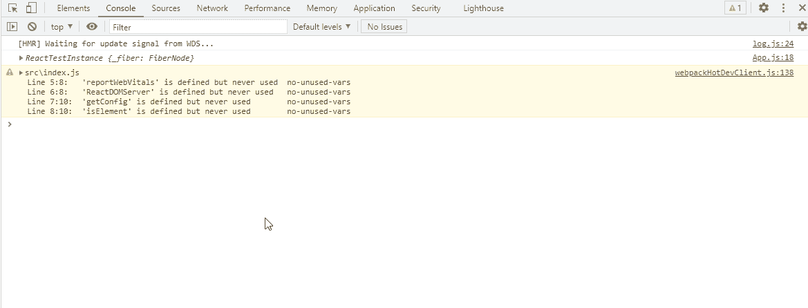

# ReactJS testinstance . findbyprops()方法

> 原文:[https://www . geeksforgeeks . org/reactjs-testinstance-findbybprops-method/](https://www.geeksforgeeks.org/reactjs-testinstance-findbyprops-method/)

React.js 库就是将应用程序拆分成几个组件。每个组件都有自己的生命周期。React 为我们提供了一些内置的方法，我们可以在组件生命周期的特定阶段覆盖这些方法。

在本文中，我们将了解如何使用 testInstance.findByProps()方法。testInstance.findByProps()方法用于使用提供的道具查找单个子代测试实例。

**创建反应应用程序并安装模块:**

*   **步骤 1:** 使用以下命令创建一个 React 应用程序

    ```
    npx create-react-app foldername
    ```

*   **步骤 2:** 创建项目文件夹(即文件夹名)后，使用以下命令移动到该文件夹。

    ```
    cd foldername
    ```

**项目结构:**如下图。


**步骤 3:** 创建 ReactJS 应用程序后，使用以下命令安装所需的****模块:****

```
**npm install react-test-renderer**
```

******例 1:******

## ****App.js****

```
**import React from 'react';
import TestRenderer from 'react-test-renderer';

// Defining our App Component
const App = () => {

// Function to demonstrate TestRenderer.findByProps() method
function func(){
    const renderer = TestRenderer.create(
        <div>
            GeeksforGeeks
            <div>
                TestRenderer.findByProps() method
            </div>
        </div>
      );
    const myfindByProps = renderer.root;
    console.log(myfindByProps.findByProps());

}
func();

// Returning our JSX code
return <>

</>;
}

// Exporting your Default App Component
export default App**
```

******输出:******

********

******参考:**[https://reactjs . org/docs/test-renderer . html # testinstance findbypes](https://reactjs.org/docs/test-renderer.html#testinstancefindbyprops)****