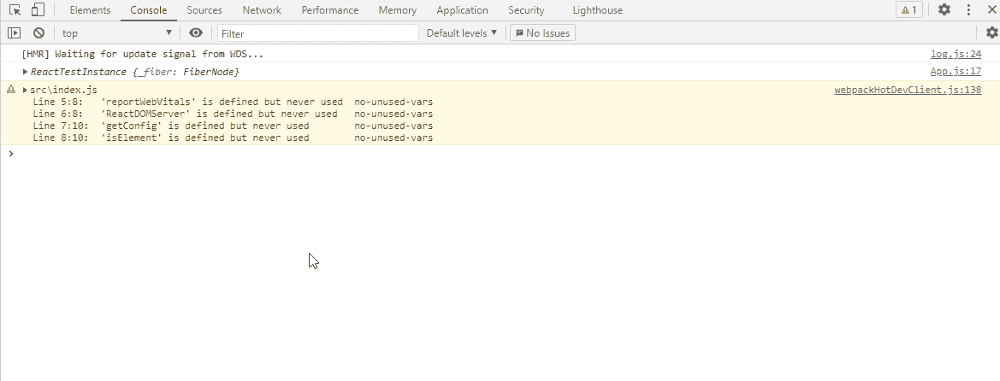

# ReactJS TestRenderer.root 属性

> 原文:[https://www . geeksforgeeks . org/reactjs-test renderer-root-property/](https://www.geeksforgeeks.org/reactjs-testrenderer-root-property/)

React.js 库就是将应用程序拆分成几个组件。每个组件都有自己的生命周期。React 为我们提供了一些内置的方法，我们可以在组件生命周期的特定阶段覆盖这些方法。

在本文中，我们将看到如何使用 TestRenderer.root 属性。TestRenderer.root 属性用于返回根“测试实例”对象。

**创建反应应用程序并安装模块:**

*   **步骤 1:** 使用以下命令创建一个 React 应用程序

    ```jsx
    npx create-react-app foldername
    ```

*   **步骤 2:** 创建项目文件夹即文件夹名称后，使用以下命令移动到该文件夹。

    ```jsx
    cd foldername
    ```

*   **步骤 3:** 创建 ReactJS 应用程序后，使用以下命令安装所需的****模块:****

    ```jsx
    **npm i react-test-renderer**
    ```

******项目结构:**如下图。****

********

******例 1:******

## ****App.js****

```jsx
**import React from 'react';
import TestRenderer from 'react-test-renderer';

// Defining our App Component
const App = () => {

// Function to demonstrate TestRenderer.root property
function func(){
    const renderer = TestRenderer.create(
        <div>
            GeeksforGeeks
            <div>
                TestRenderer.root property
            </div>
        </div>
      );
      console.log(renderer.root);
}
func();

// Returning our JSX code
return <>

</>;
}

// Exporting your Default App Component
export default App**
```

******输出:******

********

******参考:**[https://reactjs . org/docs/test-rendererot . html # testrendererot](https://reactjs.org/docs/test-renderer.html#testrendererroot)****