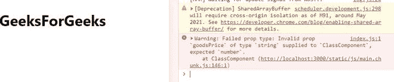
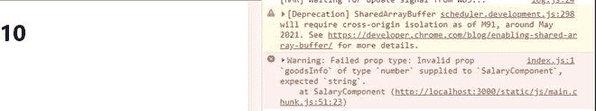

# 用程序类型重新进行类型检查–设置 1

> 原文:[https://www . geeksforgeeks . org/reactjs-type checking-with-prop types-set-1/](https://www.geeksforgeeks.org/reactjs-typechecking-with-proptypes-set-1/)

React 允许我们使用名为[](https://www.geeksforgeeks.org/reactjs-props-set-1/)<u>(代表属性)的东西将参数传递给组件，这些属性通过 HTML 属性传递给组件的方式与函数中传递参数的方式相同。这些提供了一种将数据从一个组件传递到其他组件的方法，并在我们的呈现方法中呈现动态数据。我们可以传递不同类型的数据，如整数、符号、字符串、数组、对象等。作为组件的道具。我们可以创建 [**<u>默认道具</u>**](https://www.geeksforgeeks.org/reactjs-props-set-2/) 或者可以将道具作为 HTML 属性直接传递给组件，或者从组件外部传递，并在该组件内部使用。你一定想知道我们可以通过道具检查我们在组件中传递的是什么类型的值吗？是的，我们可以使用 [**<u>道具类型</u>**](https://www.geeksforgeeks.org/reactjs-proptypes/) 来验证我们从道具接收的任何数据。这被称为**用道具类型进行类型检查**。</u>

<u>**创建反应应用程序:**</u>

<u>**步骤 1:** 使用以下命令创建一个反应应用程序:</u>

```jsx
npx create-react-app foldername
```

<u>**步骤 2:** 创建项目文件夹(即文件夹名)后，使用以下命令移动到该文件夹:</u>

```jsx
cd foldername
```

<u>**所需模块:**在使用 PropTypes 之前，我们必须通过在终端中键入给定的命令来安装它。</u>

```jsx
npm install prop-types --save
```

<u>道具的类型检查总是在组件呈现期间执行，因为 JavaScript 是一种类型化语言，数据类型总是在运行时确定。</u>

```jsx
var g = 20
// Changing the data type
g = "geeks"
g = [100,200]
```

<u>例如，这里 **g** 最初被声明为整数。然后它的类型变成一个字符串，然后变成一个数组。所以在 Javascript 中，数据类型可以是我们想要的任何类型。由于 React 也是用 Javascript 编写的，所以在渲染(或运行时)之前没有办法检查道具类型。这就是为什么 React 为我们提供了 ***道具类型*** 来帮助我们验证从道具接收的数据。如果我们传递的数据类型不同于 propTypes *指定的数据类型，类型检查将通过控制台消息警告我们。*</u>

<u>让我们来看看如何在 [**<u>类组件</u>**](https://www.geeksforgeeks.org/reactjs-class-based-components/) 和 [**<u>功能组件</u>**](https://www.geeksforgeeks.org/reactjs-functional-components/) 中逐一使用 propTypes 进行验证:</u>

<u>**示例 1:** 您可以在下面的程序中看到，我们正在将名为 **goodsPrice** 的道具作为类组件中的字符串传递，并将其验证为数字，即使在浏览器上一切都完美呈现的情况下也是如此。但是我们的浏览器控制台有一条警告消息。这条消息清楚地告诉我们，名为 goodsPrice 的道具应该有一个数值，但是传递的是一个字符串值。</u>

## <u>index.js</u>

```jsx
import PropTypes from 'prop-types';
import React from 'react';
import ReactDOM from 'react-dom';
import './index.css'

// Component
class ClassComponent extends React.Component{
    render(){
        return(
          <div>
           {/* printing all props */}
           <h1>
           {this.props.goodsPrice}
           </h1>
          </div> 
       );
   }
}

// Validating prop types
ClassComponent.propTypes = {
  goodsPrice: PropTypes.number
}

// Creating default props
ClassComponent.defaultProps = {
  goodsPrice: "GeeksForGeeks"
}

ReactDOM.render(
    <ClassComponent  />, 
    document.getElementById("root")
);
```

<u>**运行应用程序的步骤:**从项目的根目录使用以下命令运行应用程序:</u>

```jsx
npm start
```

<u>**输出:**现在打开浏览器，转到***http://localhost:3000/***，会看到如下输出:</u>

<u></u>

<u>**示例 2:** 您可以在下面的程序中看到，我们将名为 **goodsInfo** 的道具作为一个数字传递给一个功能组件，但将其验证为一个字符串，即使如此，所有内容都在浏览器上完美呈现。但是我们的浏览器控制台有一条警告消息。这条消息清楚地告诉我们，名为 goodsInfo 的道具应该有一个字符串值，但是传递的是一个数值。</u>

## <u>App.js</u>

```jsx
import React from 'react'
import PropTypes from 'prop-types'

// Function
function ProfitComponent(props) {
  return (
      <div>
        {/* Printing the props */}
         <h1>
          {props.goodsInfo}
         </h1>  
      </div>
  )
}

// Creating default props
ProfitComponent.defaultProps = {
   goodsInfo: 10
}

// Validating prop types
ProfitComponent.propTypes = {
   goodsInfo: PropTypes.string
}

export default ProfitComponent;
```

<u>**运行应用程序的步骤:**从项目的根目录使用以下命令运行应用程序:</u>

```jsx
npm start
```

<u>**输出:**现在打开浏览器，转到***http://localhost:3000/***，会看到如下输出:</u>

<u></u>

<u>以下是道具可以接受的所有有效数据类型的列表:</u>

*   <u>**道具类型.数组:**验证道具是数组。</u>
*   <u>**PropTypes.bool:** 验证道具是 bool。</u>
*   <u>**PropTypes.func:** 验证道具是一个函数。</u>
*   <u>**道具类型号:**验证道具是一个数字。</u>
*   <u>**道具对象**:验证道具是否为对象。</u>
*   <u>**道具类型.字符串**:验证道具是字符串。</u>
*   <u>**道具符号**:验证道具是一个符号。</u>

<u>**注意:**不仅仅是数据类型，我们还可以验证 React 元素、数据类型中的特定值或者我们存储在另一个数据类型中的数据(例如数组或对象)。我们将在下一篇文章 [**<u>中详细了解这一点。</u>**](https://www.geeksforgeeks.org/reactjs-typechecking-with-proptypes-set-2/)</u>