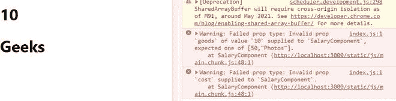

# 用螺旋桨类型重新进行类型检查–第 2 组

> 原文:[https://www . geeksforgeeks . org/reactjs-type checking-with-prop types-set-2/](https://www.geeksforgeeks.org/reactjs-typechecking-with-proptypes-set-2/)

在我们之前的文章[**<u>ReactJS type checking With PropTypes–Set 1</u>**](https://www.geeksforgeeks.org/reactjs-typechecking-with-proptypes-set-1/)中，我们讨论了如何使用[**<u>PropTypes</u>**](https://www.geeksforgeeks.org/reactjs-proptypes/)来验证我们从道具接收到的任何数据。但是我们的讨论仅限于验证数据类型，如数组、字符串、对象或数字。在本文中，我们将扩展我们的讨论，并学习如何验证 **React 元素**(如类的实例)**特定和多个值**、**形状**、**以及类型**、**、**和**对道具内部数据的精确验证**。

**创建反应应用程序:**

**步骤 1:** 使用以下命令创建一个反应应用程序:

```
npx create-react-app foldername
```

**步骤 2:** 创建项目文件夹(即文件夹名)后，使用以下命令移动到该文件夹:

```
cd foldername
```

**所需模块:**在使用 PropTypes 之前，我们必须通过在终端中键入给定的命令来安装它。

```
npm install prop-types --save
```

**示例 1:使用 propTypes 进行实例验证**

我们可以验证我们的 prop 的实例，即检查 prop 是否是类的实例。让我们看一个例子来更好地理解这一点。

## App.js

```
import React, {Component} from 'react';
import PropTypes from 'prop-types';

// Sample class
class Sample {
   constructor(value) {
     this.price = value.price;
   }
}

// Component
 class SamplePrice extends Component { 
   render() {
     return (
        <div>
          <h1>
            {this.props.priceProp}
          </h1>
        </div>
     )
   }
 }

// Creating default props
SamplePrice.defaultProps = {
  priceProp: "geeksforgeeks"
}

 // Validating the props
 SamplePrice.propTypes = {
   priceProp: PropTypes.instanceOf(Sample)
 }

 // Export the Component
 export default SamplePrice;
```

**运行应用程序的步骤:**从项目的根目录使用以下命令运行应用程序:

```
npm start
```

**输出:**现在打开浏览器，转到***http://localhost:3000/***，会看到如下输出:


**解释:**你可以在上面的程序中看到，我们正在将名为 **priceProp** 的道具作为类组件中的字符串传递，并将其验证为 [**<u>实例的</u>**](https://www.geeksforgeeks.org/instanceof-operator-in-javascript/) 用户定义的类**样本**、即使如此，一切都在浏览器上完美呈现。但是我们的浏览器控制台有一条警告消息。这条消息清楚地告诉我们，名为 priceProp 的道具应该是类 Sample 的一个实例，但是传递了一个字符串值。

**示例 2:特定值和多值验证**

我们可以验证我们的道具必须是一些特定的值，即它的值必须是集合中提供的值之一。我们还可以指定我们的道具可以是集合中给出的任何类型。

## App.js

```
import React, { Component } from 'react'
import PropTypes from 'prop-types'

// Component
class ProfitComponent extends Component {
  render() {
   return (
      <div>
        {/* printing the props */}
         <h1>
          {this.props.goods}
         </h1>
         <h1>
         {this.props.cost}
        </h1>
      </div>
      )
  }
}

// Creating default props
ProfitComponent.defaultProps = {
   goods: 10,
   cost: "Geeks"
}

// Validating prop types
ProfitComponent.propTypes = {
   // Specific validation
   goods: PropTypes.oneOf([50, 'Photos']),

   // Multiple validation
   cost: PropTypes.oneOfType([
      PropTypes.array,
      PropTypes.number
  ])
}

export default ProfitComponent;
```

**运行应用程序的步骤:**从项目的根目录使用以下命令运行应用程序:

```
npm start
```

**输出:**现在打开浏览器，转到***http://localhost:3000/***，会看到如下输出:



**说明:**在上面的程序中可以看到，我们正在将名为 **goods** 的道具作为一个类组件中的数字 10 传递，并验证它是否具有数字 50 或字符串“Photos”的确切值，即使在浏览器上一切都被完美渲染的情况下也是如此。但是我们的浏览器控制台有一条警告消息。这条消息清楚地告诉我们，道具名称的货物应该有一个 50 或“照片”的确切值，但取而代之的是，值 10 被传递。这被称为**特定值验证**，即道具必须具有相同的数据类型和相同的值。

我们还将名为**成本**的道具作为字符串传递，并验证它是数组还是数字，即使所有东西都在浏览器上完美呈现。但是我们的浏览器控制台有一条警告消息。这条消息清楚地告诉我们，名为 cost 的道具应该是一个数组或一个数字，但是传递的是一个字符串。这被称为**多值验证**，即道具必须是集合中提供的数据类型之一，但它可以有任何值。

**示例 3:类型和形状验证**

我们可以将一个属性指定为数组类型，并进一步验证数组值是否属于某个类型。我们还可以使用形状验证对多个数据类型进行验证。

## App.js

```
import React, {Component} from 'react';
import PropTypes from 'prop-types';

// Component
 class SamplePrice extends Component {
   render() {
     return (
        <div>
          <p>Type Validation</p>

          <h1>
           {/* Printing the props */}
            {
               this.props.ArrayProp.map((item, index)=>{
                   return (
                      <p key={index}>{item}</p>

                   )
               })
            }
          </h1>

          <p>Shape Validation</p>

          <h1>
           {this.props.ShapeOfProp.CarName}
          </h1>
          <h1>
           {this.props.ShapeOfProp.Price}
          </h1>
        </div>
     )
   }
 }

// Creating default props
SamplePrice.defaultProps = {
  ArrayProp: ["Car", "Driver", "Cost"],
  ShapeOfProp: ({CarName: "Ferrari", Price: "56"})
}

// Validating the props
SamplePrice.propTypes = {
   // Types validation
   ArrayProp: PropTypes.arrayOf(PropTypes.number),

   // Shapes validation
   ShapeOfProp: PropTypes.shape({
      CarName: PropTypes.string,
      Price: PropTypes.number
  })
 }

 // Export the Component
 export default SamplePrice
```