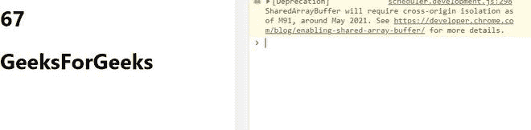
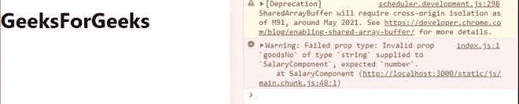
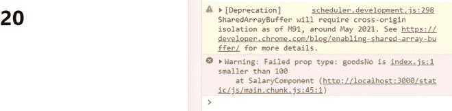

# 用螺旋桨类型重新进行类型检查–第 3 组

> 原文:[https://www . geeksforgeeks . org/reactjs-type checking-with-prop types-set-3/](https://www.geeksforgeeks.org/reactjs-typechecking-with-proptypes-set-3/)

在上一篇文章 [**<u>中，我们讨论了实例验证、单个和多个数据类型验证、类型和形状验证以及道具中的精确验证。在本文中，我们将讨论道具的**通过任何验证**、**所需验证**和**自定义验证**。</u>**](https://www.geeksforgeeks.org/reactjs-typechecking-with-proptypes-set-2/)

**创建反应应用程序:**

**步骤 1:** 使用以下命令创建一个反应应用程序:

```
npx create-react-app foldername
```

**步骤 2:** 创建项目文件夹(即文件夹名)后，使用以下命令移动到该文件夹:

```
cd foldername
```

**所需模块:**在使用 PropTypes 之前，我们必须通过在终端中键入给定的命令来安装它。

```
npm install prop-types --save
```

**例 1:传递道具内的任意数据类型**

我们可以使用这个方法验证任何数据类型的属性，无论它是数字、字符串、符号、数组、对象等等。这意味着我们可以在组件内部传递任何有效的数据类型作为道具。

## App.js

```
import React, { Component } from 'react'
import PropTypes from 'prop-types'

// Component
class ProfitComponent extends Component {
  render() {
   return (
      <div>
        {/* Printing the props */}
         <h1>
          {this.props.goodsNo}
         </h1>
         <h1>
          {this.props.goodsInfo}
         </h1>
      </div>
      )
  }
}

// Creating default props
ProfitComponent.defaultProps = {
   goodsNo: 67,
   goodsInfo: "GeeksForGeeks"
}

// Validating prop types
ProfitComponent.propTypes = {
   goodsNo: PropTypes.any,
   goodsInfo: PropTypes.any
}

export default ProfitComponent;
```

**运行应用程序的步骤:**从项目的根目录使用以下命令运行应用程序:

```
npm start
```

**输出:**现在打开浏览器，转到***http://localhost:3000/***，会看到如下输出:



**解释:**你可以在上面的程序中看到，我们在类组件中将名为**的道具**作为一个数字传递，将**的道具**作为一个字符串传递，并将两者都验证为任意数据类型。一切都在浏览器上完美呈现，没有警告消息出现。这清楚地告诉我们，任何值都可以在名为*good no*和*good info*的道具内部传递，无论是字符串、数字、数组，还是对象等。

**例 2:道具内部传递的数据需要验证**

我们可以验证是否提供了道具。为此，我们使用 **isRequired** 来确保在没有提供道具或其数据类型与指定类型不同时显示警告消息。

## App.js

```
import React, { Component } from 'react'
import PropTypes from 'prop-types'

// Component
class ProfitComponent extends Component {
  render() {
   return (
      <div>
        {/* Printing the props */}
         <h1>
          {this.props.goodsNo}
         </h1>
      </div>
      )
  }
}

// Creating default props
ProfitComponent.defaultProps = {
   goodsNo: "GeeksForGeeks"
}

// Validating prop types
ProfitComponent.propTypes = {
   goodsNo: PropTypes.number.isRequired
}

export default ProfitComponent;
```

**运行应用程序的步骤:**从项目的根目录使用以下命令运行应用程序:

```
npm start
```

**输出:**现在打开浏览器，转到***http://localhost:3000/***，会看到如下输出:



**说明:**你可以在上面的程序中看到，我们把名为**的道具国货号**作为字符串传递，并且在我们的道具中严格要求是数字。尽管如此，浏览器上的所有内容都得到了完美的呈现，但是控制台上会出现一条警告消息。这清楚地告诉我们，我们的名为*商品编号*的道具严格要求数值，但作为字符串传递。因此，我们得出结论**是必需的方法**只是验证传递到道具中的数据的另一种方式。

**示例 3:制作我们自己的正确验证函数或自定义验证**

我们还可以指定我们自己的自定义验证或适当的验证函数，以检查哪些数据必须作为组件内的道具传递。如果验证失败，它将返回一个错误对象作为警告消息。

## App.js

```
import React, { Component } from 'react'

// Component
class ProfitComponent extends Component {
  render() {
   return (
      <div>
        {/* Printing the props */}
         <h1>
          {this.props.goodsNo}
         </h1>
      </div>
      )
  }
}

// Creating default props
ProfitComponent.defaultProps = {
   goodsNo: 20
}

// Validating prop types
ProfitComponent.propTypes = {
   goodsNo(props, propName, component){
     if(props[propName] < 100){
        return new Error(`${propName} is smaller than 100`)
     }
   }
}

export default ProfitComponent;
```

**运行应用程序的步骤:**从项目的根目录使用以下命令运行应用程序:

```
npm start
```

**输出:**现在打开浏览器，转到***http://localhost:3000/***，会看到如下输出:



**说明:**你可以在上面的程序中看到，我们正在将名为**的道具【商品编号】**作为一个数值为 20 的数字传递，并在我们自己的验证函数中验证它的值是否大于 100。也称为**自定义验证函数**，其名称必须与我们的**proname**相同(在本例中为*商品编号*)。我们在功能**商品编号()**中提供以下参数:

*   **道具:**是指我们在组件内部经过的所有道具。
*   **道具名称:**是指我们正在为其创建验证功能的道具，在本例中为**商品编号**。
*   **组件:**指的是我们传递道具的组件，这里是我们的类组件**盈利组件**。

我们通过在函数中写入**道具【道具名称】**来访问我们的**道具名称商品号**，并验证其值是否大于 100。由于我们的道具值为 20，我们在浏览器的控制台中收到一条由我们提供的错误消息。它清楚地告诉我们，我们名为*的道具*的价值小于 100。这样，我们可以使用用户定义的验证函数来验证传递到道具中的数据。