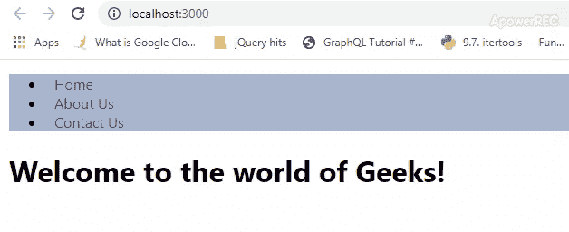
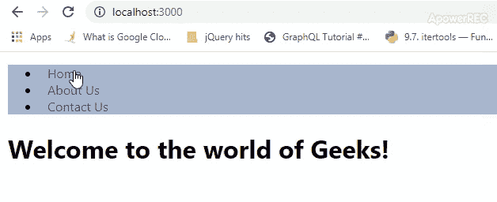
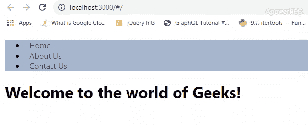

# 路由器|路由器类型

> 原文:[https://www.geeksforgeeks.org/reactjs-types-of-routers/](https://www.geeksforgeeks.org/reactjs-types-of-routers/)

根据路由器用来跟踪用户试图查看的内容的 URL 部分，React Router 提供了三种不同的路由器:

*   [**【内存路由器】**](#memory)
*   [**浏览器路由器**](#browser)
*   [**哈希路由器**](#hash)

**先决条件:**在开始这篇文章之前，你需要具备 [**React Router**](https://www.geeksforgeeks.org/reactjs-router/) 的基本知识。
**内存路由器:**内存路由器将网址更改保存在内存中，而不是用户浏览器中。它将网址的历史记录保存在内存中(不读取或写入地址栏，因此用户不能使用浏览器的后退按钮和前进按钮。它不会改变浏览器中的网址。它对于测试和像 React Native 这样的非浏览器环境非常有用。

*   **语法:**

```jsx
import { MemoryRouter as Router } from 'react-router-dom';
```

*   **程序:**

## Java Script 语言

```jsx
import React, { Component } from 'react';
import { MemoryRouter as Router, Route, Link, Switch }
                    from 'react-router-dom';
import Home from './component/home';
import About from './component/about';
import Contact from './component/contact';
import './App.css';

class App extends Component {
  render() {
      return (
        <Router>
            <div className="App">
                <ul className="App-header">
                  <li>
                      <Link to="/">Home</Link>
                  </li>
                  <li>
                      <Link to="/about">
                        About Us
                      </Link>
                  </li>
                  <li>
                      <Link to="/contact">
                        Contact Us
                      </Link>
                  </li>
                </ul>
                <Switch>
                  <Route exact path='/'
                      component={Home}>
                  </Route>
                  <Route exact path='/about'
                      component={About}>
                  </Route>
                  <Route exact path='/contact'
                      component={Contact}>
                  </Route>
                </Switch>
            </div>
        </Router>
    );
  }
}

export default App;
```

*   **输出:**



**浏览器路由器:**它使用 HTML 5 历史 API(即 pushState、replaceState 和 popState API)来保持你的 UI 与 URL 同步。它在浏览器中作为普通的 URL 进行路由，并假设服务器正在处理所有的请求 URL(例如，/，/about)，并指向根 index.html。它接受强制刷新道具来支持不支持 HTML 5 推送状态 API 的传统浏览器

*   **语法:**

```jsx
import { BrowserRouter as Router } from 'react-router-dom';
```

*   **程序:**

## Java Script 语言

```jsx
import React, { Component } from 'react';
import { BrowserRouter as Router, Route, Link, Switch }
                  from 'react-router-dom';

import Home from './component/home';
import About from './component/about';
import Contact from './component/contact';
import './App.css';

class App extends Component {
  render() {
      return (
        <Router>
            <div className="App">
                <ul className="App-header">
                  <li>
                      <Link to="/">Home</Link>
                  </li>
                  <li>
                      <Link to="/about">About Us</Link>
                  </li>
                  <li>
                      <Link to="/contact">
                        Contact Us
                      </Link>
                  </li>
                </ul>
                <Switch>
                  <Route exact path='/'
                      component={Home}>
                  </Route>
                  <Route exact path='/about'
                      component={About}>
                  </Route>
                  <Route exact path='/contact'
                      component={Contact}>
                  </Route>
                </Switch>
            </div>
        </Router>
    );
  }
}

export default App;
```

*   **输出:**



**哈希路由器:**哈希路由器使用客户端哈希路由。它使用网址的散列部分(即 window.location.hash)来保持用户界面与网址同步。服务器不会处理网址的散列部分，服务器总是为每个请求发送 index.html，并忽略散列值。它不需要服务器中的任何配置来处理路由。它用于支持通常不支持 HTML pushState API 的旧式浏览器。它对于遗留浏览器非常有用，或者您没有服务器逻辑来处理客户端。不建议 react-router-dom 团队使用此路由。

*   **语法:**

```jsx
import { HashRouter as Router } from 'react-router-dom';
```

*   **程序:**

## Java Script 语言

```jsx
import React, { Component } from 'react';
import { HashRouter as Router, Route, Link, Switch }
              from 'react-router-dom';
import Home from './component/home';
import About from './component/about';
import Contact from './component/contact';
import './App.css';

class App extends Component {
  render() {
      return (
        <Router>
            <div className="App">
                <ul className="App-header">
                  <li>
                      <Link to="/">Home</Link>
                  </li>
                  <li>
                      <Link to="/about">About Us</Link>
                  </li>
                  <li>
                      <Link to="/contact">
                          Contact Us
                      </Link>
                  </li>
                </ul>
                <Switch>
                  <Route exact path='/'
                      component={Home}>
                  </Route>
                  <Route exact path='/about'
                      component={About}>
                  </Route>
                  <Route exact path='/contact'
                      component={Contact}>
                  </Route>
                </Switch>
            </div>
        </Router>
    );
  }
}

export default App;
```

*   **语法:**

