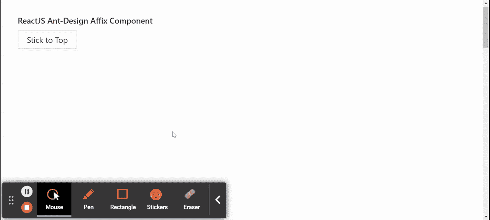

# 重新获取用户界面蚂蚁设计附着组件

> 原文:[https://www . geeksforgeeks . org/reactjs-ui-ant-design-词缀-component/](https://www.geeksforgeeks.org/reactjs-ui-ant-design-affix-component/)

蚂蚁设计库预建了这个组件，也很容易集成。词缀成分要习惯于 w 在另一个成分周围说唱词缀以使其粘在视口 上。我们可以在 ReactJS 中使用以下方法来使用 Ant 设计词缀组件。

**语法:**

```
<Affix>
  Component
</Affix>

```

**粘贴道具:**

*   **偏移底部:**用于从视口底部偏移。
*   **偏移:用于从视口顶部偏移。**
*   **目标:**用于指定可滚动区 DOM 节点。
*   **onChange:** 用于词缀状态改变时触发回调。

**创建反应应用程序并安装模块:**

*   **步骤 1:** 使用以下命令创建一个反应应用程序:

    ```
    npx create-react-app foldername
    ```

*   **步骤 2:** 创建项目文件夹后，即文件夹名称**，**使用以下命令移动到项目文件夹:

    ```
    cd foldername
    ```

*   **步骤 3:** 创建 ReactJS 应用程序后，使用以下命令安装所需的****模块:****

    ```
    **npm install antd**
    ```

******项目结构:**如下图。****

****

项目结构**** 

******示例:**现在在 **App.js** 文件中写下以下代码。在这里，App 是我们编写代码的默认组件。****

## ****App.js****

```
**import React from 'react'
import "antd/dist/antd.css";
import { Affix, Button } from 'antd';

export default function App() {

  return (
    <div style={{ display: 'block', width: 700,
                  padding: 30, height: 1800, 
                  scrollBehavior: 'auto' }}>
      <h4>ReactJS Ant-Design Affix Component</h4>
      <Affix offsetTop="5">
        <Button>Stick to Top</Button> <br />
      </Affix>
    </div>
  );
}**
```

******运行应用程序的步骤:**从项目的根目录使用以下命令运行应用程序:****

```
**npm start**
```

******输出:**现在打开浏览器，转到***http://localhost:3000/***，会看到如下输出:****

********

******参考:**T2】https://ant.design/components/affix/****