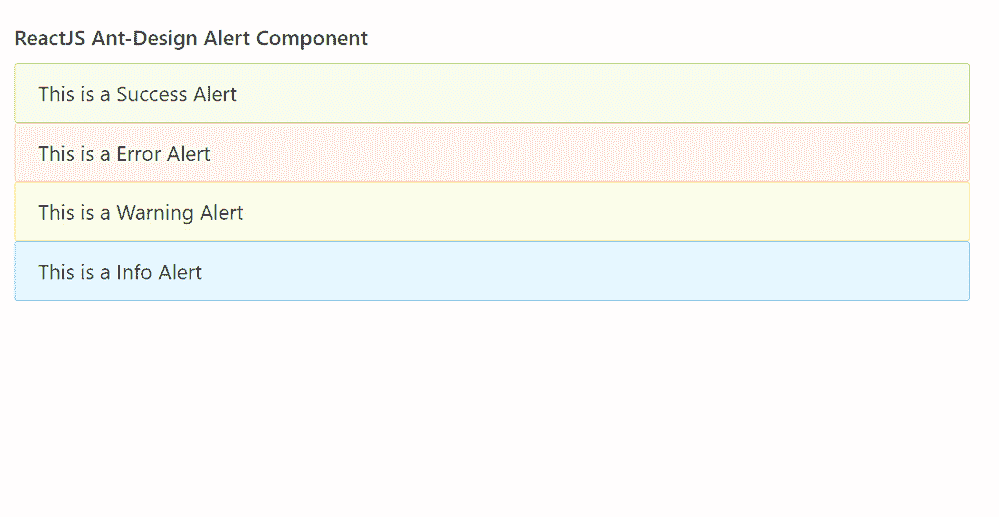

# 反应蚂蚁界面设计预警组件

> 原文:[https://www . geeksforgeeks . org/reactjs-ui-ant-design-alert-component/](https://www.geeksforgeeks.org/reactjs-ui-ant-design-alert-component/)

蚂蚁设计库预建了这个组件，也很容易集成。报警组件用于紧急中断，要求 确认 ，通知用户情况。我们可以在 ReactJS 中使用以下方法来使用 Ant 设计警报组件。

**警戒道具:**

*   **动作:**用于定义 Alert 的动作。
*   **afterClose:** 是关闭动画完成时触发的回调函数。
*   **横幅:**用于表示是否显示为横幅。
*   **可关闭:**用于指示 Alert 是否可以关闭。
*   **关闭文本:**用于定义要显示的关闭文本。
*   **说明:**用于定义 Alert 的附加内容。
*   **图标:**用于定义自定义图标。
*   **消息:**用于定义 Alert 的内容。
*   **显示图标:**表示是否显示图标。
*   **类型:**用于表示成功、警告等预警样式的类型。
*   **onClose:** 是报警关闭时触发的回调函数。

**警戒。错误边界道具:**

*   **描述:**用于定义自定义错误描述。
*   **消息:**用于定义自定义错误消息。

**创建反应应用程序并安装模块:**

*   **步骤 1:** 使用以下命令创建一个反应应用程序:

    ```jsx
    npx create-react-app foldername
    ```

*   **步骤 2:** 在创建项目文件夹(即文件夹名**)后，使用以下命令将**移动到该文件夹:

    ```jsx
    cd foldername
    ```

*   **步骤 3:** 创建 ReactJS 应用程序后，使用以下命令安装所需的模块:

    ```jsx
    npm install antd
    ```

**项目结构:**如下图。


项目结构

**示例:**现在在 **App.js** 文件中写下以下代码。在这里，App 是我们编写代码的默认组件。

## App.js

```jsx
import React from 'react'
import "antd/dist/antd.css";
import { Alert } from 'antd';

export default function App() {
  return (
    <div style={{
      display: 'block', width: 700, padding: 30
    }}>
      <h4>ReactJS Ant-Design Alert Component</h4>
      <Alert message="This is a Success Alert" type="success" />
      <Alert message="This is a Error Alert" type="error" />
      <Alert message="This is a Warning Alert" type="warning" />
      <Alert message="This is a Info Alert" type="info" />
    </div>
  );
}
```

**运行应用程序的步骤:**从项目的根目录使用以下命令运行应用程序:

```jsx
npm start
```

**输出:**现在打开浏览器，转到***http://localhost:3000/***，会看到如下输出:



**参考:**T2】https://ant.design/components/alert/