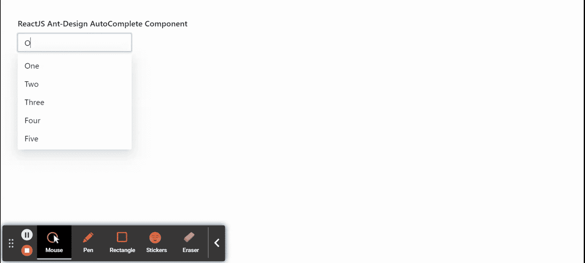

# 重新获取用户界面蚂蚁设计自动完成组件

> 原文:[https://www . geeksforgeeks . org/reactjs-ui-ant-design-autocomplete-component/](https://www.geeksforgeeks.org/reactjs-ui-ant-design-autocomplete-component/)

蚂蚁设计库预建了这个组件，也很容易集成。自动完成组件用于用选项值 自动完成自由文本值。我们可以在 ReactJS 中使用以下方法来使用 Ant 设计自动完成组件。

**自动完成方法:**

*   **blur():** 此方法用于去除元素的焦点。
*   **focus():** 此方法用于获取元素的焦点。

**自动完成道具:**

*   **允许清除:**用于显示清除按钮。
*   **自动对焦:**用于在安装组件时获得对焦。
*   **回填:**如果该值为真，则在使用键盘输入时，它会回填选定的项目。
*   **子项(用于自定义输入元素):**用于自定义输入元素。
*   **子级(对于数据源):**用于数据源自动完成。
*   **defaultactive first option:**用于表示第一个选项是否默认激活。
*   **默认打开:**表示下拉菜单的初始打开状态。
*   **默认值:**用于表示最初选择的选项。
*   **禁用:**用于禁用选择。
*   **dropdownClassName:** 用于传递下拉菜单样式的类名。
*   **DropDownMatchSelectWidth:**用于判断选择输入和下拉菜单的宽度是否相同。
*   **过滤选项:**如果设置为真，则用于对其应用过滤选项。
*   **notFoundContent:** 用于显示没有结果匹配时的内容。
*   **打开:**用于控制下拉菜单的打开状态。
*   **选项:**用于传递选择选项。
*   **占位符:**表示输入的占位符。
*   **值:**用于表示选择的选项值。
*   **onbulr:**是离开组件时触发的回调函数。
*   **onChange:** 是一个回调函数，在选择一个选项或输入值改变时触发。
*   **onDropdownVisibleChange:** 是一个回调函数，当下拉菜单打开时触发。
*   **onFocus:** 是进入组件时触发的回调函数。
*   **onSearch:** 是搜索项目时触发的回调函数。
*   **onSelect:** 是一个回调函数，在选择一个选项时触发。

**创建反应应用程序并安装模块:**

*   **步骤 1:** 使用以下命令创建一个反应应用程序:

    ```jsx
    npx create-react-app foldername
    ```

*   **步骤 2:** 创建项目文件夹(即文件夹名**)后，使用以下命令移动到该文件夹中:**

    ```jsx
    cd foldername
    ```

*   **步骤 3:** 创建 ReactJS 应用程序后，使用以下命令安装所需的****模块:****

    ```jsx
    **npm install antd**
    ```

******项目结构:**如下图。****

****

项目结构**** 

******示例:**现在在 **App.js** 文件中写下以下代码。在这里，App 是我们编写代码的默认组件。****

## ****App.js****

```jsx
**import React, { useState } from 'react'
import "antd/dist/antd.css";
import { AutoComplete } from 'antd';

export default function App() {

  const [currentValue, setCurrentValue] = useState('')
  const options = [
    {label: 'One', value: 'One'}, 
    {label: 'Two', value: 'Two'},
    {label: 'Three', value: 'Three'}, 
    {label: 'Four', value: 'Four'},
    {label: 'Five', value: 'Five'}
  ]

  return (
    <div style={{ display: 'block',
                  width: 700, padding: 30 }}>
      <h4>ReactJS Ant-Design AutoComplete Component</h4>
      <AutoComplete
        options={options}
        style={{ width: 200 }}
        onSelect={(value)=> {
            setCurrentValue(value)
        }}
        placeholder="Enter your text"
      /> <br />

      <p>Selected Value {`${currentValue}`} </p>

    </div>
  );
}**
```

******运行应用程序的步骤:**从项目的根目录使用以下命令运行应用程序:****

```jsx
**npm start**
```

******输出:**现在打开浏览器，转到***http://localhost:3000/***，会看到如下输出:****

********

******参考:**T2】https://ant.design/components/auto-complete/****