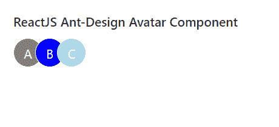

# ReactJS UI 蚂蚁设计头像组件

> 原文:[https://www . geeksforgeeks . org/reactjs-ui-ant-design-avatar-component/](https://www.geeksforgeeks.org/reactjs-ui-ant-design-avatar-component/)

蚂蚁设计库预建了这个组件，也很容易集成。头像组件用于表示人或物体，它支持图标、字母或图像。我们可以在 ReactJS 中使用以下方法来使用 Ant 设计化身组件。

**头像道具:**

*   **alt:** 用于定义描述图像的备选文本。
*   **间隙:**是左右两边字母类型的单位距离。
*   **图标:**用于定义图标头像的自定义图标类型。
*   **形状:**用来表示头像的形状。
*   **大小:**用来表示头像的大小。
*   **src:** 用于传递图像元素或头像的图像地址。
*   **srcSet:** 用于定义不同屏幕分辨率使用的信号源列表。
*   **可拖动:**表示图片是否允许拖动。
*   **onError:** 这是一个回调函数，当出现图像加载错误时触发。

**神通。团体道具:**

*   **maxCount:** 用于定义要显示的最大头像。
*   **maxPopoverPlacement:** 用于放置多余的头像 Popover。
*   **maxStyle:** 用于定义多余的头像样式。
*   **大小:**用来表示头像的大小。

**创建反应应用程序并安装模块:**

*   **步骤 1:** 使用以下命令创建一个反应应用程序:

    ```
    npx create-react-app foldername
    ```

*   **步骤 2:** 创建项目文件夹(即文件夹名**)后，使用以下命令移动到该文件夹中:**

    ```
    cd foldername
    ```

*   **步骤 3:** 创建 ReactJS 应用程序后，使用以下命令安装所需的****模块:****

    ```
    **npm install antd**
    ```

******项目结构:**如下图。****

****

项目结构**** 

******示例:**现在在 **App.js** 文件中写下以下代码。在这里，App 是我们编写代码的默认组件。****

## ****App.js****

```
**import React from 'react'
import "antd/dist/antd.css";
import { Avatar } from 'antd';

export default function App() {

  return (
    <div style={{
      display: 'block', width: 700, padding: 30
    }}>
      <h4>ReactJS Ant-Design Avatar Component</h4>
      <Avatar.Group>
        <Avatar style={{ backgroundColor: 'gray' }}>
          A
        </Avatar>
        <Avatar style={{ backgroundColor: 'blue' }}>
          B
        </Avatar>
        <Avatar style={{ backgroundColor: 'lightblue' }}>
          C
        </Avatar>
      </Avatar.Group>
    </div>
  );
}**
```

******运行应用程序的步骤:**从项目的根目录使用以下命令运行应用程序:****

```
**npm start**
```

******输出:**现在打开浏览器，转到***http://localhost:3000/***，会看到如下输出:****

********

******参考:**T2】https://ant.design/components/avatar/****