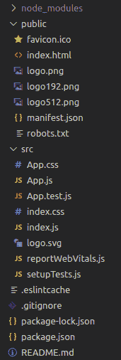
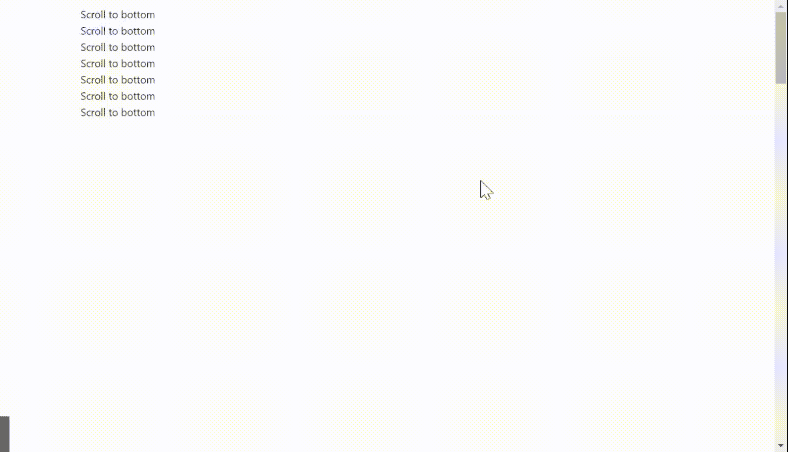

# 重新获取用户界面蚂蚁设计后台组件

> 原文:[https://www . geeksforgeeks . org/reactjs-ui-ant-design-back top-component/](https://www.geeksforgeeks.org/reactjs-ui-ant-design-backtop-component/)

BackTop 是 Ant Design 中的一个组件，当用户已经滚动页面返回页面顶部时，它提供了一个按钮，而不需要滚动回顶部。它会将用户带到页面顶部，并显示平滑的滚动动画。

蚂蚁设计库已经预建了这个组件，它也很容易集成。我们可以使用下面的方法轻松地使用这个 BackTop 组件。

#### 语法:

```
<BackTop>
      Scroll to Top
</BackTop>
```

#### 后台属性:

*   **持续时间**:该属性指定返回顶部的时间(毫秒)
*   **目标**:该属性指定可滚动区 dom 节点
*   **可见高度**:该属性指定在滚动高度达到该值之前，后退按钮不会显示
*   **onClick** :该属性指定一个回调函数，点击按钮即可执行

#### 创建反应应用程序和安装模块:

*   **步骤 1:** 使用以下命令创建一个 React 应用程序。

    ```
    npx create-react-app demo
    ```

*   **第二步**:创建项目文件夹即演示后，使用以下命令移动到它。

    ```
    cd demo
    ```

*   **步骤 3** :创建 ReactJS 应用程序后，使用以下命令安装 antd 库。

    ```
    npm install antd
    ```

**项目结构:**



**示例:**现在在 filename App.js 中编写以下代码

## app.js

```
import { BackTop } from "antd";
import "./App.css";
import "antd/dist/antd.css";

const style = {
  height: 40,
  width: 40,
  lineHeight: "40px",
  borderRadius: 4,
  backgroundColor: "#1088e9",
  color: "#fff",
  textAlign: "center",
  fontSize: 14,
};

function App() {
  return (
    <div className="App">
      <div style={{ height: "600vh", 
                    padding: 8, 
                    margin: "auto 20rem" }}>
        <div>Scroll to bottom</div>
        <div>Scroll to bottom</div>
        <div>Scroll to bottom</div>
        <div>Scroll to bottom</div>
        <div>Scroll to bottom</div>
        <div>Scroll to bottom</div>
        <div>Scroll to bottom</div>
        <BackTop>
          <div style={style}>UP</div>
        </BackTop>
      </div>
    </div>
  );
}

export default App;
```

**运行应用程序**:使用以下命令运行应用程序。

```
npm start
```

**输出:**现在打开浏览器，转到 **http://localhost:3000/** ，会看到如下输出。



**参考:**T2】https://ant.design/components/back-top/