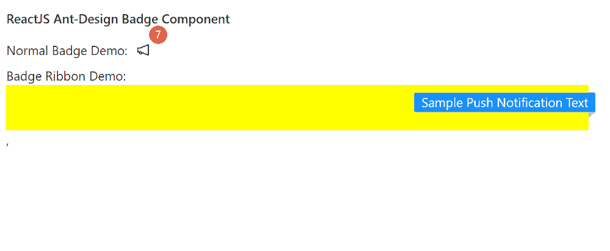

# 重新获取用户界面蚂蚁设计徽章组件

> 原文:[https://www . geeksforgeeks . org/reactjs-ui-ant-design-badge-component/](https://www.geeksforgeeks.org/reactjs-ui-ant-design-badge-component/)

蚂蚁设计库预建了这个组件，也很容易集成。徽章组件用作用户界面元素 的 s 商城数值或状态描述符。我们可以在 ReactJS 中使用以下方法来使用 Ant 设计徽章组件。

**徽章道具:**

*   **颜色:**用于自定义徽章圆点颜色。
*   **计数:**用于表示要在徽章中显示的数字。
*   **点:**表示是否显示红点而不是计数。
*   **偏移量:**用于设置徽章点的偏移量。
*   **overflowCount:** 用于表示要显示的最大计数。
*   **显示零:**用于指示计数为零时是否显示徽章。
*   **尺寸:**如果设置了计数，用于设置徽章的尺寸。
*   **状态:**用于将徽章设置为状态点。
*   **文字:**如果设置了状态，用于设置状态点的显示文字。
*   **标题:**用于表示悬停在徽章上方时要显示的文本。

**徽章。丝带**

*   **颜色:**用于自定义色带颜色。
*   **放置:**用于放置色带。
*   **文本:**用于表示丝带内部的内容。

**创建反应应用程序并安装模块:**

*   **步骤 1:** 使用以下命令创建一个反应应用程序:

    ```jsx
    npx create-react-app foldername
    ```

*   **步骤 2:** 创建项目文件夹(即文件夹名**)后，使用以下命令移动到该文件夹中:**

    ```jsx
    cd foldername
    ```

*   **步骤 3:** 创建 ReactJS 应用程序后，使用以下命令安装所需的模块:

```jsx
npm install antd
```

**项目结构:**如下图。


项目结构

**示例:**现在在 **App.js** 文件中写下以下代码。在这里，App 是我们编写代码的默认组件。

## App.js

```jsx
import React from 'react'
import "antd/dist/antd.css";
import { Badge } from 'antd';
import { NotificationOutlined } from '@ant-design/icons';

export default function App() {
  return (
    <div style={{
      display: 'block', width: 700, padding: 30
    }}>
      <h4>ReactJS Ant-Design Badge Component</h4>
      Normal Badge Demo:
      <Badge count={7}>
        <NotificationOutlined style={{ padding: 10 }} />
      </Badge>  <br />

      Badge Ribbon Demo:
      <Badge.Ribbon text="Sample Push Notification Text">
        <div style={{backgroundColor: 'yellow',
                     width: '100%', height: 50}}>
        </div>
      </Badge.Ribbon>,
    </div>
  );
}
```

**运行应用程序的步骤:**从项目的根目录使用以下命令运行应用程序:

```jsx
npm start
```

**输出:**现在打开浏览器，转到***http://localhost:3000/***，会看到如下输出:



**参考:**T2】https://ant.design/components/badge/