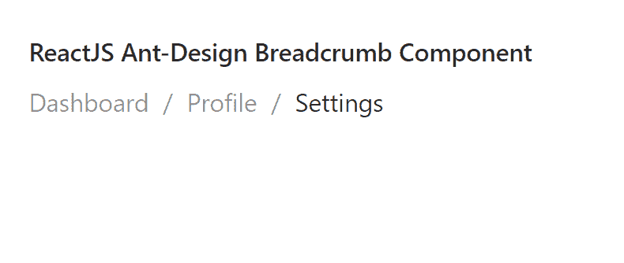

# 重新获取用户界面蚂蚁设计面包屑组件

> 原文:[https://www . geeksforgeeks . org/reactjs-ui-ant-design-bread crumb-component/](https://www.geeksforgeeks.org/reactjs-ui-ant-design-breadcrumb-component/)

蚂蚁设计库预建了这个组件，也很容易集成。面包屑组件  提供一种方式来指示当前页面 的位置。我们可以在 ReactJS 中使用以下方法来使用 Ant Design 面包屑组件。

**语法:**

```
<Breadcrumb>
  <Breadcrumb.Item>
   Content
  </Breadcrumb.Item>
</Breadcrumb>
```

**面包屑道具:**

*   **项目渲染:**用于指定要渲染的自定义项目。
*   **参数:**用于指定路由参数。
*   **路由:**用于表示路由器的路由栈信息。
*   **分隔符:**用于指定自定义分隔符。

**面包屑。物品道具:**

*   **类名:**用于指定该组件的类名。
*   **dropdowrops:**用于传递下拉道具。
*   **href:** 用于指定超链接的目标值。
*   **叠加:**用于指定下拉菜单。
*   **onClick:** 用于触发点击事件的回调。

**面包屑。分离器道具:**

*   **子项:**用于指定自定义分隔符。

**创建反应应用程序并安装模块:**

*   **步骤 1:** 使用以下命令创建一个反应应用程序:

    ```
    npx create-react-app foldername
    ```

*   **步骤 2:** 创建项目文件夹后，即文件夹名称**，**使用以下命令移动到项目文件夹:

    ```
    cd foldername
    ```

*   **步骤 3:** 创建 ReactJS 应用程序后，使用以下命令安装所需的****模块:****

    ```
    **npm install antd**
    ```

******项目结构:**如下图。****

****

项目结构**** 

******示例:**现在在 **App.js** 文件中写下以下代码。在这里，App 是我们编写代码的默认组件。****

## ****App.js****

```
**import React from 'react'
import "antd/dist/antd.css";
import { Breadcrumb } from 'antd';

export default function App() {

  return (
    <div style={{ display: 'block', width: 700, padding: 30 }}>
      <h4>ReactJS Ant-Design Breadcrumb Component</h4>
      <Breadcrumb>
        <Breadcrumb.Item>
          Dashboard
        </Breadcrumb.Item>
        <Breadcrumb.Item>
          <a href="#">Profile</a>
        </Breadcrumb.Item>
        <Breadcrumb.Item>
          <a href="#">Settings</a>
        </Breadcrumb.Item>
      </Breadcrumb>
    </div>
  );
}**
```

******运行应用程序的步骤:**从项目的根目录使用以下命令运行应用程序:****

```
**npm start**
```

******输出:**现在打开浏览器，转到***http://localhost:3000/***，会看到如下输出:****

********

******参考:**T2】https://ant.design/components/breadcrumb/****