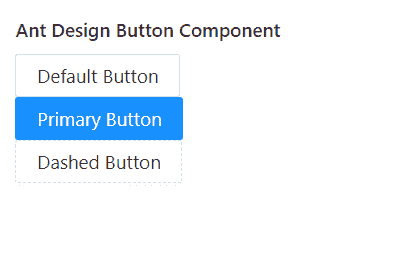

# 重新获取用户界面蚂蚁设计按钮组件

> 原文:[https://www . geeksforgeeks . org/reactjs-ui-ant-design-button-component/](https://www.geeksforgeeks.org/reactjs-ui-ant-design-button-component/)

蚂蚁设计库预建了这个组件，也很容易集成。按钮组件  为 用户提供了一种只需轻点一下就能采取行动和做出选择的方式。我们可以在 ReactJS 中使用以下方法来使用 Ant 设计按钮组件。

**按钮道具:**

*   **危险:**用于设置按钮的危险状态。
*   **块:**用作选项，使按钮的宽度适合其父宽度。
*   **禁用:**用于将按钮设置为禁用状态。
*   **ghost:** 用于反转文字和边框颜色，使背景透明。
*   **href:** 用于定义链接按钮的重定向 URL。
*   **htmlType:** 用于设置按钮的原始 HTML 类型。
*   **图标:**用于设置按钮的图标组件。
*   **加载:**用于设置按钮的加载状态。
*   **形状:**用于设置按钮形状。
*   **大小:**用于设置按钮的大小。
*   **目标:**与< a >标签的目标属性相同。
*   **类型:**用于表示按钮状虚线、初级等类型。
*   **onClick:** 用于点击按钮触发回调功能。

**创建反应应用程序并安装模块:**

*   **步骤 1:** 使用以下命令创建一个反应应用程序:

    ```
    npx create-react-app foldername
    ```

*   **步骤 2:** 在创建项目文件夹(即文件夹名**)后，使用以下命令将**移动到该文件夹:

    ```
    cd foldername
    ```

*   **步骤 3:** 创建 ReactJS 应用程序后，使用以下命令安装所需的****模块:****

    ```
    **npm install antd**
    ```

******项目结构:**如下图。****

****

项目结构**** 

******示例:**现在在 **App.js** 文件中写下以下代码。在这里，App 是我们编写代码的默认组件。****

## ****App.js****

```
**import React from 'react'
import "antd/dist/antd.css";
import { Button } from 'antd';

export default function App() {

  return (
    <div style={{ display: 'block', width: 700, padding: 30 }}>
      <h4>Ant Design Button Component</h4>
      <Button>Default Button</Button> <br />
      <Button type="primary">Primary Button</Button> <br />
      <Button type="dashed">Dashed Button</Button> <br />
    </div>
  );
}**
```

******运行应用程序的步骤:**从项目的根目录使用以下命令运行应用程序:****

```
**npm start**
```

******输出:**现在打开浏览器，转到***http://localhost:3000/***，会看到如下输出:****

********

******参考:**T2】https://ant.design/components/button/****