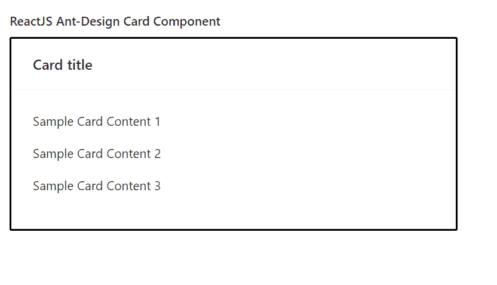

# ReactJS UI 蚂蚁设计卡组件

> 原文:[https://www . geeksforgeeks . org/reactjs-ui-ant-design-card-component/](https://www.geeksforgeeks.org/reactjs-ui-ant-design-card-component/)

蚂蚁设计库预建了这个组件，也很容易集成。Card Component 用作一个简单的矩形容器，当用户想要显示与单个主题相关的内容时使用。我们可以在 ReactJS 中使用以下方法来使用 Ant 设计卡组件。

**卡牌道具:**

*   **动作:**用于表示动作列表。
*   **活动标签键:**用于表示当前标签面板的键。
*   **bodyStyle:** 用于表示应用于卡片内容的内嵌样式。
*   **加边框:**用于切换卡片周围边框的渲染。
*   **封面:**用于表示卡片封面。
*   **默认活动选项卡键:**用于表示初始活动选项卡面板的键。
*   **额外:**用于内容在卡片右上角渲染。
*   **头像:**用于表示应用于卡头的内嵌样式。
*   **可悬停:**用于在卡格悬停时抬升。
*   **加载:**用于在取卡时显示加载指示。
*   **大小:**用来表示卡片的大小。
*   **标签栏额外内容:**用于表示标签栏中的额外内容。
*   **tabList:** 用来表示 TabPane 头部的列表。
*   **Tab 道具:**用来表示 Tab 道具。
*   **标题:**用于表示卡片标题。
*   **类型:**用于表示卡片样式类型。
*   **onTabChange:** 是切换标签时触发的回调函数。

**卡片。格子道具:**

*   **类名:**用于表示容器的类名。
*   **可悬停:**用于在卡格悬停时抬升。
*   **样式:**用于传递容器的样式对象。

**卡片。元道具:**

*   **头像:**用来表示头像或图标。
*   **类名:**用于表示容器的类名。
*   **描述:**用于表示描述内容。
*   **样式:**用于传递容器的样式对象。
*   **标题:**用于表示标题内容。

**创建反应应用程序并安装模块:**

*   **步骤 1:** 使用以下命令创建一个反应应用程序:

    ```jsx
    npx create-react-app foldername
    ```

*   **步骤 2:** 在创建项目文件夹(即文件夹名**)后，使用以下命令将**移动到该文件夹:

    ```jsx
    cd foldername
    ```

*   **步骤 3:** 创建 ReactJS 应用程序后，使用以下命令安装所需的****模块:****

    ```jsx
    **npm install antd**
    ```

******项目结构:**如下图。****

****

项目结构**** 

******示例:**现在在 **App.js** 文件中写下以下代码。在这里，App 是我们编写代码的默认组件。****

## ****App.js****

```jsx
**import React from 'react'
import "antd/dist/antd.css";
import { Card } from 'antd';

export default function App() {

  return (
    <div style={{
      display: 'block', width: 700, padding: 30
    }}>
      <h4>ReactJS Ant-Design Card Component</h4>
      <>
        <Card title="Card title" bordered
          style={{
            width: 500,
            border: '2px solid black'
          }}>
          <p>Sample Card Content 1</p>

          <p>Sample Card Content 2</p>

          <p>Sample Card Content 3</p>

        </Card>
      </>
    </div>
  );
}**
```

******运行应用程序的步骤:**从项目的根目录使用以下命令运行应用程序:****

```jsx
**npm start**
```

******输出:**现在打开浏览器，转到***http://localhost:3000/***，会看到如下输出:****

********

******参考:**T2】https://ant.design/components/card/****