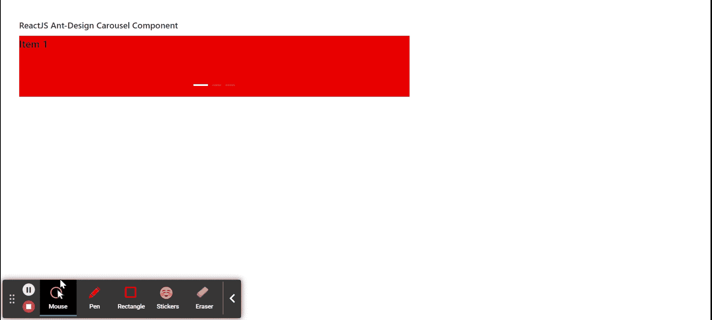

# 重新获取用户界面蚂蚁设计转盘组件

> 原文:[https://www . geeksforgeeks . org/reactjs-ui-ant-design-carousel-component/](https://www.geeksforgeeks.org/reactjs-ui-ant-design-carousel-component/)

蚂蚁设计库预建了这个组件，也很容易集成。轮播组件用于显示滑动项，当同一层级有一组内容时使用。我们可以在 ReactJS 中使用以下方法来使用 Ant 设计转盘组件。

**转盘道具:**

*   **自动播放:**用于指示是否自动滚动。
*   **点位置:**用于定位点。
*   **点:**用于指示是否显示图库底部的点、dotsClass 的对象以及其他任何点。
*   **缓和:**是过渡插值函数名。
*   **效果:**用于过渡效果。
*   **afterChange:** 是当前指数变化后触发的回调函数。
*   **beforeChange:** 是当前指数变化前触发的回调函数。

**方法:**

*   **goTo(slideNumber，dontAnimate):** 此功能用于转到幻灯片索引，如果 *dontAnimate=true* 则无动画发生。
*   **next():** 此功能用于将当前幻灯片切换到下一张幻灯片。
*   **prev():** 此功能用于将当前幻灯片更改为上一张幻灯片。

**创建反应应用程序并安装模块:**

*   **步骤 1:** 使用以下命令创建一个反应应用程序:

    ```jsx
    npx create-react-app foldername
    ```

*   **步骤 2:** 在创建项目文件夹(即文件夹名**)后，使用以下命令将**移动到该文件夹:

    ```jsx
    cd foldername
    ```

*   **步骤 3:** 创建 ReactJS 应用程序后，使用以下命令安装所需的****模块:****

    ```jsx
    **npm install antd**
    ```

******项目结构:**如下图。****

****

项目结构**** 

******示例:**现在在 **App.js** 文件中写下以下代码。在这里，App 是我们编写代码的默认组件。****

## ****App.js****

```jsx
**import React from 'react'
import "antd/dist/antd.css";
import { Carousel } from 'antd';

export default function App() {

  return (
    <div style={{
      display: 'block', width: 700, padding: 30
    }}>
      <h4>ReactJS Ant-Design Carousel Component</h4>
      <>
        <Carousel>
          <div>
            <h3 style={{ backgroundColor: 'red', 
                         height: 100 }}>Item 1</h3>
          </div>
          <div>
            <h3 style={{ backgroundColor: 'blue',
                         height: 100 }}>Item 2</h3>
          </div>
          <div>
            <h3 style={{ backgroundColor: 'yellow', 
                         height: 100 }}>Item 3</h3>
          </div>
        </Carousel>
      </>
    </div>
  );
}**
```

******运行应用程序的步骤:**从项目的根目录使用以下命令运行应用程序:****

```jsx
**npm start**
```

******输出:**现在打开浏览器，转到***http://localhost:3000/***，会看到如下输出:****

********

******参考:**T2】https://ant.design/components/carousel/****