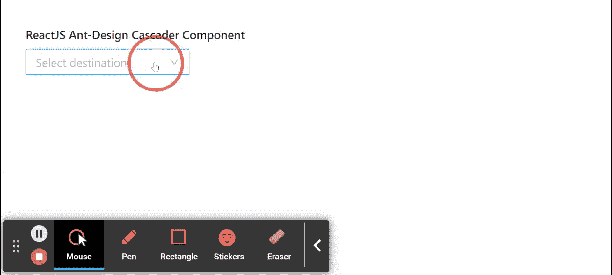

# 重新获取用户界面蚂蚁设计级联组件

> 原文:[https://www . geeksforgeeks . org/reactjs-ui-ant-design-cascader-component/](https://www.geeksforgeeks.org/reactjs-ui-ant-design-cascader-component/)

蚂蚁设计库预建了这个组件，也很容易集成。Cascader 组件用作 c 作为代码选择框。当用户需要从一组中选择关联数据组时，使用该组件。我们可以在 ReactJS 中使用以下方法来使用 Ant Design Cascader 组件。

**梯级推进剂:**

*   **允许清除:**表示是否允许清除。
*   **自动对焦:**如果设置为真，用于在组件安装时对焦。
*   **有边框:**表示是否有边框样式。
*   **更改选择:**如果设置为真，则用于更改每个选择的值。
*   **类名:**用于附加 CSS 类。
*   **默认值:**用于表示最初选择的值。
*   **禁用:**表示是否禁用选择。
*   **显示渲染:**是显示选中选项的渲染功能。
*   **dropdownRender:** 用于自定义下拉内容。
*   **展开图标:**用于自定义当前项目展开图标。
*   **expandTrigger:** 用于在点击或悬停时展开当前项目，点击悬停其中之一。
*   **字段名:**用于标签和值及子项的自定义字段名。
*   **getPopupContainer:** 它是选择器应该呈现到的父节点。
*   **loadData:** 用于惰性加载选项。
*   **notFoundContent:** 用于指定无结果匹配时显示的内容。
*   **选项:**用于级联的数据选项。
*   **占位符:**用于表示输入占位符。
*   **弹出类名:**用于弹出叠加的附加类名。
*   **弹出窗口:**用于预设弹出窗口对齐。
*   **弹出菜单:**用于设置级联弹出菜单的可见性
*   **显示搜索:**用于指示是否以单模方式显示搜索输入。
*   **大小:**用于表示输入大小。
*   **样式:**用于附加样式。
*   **后缀图标:**用于自定义后缀图标。
*   **值:**用于表示选择的值。
*   **onChange:** 是一个回调函数，在完成级联选择时触发。
*   **onopupvisiblechange:**是弹出窗口显示或隐藏时触发的回调函数。

**展示搜索道具:**

*   **过滤:**如果此函数返回真，作为参数传递给此函数的选项将包含在过滤集中，否则将被排除。
*   **限制:**用于设置过滤项目的计数。
*   **matchinputwith:**用于表示列表宽度是否与输入匹配。
*   **渲染:**用于渲染过滤后的选项。
*   **排序:**用于对过滤后的选项进行排序。

**方法:**

*   **模糊():**此功能用于去除焦点。
*   **focus():** 此功能用于获取焦点。

**创建反应应用程序并安装模块:**

*   **步骤 1:** 使用以下命令创建一个反应应用程序:

    ```jsx
    npx create-react-app foldername
    ```

*   **步骤 2:** 在创建项目文件夹(即文件夹名**)后，使用以下命令将**移动到该文件夹:

    ```jsx
    cd foldername
    ```

*   **步骤 3:** 创建 ReactJS 应用程序后，使用以下命令安装所需的****模块:****

    ```jsx
    **npm install antd**
    ```

******项目结构:**如下图。****

****

项目结构**** 

******示例:**现在在 **App.js** 文件中写下以下代码。在这里，App 是我们编写代码的默认组件。****

## ****App.js****

```jsx
**import React from 'react'
import "antd/dist/antd.css";
import { Cascader } from 'antd';

export default function App() {

  return (
    <div style={{
      display: 'block', width: 700, padding: 30
    }}>
      <h4>ReactJS Ant-Design Cascader Component</h4>
      <>
        <Cascader
          options={[
            {
              value: 'Madhya Pradesh',
              label: 'Madhya Pradesh',
              children: [
                {
                  value: 'Indore',
                  label: 'Indore',
                  children: [
                    {
                      value: 'Vijay Nagar',
                      label: 'Vijay Nagar',
                    }, {
                      value: 'Bhawarkuwa',
                      label: 'Bhawarkuwa',
                    },
                    {
                      value: 'MR10',
                      label: 'MR10',
                    },
                  ],
                },
              ],
            },
          ]}
          onChange={(data) => { console.log(data) }}
          placeholder="Select destination" />
      </>
    </div>
  );
}**
```

******运行应用程序的步骤:**从项目的根目录使用以下命令运行应用程序:****

```jsx
**npm start**
```

******输出:**现在打开浏览器，转到***http://localhost:3000/***，会看到如下输出:****

********

******参考:**T2】https://ant.design/components/cascader/****