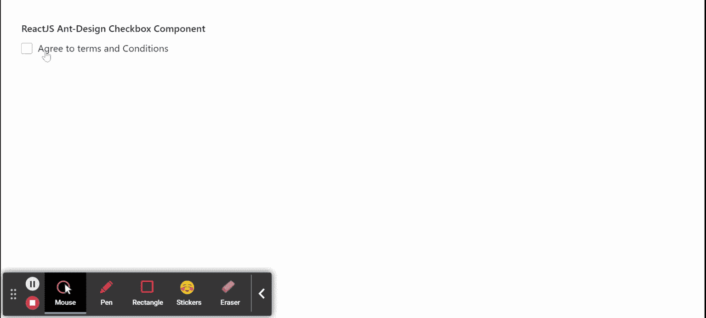

# 重新获取用户界面蚂蚁设计复选框组件

> 原文:[https://www . geeksforgeeks . org/reactjs-ui-ant-design-checkbox-component/](https://www.geeksforgeeks.org/reactjs-ui-ant-design-checkbox-component/)

蚂蚁设计库预建了这个组件，也很容易集成。复选框组件允许用户从给定选项中进行二进制选择。我们可以在 ReactJS 中使用以下方法来使用 Ant 设计复选框组件。

**复选框方法:**

*   **blur():** 此方法用于去除元素的焦点。
*   **focus():** 此方法用于获取元素的焦点。

**复选框道具:**

*   **自动对焦:**用于安装组件时对焦。
*   **选中:**表示复选框是否被选中。
*   **默认选中:**用于指定复选框是否被选中的初始状态。
*   **禁用:**用于禁用复选框。
*   **不确定:**用于表示复选框的不确定选中状态。
*   **onChange:** 是状态变化时触发的回调函数。

**复选框组道具:**

*   **默认值:**用于定义复选框的默认选定值。
*   **禁用:**用于禁用所有复选框。
*   **名称:**用于定义所有类型为*复选框的输入子项的名称属性。*
*   **选项:**用于指定选项。
*   **值:**用于设置当前选择的值。
*   **onChange:** 是状态变化时触发的回调函数。

**创建反应应用程序并安装模块:**

*   **步骤 1:** 使用以下命令创建一个反应应用程序:

    ```jsx
    npx create-react-app foldername
    ```

*   **步骤 2:** 创建项目文件夹(即文件夹名**)后，使用以下命令移动到该文件夹中:**

    ```jsx
    cd foldername
    ```

*   **步骤 3:** 创建 ReactJS 应用程序后，使用以下命令安装所需的****模块:****

    ```jsx
    **npm install antd**
    ```

******项目结构:**如下图。****

****

项目结构**** 

******示例:**现在在 **App.js** 文件中写下以下代码。在这里，App 是我们编写代码的默认组件。****

## ****App.js****

```jsx
**import React from 'react'
import "antd/dist/antd.css";
import { Checkbox } from 'antd';

export default function App() {

  return (
    <div style={{ display: 'block',
                  width: 700, padding: 30 }}>
      <h4>ReactJS Ant-Design Checkbox Component</h4>
      <Checkbox onChange={()=> {
         alert("You Checked the box!")
      }}>Agree to terms and Conditions</Checkbox>
    </div>
  );
}**
```

******运行应用程序的步骤:**从项目的根目录使用以下命令运行应用程序:****

```jsx
**npm start**
```

******输出:**现在打开浏览器，转到***http://localhost:3000/***，会看到如下输出:****

********

******参考:**T2】https://ant.design/components/checkbox/****