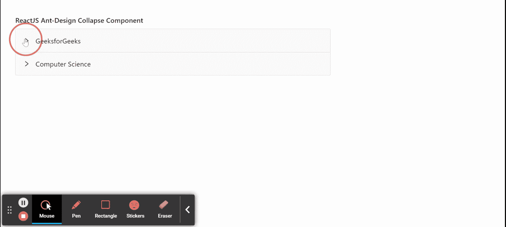

# 重新获取用户界面蚂蚁设计折叠组件

> 原文:[https://www . geeksforgeeks . org/reactjs-ui-ant-design-collapse-component/](https://www.geeksforgeeks.org/reactjs-ui-ant-design-collapse-component/)

蚂蚁设计库预建了这个组件，也很容易集成。折叠组件用作可折叠和展开的内容区域。我们可以在 ReactJS 中使用以下方法来使用 Ant 设计折叠组件。

**塌陷道具:**

*   **手风琴:**如果该值设置为真，则用于折叠渲染为手风琴。
*   **活动键:**用于表示活动面板的键。
*   **加边框:**用于切换折叠块周围边框的渲染。
*   **可折叠:**用于指定子面板或触发区域是否可折叠。
*   **defaultActiveKey:** 用于表示初始活动面板的按键。
*   **摧毁无效面板:**用来摧毁无效面板。
*   **expandIcon:** 用于自定义折叠图标。
*   **展开图标位置:**用于设置展开图标位置。
*   **鬼影:**用于使塌陷背景透明无边界。
*   **onChange:** 是活动面板改变时触发的回调函数。

**崩溃。面板道具**

*   **可折叠:**用于指定面板或触发区域是否可折叠。
*   **extra:** 用来表示角落的额外元素。
*   **强制渲染:**点击表头时，用于强制渲染面板上的内容，而不是懒渲染。
*   **表头:**用于定义面板的标题。
*   **键:**是识别面板的唯一键。
*   **显示箭头:**如果为真，则显示箭头图标。

**创建反应应用程序并安装模块:**

*   **步骤 1:** 使用以下命令创建一个反应应用程序:

    ```
    npx create-react-app foldername
    ```

*   **步骤 2:** 创建项目文件夹(即文件夹名**)后，使用以下命令移动到该文件夹中:**

    ```
    cd foldername
    ```

*   **步骤 3:** 创建 ReactJS 应用程序后，使用以下命令安装所需的****模块:****

    ```
    **npm install antd**
    ```

******项目结构:**如下图。****

****

项目结构**** 

******示例:**现在在 **App.js** 文件中写下以下代码。在这里，App 是我们编写代码的默认组件。****

## ****App.js****

```
**import React from 'react'
import "antd/dist/antd.css";
import { Collapse } from 'antd';

const { Panel } = Collapse;

export default function App() {
  return (
    <div style={{
      display: 'block', width: 700, padding: 30
    }}>
      <h4>ReactJS Ant-Design Collapse Component</h4>
      <Collapse>
        <Panel header="GeeksforGeeks" key="1">

<p>Greetings from GeeksforGeeks</p>

        </Panel>
        <Panel header="Computer Science" key="2">

<p>This is Best computer Science Portal</p>

        </Panel>
      </Collapse>
    </div>
  );
}**
```

******运行应用程序的步骤:**从项目的根目录使用以下命令运行应用程序:****

```
**npm start**
```

******输出:**现在打开浏览器，转到***http://localhost:3000/***，会看到如下输出:****

********

******参考:**T2】https://ant.design/components/collapse/****