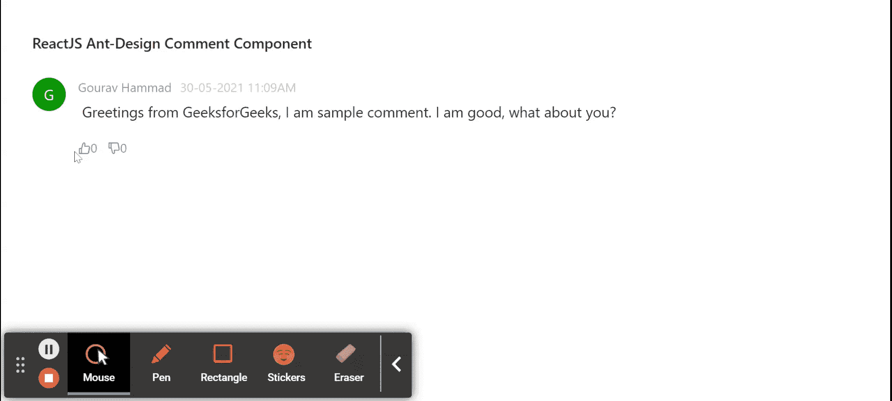

# ReactJS UI 蚂蚁设计评论组件

> 原文:[https://www . geeksforgeeks . org/reactjs-ui-ant-design-comment-component/](https://www.geeksforgeeks.org/reactjs-ui-ant-design-comment-component/)

蚂蚁设计库预建了这个组件，也很容易集成。评论组件用于添加用户评论，用于显示用户反馈和他对这个评论框的讨论。我们可以在 ReactJS 中使用以下方法来使用 Ant 设计注释组件。

**comment proposs:**

*   **动作:**用于表示在评论内容下方呈现的动作项列表。
*   **作者:**用于表示显示为评论作者的元素。
*   **头像:**用于表示显示为评论头像的元素。
*   **子级:**用于表示嵌套注释应作为注释的子级提供。
*   **内容:**用于表示评论的主要内容。
*   **日期时间:**用于表示包含要显示的时间的*日期时间*元素。

**创建反应应用程序并安装模块:**

*   **步骤 1:** 使用以下命令创建一个反应应用程序:

    ```
    npx create-react-app foldername
    ```

*   **步骤 2:** 创建项目文件夹(即文件夹名**)后，使用以下命令移动到该文件夹中:**

    ```
    cd foldername
    ```

*   **步骤 3:** 创建 ReactJS 应用程序后，使用以下命令安装所需的****模块:****

    ```
    **npm install antd
    npm install --save @ant-design/icons**
    ```

******项目结构:**如下图。****

****

项目结构**** 

******示例:**现在在 **App.js** 文件中写下以下代码。在这里，App 是我们编写代码的默认组件。****

## ****App.js****

```
**import React, { createElement, useState } from 'react';
import { Comment, Avatar, Tooltip } from 'antd';
import "antd/dist/antd.css";
import {
  LikeOutlined, DislikeFilled,
  DislikeOutlined, LikeFilled
} from '@ant-design/icons';

export default function App() {

  // To maintain Like state
  const [likesCount, setLikesCount] = useState(0);

  // To maintain Dislike state
  const [dislikesCount, setDislikesCount] = useState(0);

  // To maintain action state
  const [action, setAction] = useState(null);

  return (
    <div style={{
      display: 'block', width: 700, padding: 30
    }}>
      <h4>ReactJS Ant-Design Comment Component</h4>
      <Comment
        author={<a>Gourav Hammad</a>}
        avatar={<Avatar style={{ backgroundColor: 'green' }}>G</Avatar>}
        content={
          <p> 
           Greetings from GeeksforGeeks, I am sample comment.
           I am good, what about you?
          </p>

        }
        actions={[
          <Tooltip title="Like">
            <span onClick={() => {
              setLikesCount(1);
              setDislikesCount(0);
              setAction('liked');
            }}>
              {createElement(action === 'liked' ? 
              LikeFilled : LikeOutlined)}
              {likesCount}
            </span>
          </Tooltip>,
          <Tooltip title="Dislike">
            <span onClick={() => {
              setLikesCount(0);
              setDislikesCount(1);
              setAction('disliked');
            }}>
              {React.createElement(action === 'disliked' ? 
              DislikeFilled : DislikeOutlined)}
              {dislikesCount}
            </span>
          </Tooltip>
        ]}
        datetime={'30-05-2021 11:09AM'}
      />
    </div>
  );
}**
```

******运行应用程序的步骤:**从项目的根目录使用以下命令运行应用程序:****

```
**npm start**
```

******输出:**现在打开浏览器，转到***http://localhost:3000/***，会看到如下输出:****

********

******参考:**T2】https://ant.design/components/comment/****