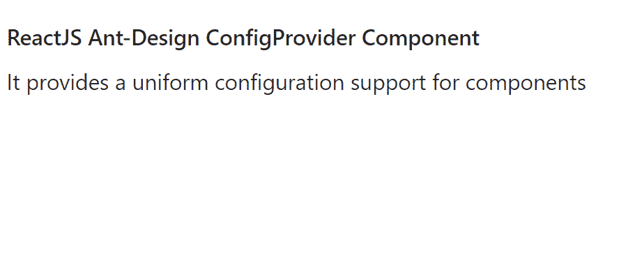

# 重新获取用户界面蚂蚁设计配置提供程序组件

> 原文:[https://www . geeksforgeeks . org/reactjs-ui-ant-design-config provider-component/](https://www.geeksforgeeks.org/reactjs-ui-ant-design-configprovider-component/)

蚂蚁设计库预建了这个组件，也很容易集成。ConfigProvider 组件用于为组件提供统一的配置支持。我们可以在 ReactJS 中使用以下方法来使用 Ant 设计配置提供程序组件。

**配置提供者道具：**

*   **autoInsertSpaceInButton:** 设置为 false 时，删除按钮上 2 个汉字之间的空格。
*   **组件大小:**用于配置 antd 组件大小。
*   **csp:** 用于设置内容安全策略配置。
*   **方向:**用于设置布局的方向。
*   **DropDownMatchSelectWidth:**用于判断下拉菜单和选择输入的宽度是否相同。
*   **形态:**用于设置形态常用道具。
*   **getPopupContainer:** 用于设置弹出元素的容器。
*   **getTargetContainer:** 用于配置词缀、锚点滚动目标容器。
*   **图标前缀前缀:**用于设置图标前缀类名。
*   **输入:**用于设置 input 常用道具。
*   **地区:**用于表示语言包设置。
*   **pageHeader:** 用于统一 pageHeader 的幽灵。
*   **前缀:**用于设置前缀类名。
*   **renderEmpty:** 用于设置组件的空内容。
*   **空间:**用于设置空间大小。
*   **虚拟:**设置为假时，用于禁用虚拟滚动。

**创建反应应用程序并安装模块:**

*   **步骤 1:** 使用以下命令创建一个反应应用程序:

    ```
    npx create-react-app foldername
    ```

*   **步骤 2:** 在创建项目文件夹(即文件夹名**)后，使用以下命令将**移动到该文件夹:

    ```
    cd foldername
    ```

*   **步骤 3:** 创建 ReactJS 应用程序后，使用以下命令安装所需的****模块:****

    ```
    **npm install antd**
    ```

******项目结构:**如下图。****

****

项目结构**** 

******示例:**现在在 **App.js** 文件中写下以下代码。在这里，App 是我们编写代码的默认组件。****

## ****App.js****

```
**import React from 'react'
import "antd/dist/antd.css";
import { ConfigProvider } from 'antd';

export default function App() {
  return (
    <div style={{
      display: 'block', width: 700, padding: 30
    }}>
      <h4>ReactJS Ant-Design ConfigProvider Component</h4>
      <ConfigProvider componentSize={"small"}>
        <label>
          It provides a uniform configuration 
          support for components
        </label>
      </ConfigProvider>
    </div>
  );
}**
```

******运行应用程序的步骤:**从项目的根目录使用以下命令运行应用程序:****

```
**npm start**
```

******输出:**现在打开浏览器，转到***http://localhost:3000/***，会看到如下输出:****

********

******参考:**T2】https://ant.design/components/config-provider/****