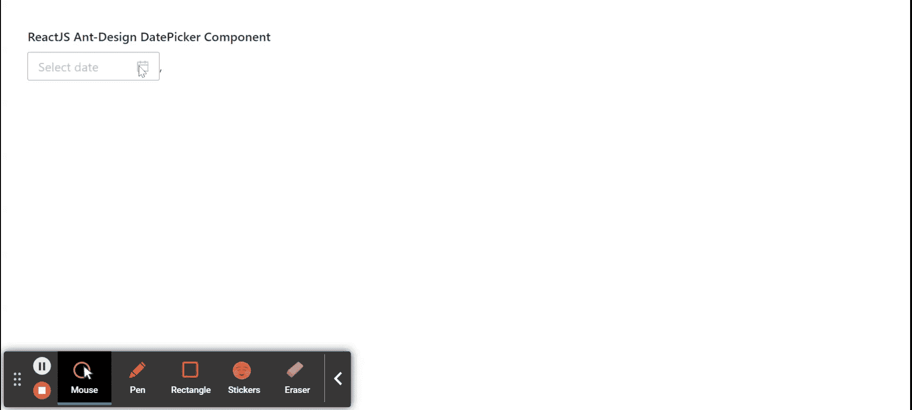

# 重新获取用户界面蚂蚁设计日期选择器组件

> 原文:[https://www . geeksforgeeks . org/reactjs-ui-ant-design-date picker-component/](https://www.geeksforgeeks.org/reactjs-ui-ant-design-datepicker-component/)

蚂蚁设计库预建了这个组件，也很容易集成。日期选择器组件用于当用户点击输入框时，从弹出面板中选择一个日期。我们可以在 ReactJS 中使用以下方法来使用 Ant 设计日期选择器组件。

**常用原料药:**

*   **allowClear:** 表示是否允许清除文本。
*   **自动对焦:**如果设置为真，则用于在安装组件时获取焦点。
*   **有边框:**表示是否有边框样式。
*   **类名:**用于传递拾取器的类名。
*   **dateRender:** 用作日期单元格的自定义渲染函数。
*   **禁用:**用于确定日期选择器是否禁用。
*   **disabledDate:** 用于指定不能选择的日期。
*   **dropdownClassName:** 用于自定义弹出日历的类名。
*   **getPopupContainer:** 用于设置浮动层的容器。
*   **inputReadOnly:** 用于设置输入标签的只读属性。
*   **地区:**用于本地化配置。
*   **模式:**用于表示拾取器面板模式。
*   **打开:**用于表示采摘机的打开状态。
*   **面板渲染:**用于自定义面板渲染。
*   **提货人:**用于设置提货人类型日期。
*   **占位符:**表示日期输入的占位符。
*   **弹出样式:**用于自定义弹出日历的样式。
*   **大小:**用于确定输入框的大小。
*   **样式:**用于自定义输入框的样式。
*   **后缀图标:**用于自定义后缀图标。
*   **onOpenChange:** 是弹出或关闭弹出日历时可以触发的回调函数。
*   **onPanelChange:** 是一个回拨功能，在机械臂面板模式改变时触发。

**DatePicker Props:**

*   **默认提货日期值:**用于设置默认提货日期。
*   **默认值:**如果开始时间或结束时间为空或未定义，则用于设置默认日期。
*   **disabledTime:** 用于指定不能选择的时间。
*   **格式:**用于设置日期格式。
*   **渲染额外页脚:**用于在面板中渲染额外的页脚。
*   **showNow:** 用于指示设置 showTime 时是否在面板上显示‘Now’按钮。
*   **showTime:** 用于提供额外的时间选择对象。
*   **showTime.defaultValue:** 用于设置所选日期的默认时间。
*   **显示今日:**表示是否显示今日按钮。
*   **值:**用于设置日期。
*   **onChange:** 是选择的时间发生变化时触发的回调函数。
*   **onOk:** 是点击确定按钮时触发的回调功能。
*   **onPanelChange:** 是面板变化触发的回调函数。

**日期选取器【选取器=年份】道具:**

*   **默认提货日期值:**用于设置默认提货日期。
*   **默认值:**用于设置默认日期。
*   **格式:**用于设置日期格式。
*   **渲染额外页脚:**用于在面板中渲染额外的页脚。
*   **值:**用于设置日期。
*   **onChange:** 是选择的时间发生变化时触发的回调函数。

**日期选取器【选取器=季度】道具:**

*   **默认提货日期值:**用于设置默认提货日期。
*   **默认值:**用于设置默认日期。
*   **格式:**用于设置日期格式。
*   **渲染额外页脚:**用于在面板中渲染额外的页脚。
*   **值:**用于设置日期。
*   **onChange:** 是选择的时间发生变化时触发的回调函数。

**日期选取器【选取器=月份】道具:**

*   **默认提货日期值:**用于设置默认提货日期。
*   **默认值:**用于设置默认日期。
*   **格式:**用于设置日期格式。
*   **monthCellRender:** 用于自定义月份单元格内容呈现方式。
*   **渲染额外页脚:**用于在面板中渲染额外的页脚。
*   **值:**用于设置日期。
*   **onChange:** 是选择的时间发生变化时触发的回调函数。

**日期选取器【选取器=周】道具:**

*   **默认提货日期值:**用于设置默认提货日期。
*   **默认值:**用于设置默认日期。
*   **格式:**用于设置日期格式。
*   **渲染额外页脚:**用于在面板中渲染额外的页脚。
*   **值:**用于设置日期。
*   **onChange:** 是选择的时间发生变化时触发的回调函数。

**方法:**

*   **模糊():**此方法用于去除焦点。
*   **焦点():**这个方法是用来获取焦点的。

**RangePicker Props:**

*   **允许空:**用于允许开始或结束输入留空。
*   **日期渲染:**用于自定义日期单元格。
*   **默认提货日期值:**用于设置默认提货日期。
*   **默认值:**用于设置默认日期。
*   **禁用:**表示是否禁用开始或结束。
*   **disabledTime:** 用于指定不能选择的时间。
*   **格式:**用于设置日期格式。
*   **范围:**用于快速选择的预设范围。
*   **渲染额外页脚:**用于在面板中渲染额外的页脚。
*   **分隔符:**用于设置输入之间的分隔符。
*   **显示时间:**用于提供额外的时间选择。
*   **showTime.defaultValue:** 用于设置所选日期的默认时间。
*   **值:**用于设置日期。
*   **onCalendarChange:** 是当范围的开始时间或结束时间发生变化时触发的回调函数。
*   **onChange:** 是选择的时间发生变化时触发的回调函数。

**创建反应应用程序并安装模块:**

*   **步骤 1:** 使用以下命令创建一个反应应用程序:

    ```
    npx create-react-app foldername
    ```

*   **步骤 2:** 创建项目文件夹(即文件夹名**)后，使用以下命令移动到该文件夹中:**

    ```
    cd foldername
    ```

*   **步骤 3:** 创建 ReactJS 应用程序后，使用以下命令安装所需的****模块:****

     ****```
    npm install antd
    ```**** 

******项目结构:**如下图。****

****

项目结构**** 

******示例:**现在在 **App.js** 文件中写下以下代码。在这里，App 是我们编写代码的默认组件。****

## ****App.js****

```
**import React from 'react'
import "antd/dist/antd.css";
import { DatePicker } from 'antd';

export default function App() {

  return (
    <div style={{
      display: 'block', width: 700, padding: 30
    }}>
      <h4>ReactJS Ant-Design DatePicker Component</h4>
      <>
        <DatePicker onChange={(date) => console.log(date)} />,
      </>
    </div>
  );
}**
```

******运行应用程序的步骤:**从项目的根目录使用以下命令运行应用程序:****

```
**npm start**
```

******输出:**现在打开浏览器，转到***http://localhost:3000/***，会看到如下输出:****

********

******参考:**T2】https://ant.design/components/date-picker/****