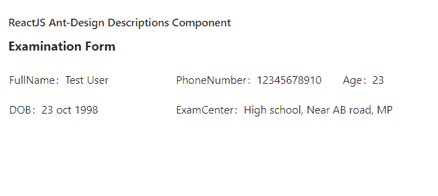

# 重新获取用户界面蚂蚁设计描述组件

> 原文:[https://www . geeksforgeeks . org/reactjs-ui-ant-design-descriptions-component/](https://www.geeksforgeeks.org/reactjs-ui-ant-design-descriptions-component/)

蚂蚁设计库预建了这个组件，也很容易集成。描述组件用于在组 中显示多个只读字段。该组件通常用于应用的详细信息页面。我们可以在 ReactJS 中使用以下方法来使用 Ant 设计描述组件。

**描述道具:**

*   **加边框:**表示是否显示边框。
*   **冒号:**用于更改*说明默认道具冒号的值。项目*。
*   **列:**用于表示*描述的编号。连续物品*。
*   **contentStyle:** 用于自定义标签样式。
*   **extra:** 用于描述列表的动作区，放置在右上角位置。
*   **标签样式:**用于自定义标签样式。
*   **布局:**用于定义描述布局。
*   **大小:**用于设置列表的大小。
*   **标题:**用于定义描述列表的标题，置于顶部。

**描述。物品道具:**

*   **contentStyle:** 用于自定义标签样式。
*   **标签:**用于定义内容的描述。
*   **标签样式:**用于自定义标签样式。
*   **span:** 用于表示包含的列数。

**创建反应应用程序并安装模块:**

*   **步骤 1:** 使用以下命令创建一个反应应用程序:

    ```
    npx create-react-app foldername
    ```

*   **步骤 2:** 创建项目文件夹(即文件夹名**)后，使用以下命令移动到该文件夹中:**

    ```
    cd foldername
    ```

*   **步骤 3:** 创建 ReactJS 应用程序后，使用以下命令安装所需的****模块:****

    ```
    **npm install antd**
    ```

******项目结构:**如下图。****

****

项目结构**** 

******示例:**现在在 **App.js** 文件中写下以下代码。在这里，App 是我们编写代码的默认组件。****

## ****App.js****

```
**import React from 'react'
import "antd/dist/antd.css";
import { Descriptions } from 'antd';

export default function App() {
  return (
    <div style={{
      display: 'block', width: 700, padding: 30
    }}>
      <h4>ReactJS Ant-Design Descriptions Component</h4>
      <Descriptions title="Examination Form">
        <Descriptions.Item label="FullName
        ">Test User</Descriptions.Item>
        <Descriptions.Item label="PhoneNumber">12345678910</Descriptions.Item>
        <Descriptions.Item label="Age">23</Descriptions.Item>
        <Descriptions.Item label="DOB">23 oct 1998</Descriptions.Item>
        <Descriptions.Item label="ExamCenter">High school, Near AB road, MP
        </Descriptions.Item>
      </Descriptions>
    </div>
  );
}**
```

******运行应用程序的步骤:**从项目的根目录使用以下命令运行应用程序:****

```
**npm start**
```

******输出:**现在打开浏览器，转到***http://localhost:3000/***，会看到如下输出:****

********

******参考:**T2】https://ant.design/components/descriptions/****