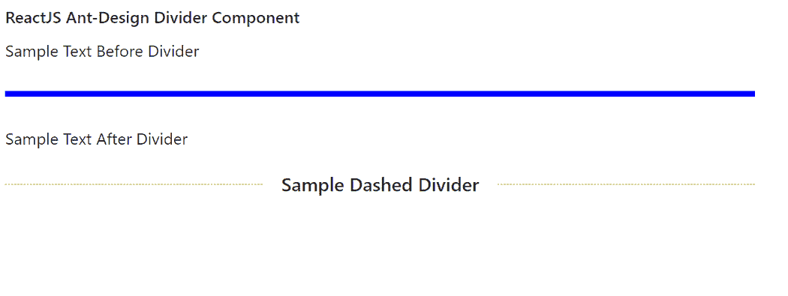

# 反应界面蚂蚁设计分割器组件

> 原文:[https://www . geeksforgeeks . org/reactjs-ui-ant-design-divider-component/](https://www.geeksforgeeks.org/reactjs-ui-ant-design-divider-component/)

蚂蚁设计库预建了这个组件，也很容易集成。分隔线组件  为提供了一种使用分隔线 分隔不同内容的方法。我们可以在 ReactJS 中使用以下方法来使用 Ant 设计除法器组件。

**分隔道具:**

*   **类名:**用于表示容器的类名。
*   **虚线:**用于表示直线是否为虚线。
*   **方位:**用于将标题定位在分割线内。
*   **普通:**用于指示分隔线文本是否以普通样式显示。
*   **风格:**用于将风格道具传递给容器。
*   **类型:**用于定义分割线的方向类型。

**创建反应应用程序并安装模块:**

*   **步骤 1:** 使用以下命令创建一个反应应用程序:

    ```
    npx create-react-app foldername
    ```

*   **步骤 2:** 在创建项目文件夹(即文件夹名**)后，使用以下命令将**移动到该文件夹:

    ```
    cd foldername
    ```

*   **步骤 3:** 创建 ReactJS 应用程序后，使用以下命令安装所需的****模块:****

    ```
    **npm install antd**
    ```

******项目结构:**如下图。****

****

项目结构**** 

******示例:**现在在 **App.js** 文件中写下以下代码。在这里，App 是我们编写代码的默认组件。****

## ****App.js****

```
**import React from 'react'
import "antd/dist/antd.css";
import { Divider } from 'antd';

export default function App() {

  return (
    <div style={{ display: 'block', width: 700, padding: 30 }}>
      <h4>ReactJS Ant-Design Divider Component</h4>
      Sample Text Before Divider
      <Divider style={{ borderWidth: 5, borderColor: 'blue' }} />
      Sample Text After Divider
      <Divider style={{ borderColor: '#orange' }} dashed>
       Sample Dashed Divider
      </Divider>
    </div>
  );
}**
```

******运行应用程序的步骤:**从项目的根目录使用以下命令运行应用程序:****

```
**npm start**
```

******输出:**现在打开浏览器，转到***http://localhost:3000/***，会看到如下输出:****

********

******参考:**T2】https://ant.design/components/divider/****