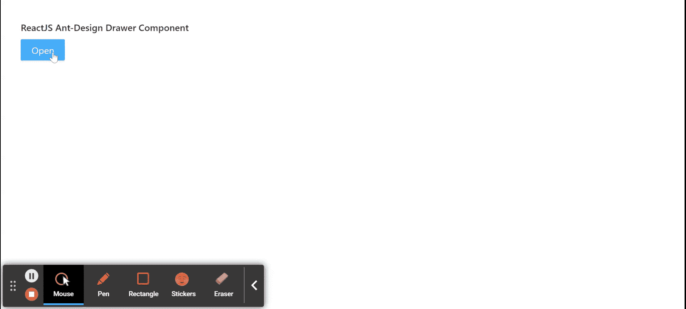

# ReactJS UI Ant 设计抽屉组件

> 原文:[https://www . geesforgeks . org/reactjs-ui-ant-design-drawer-component/](https://www.geeksforgeeks.org/reactjs-ui-ant-design-drawer-component/)

蚂蚁设计库预建了这个组件，也很容易集成。抽屉组件是一个面板，从屏幕边缘滑入。我们可以在 ReactJS 中使用以下方法来使用 Ant 设计抽屉组件。

**抽屉道具:**

*   **afterVisibleChange:** 是切换抽屉时动画结束后触发的回调函数。
*   **bodyStyle:** 用于抽屉内容部分的样式。
*   **类名:**用于传递抽屉对话框容器的类名。
*   **可关闭:**用于指示抽屉对话框右上角是否可见关闭按钮
*   **关闭图标:**用于自定义关闭图标。
*   **contentWrapperStyle:** 用于内容部分的抽屉包装的样式。
*   **destroyoonclose:**用于指示是否卸载正在关闭的抽屉上的子组件。
*   **drawerStyle:** 用于弹出层元素的样式。
*   **页脚:**用于表示抽屉的页脚。
*   **footers style:**用于抽屉页脚部分的样式。
*   **强制渲染:**用于强制预渲染抽屉组件。
*   **getContainer:** 用于返回抽屉的挂载节点。
*   **表头样式:**用于抽屉表头部分的样式。
*   **高度:**用于表示抽屉对话框的高度。
*   **键盘:**用于指示是否支持按 ESC 键关闭。
*   **蒙版:**表示是否显示蒙版。
*   **maskClosable:** 用于在点击蒙版时指示是否关闭抽屉。
*   **遮罩样式:**用于抽屉的遮罩元素的样式。
*   **放置:**用于放置抽屉。
*   **推送:**是嵌套抽屉的推送行为。
*   **样式:**用于包装元素的样式。
*   **标题:**用于表示抽屉的标题。
*   **可见:**用于指示抽屉对话框是否可见。
*   **宽度:**用于表示抽屉对话框的宽度。
*   **zIndex:** 用于表示抽屉的 z 索引。
*   **onClose:** 它是一个回调函数，当用户点击屏蔽、关闭按钮或取消按钮时会被触发。

**创建反应应用程序并安装模块:**

*   **步骤 1:** 使用以下命令创建一个反应应用程序:

    ```
    npx create-react-app foldername
    ```

*   **步骤 2:** 在创建项目文件夹(即文件夹名**)后，使用以下命令将**移动到该文件夹:

    ```
    cd foldername
    ```

*   **步骤 3:** 创建 ReactJS 应用程序后，使用以下命令安装所需的****模块:****

    ```
    **npm install antd**
    ```

******项目结构:**如下图。****

****

项目结构**** 

******示例:**现在在 **App.js** 文件中写下以下代码。在这里，App 是我们编写代码的默认组件。****

## ****App.js****

```
**import React, { useState } from 'react'
import "antd/dist/antd.css";
import { Drawer, Button } from 'antd';

export default function App() {

  const [visible, setVisible] = useState(false);

  return (
    <div style={{
      display: 'block', width: 700, padding: 30
    }}>
      <h4>ReactJS Ant-Design Drawer Component</h4>
      <>
        <Button type="primary"
          onClick={() => {
            setVisible(true);
          }}>Open</Button>
        <Drawer
          title="Drawer Demo"
          placement="left"
          closable={false}
          visible={visible}
          onClose={() => {
            setVisible(false)
          }}
        >
          <p>Item One</p>
          <p>Item Two</p>
          <p>Item Three</p>
          <p>Item Four</p>
          <p>Item Five</p>
        </Drawer>
      </>
    </div>
  );
}**
```

******运行应用程序的步骤:**从项目的根目录使用以下命令运行应用程序:****

```
**npm start**
```

******输出:**现在打开浏览器，转到***http://localhost:3000/***，会看到如下输出:****

********

******参考:**T2】https://ant.design/components/drawer/****