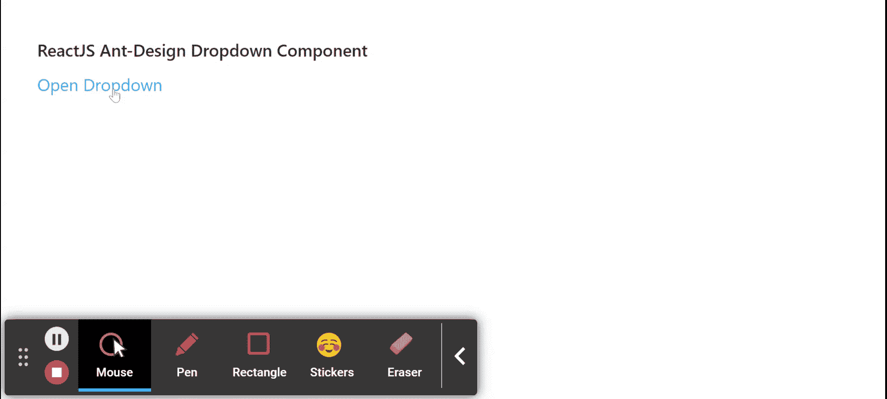

# 重新获取用户界面蚂蚁设计下拉组件

> 原文:[https://www . geeksforgeeks . org/reactjs-ui-ant-design-drop down-component/](https://www.geeksforgeeks.org/reactjs-ui-ant-design-dropdown-component/)

蚂蚁设计库预建了这个组件，也很容易集成。下拉组件用于提供下拉列表，用于用户有多个选项可供 选择。我们可以在 ReactJS 中使用以下方法来使用 Ant 设计下拉组件。

**下拉道具:**

*   **箭头:**表示下拉箭头是否可见。
*   **禁用:**用于指示下拉菜单是否禁用。
*   **getPopupContainer:** 用于设置下拉菜单的容器。
*   **叠加:**是下拉菜单。
*   **overlayClassName:** 用于传递下拉根元素的类名。
*   **overlayStyle:** 用于下拉根元素的样式。
*   **放置:**用于放置弹出菜单。
*   **触发:**执行下拉动作的是触发模式。
*   **可见:**用于指示下拉菜单当前是否可见。
*   **onVisibleChange:** 是可见状态改变时调用的回调函数。

**下拉列表。按钮道具:**

*   **按钮下方:**用于下拉按钮内的自定义按钮。
*   **禁用:**表示下拉菜单是否禁用
*   **图标:**用于传递右侧出现的图标。
*   **叠加:**是下拉菜单。
*   **放置:**用于放置弹出菜单。
*   **大小:**用于表示按钮的大小。
*   **触发:**执行下拉动作的是触发模式。
*   **类型:**用于表示按钮的类型。
*   **可见:**用于指示下拉菜单当前是否可见。
*   **onClick:** 是一个回调函数，点击左侧按钮时调用。
*   **onVisibleChange:** 是可见状态改变时调用的回调函数。

**创建反应应用程序并安装模块:**

*   **步骤 1:** 使用以下命令创建一个反应应用程序:

    ```jsx
    npx create-react-app foldername
    ```

*   **步骤 2:** 在创建项目文件夹(即文件夹名**)后，使用以下命令将**移动到该文件夹:

    ```jsx
    cd foldername
    ```

*   **步骤 3:** 创建 ReactJS 应用程序后，使用以下命令安装所需的****模块:****

    ```jsx
    **npm install antd**
    ```

******项目结构:**如下图。****

****

项目结构**** 

******示例:**现在在 **App.js** 文件中写下以下代码。在这里，App 是我们编写代码的默认组件。****

## ****App.js****

```jsx
**import React from 'react'
import "antd/dist/antd.css";
import { Menu, Dropdown } from 'antd';

export default function App() {

  return (
    <div style={{
      display: 'block', width: 700, padding: 30
    }}>
      <h4>ReactJS Ant-Design Dropdown Component</h4>
      <>
        <Dropdown
          overlay={(
            <Menu>
              <Menu.Item key="0">
                Menu Item One
              </Menu.Item>
              <Menu.Item key="1">
              Menu Item Two
              </Menu.Item>
              <Menu.Item key="1">
              Menu Item Three
              </Menu.Item>
            </Menu>
          )}
          trigger={['click']}>
          <a className="ant-dropdown-link" 
             onClick={e => e.preventDefault()}>
            Open Dropdown
          </a>
        </Dropdown>
      </>
    </div>
  );
}**
```

******运行应用程序的步骤:**从项目的根目录使用以下命令运行应用程序:****

```jsx
**npm start**
```

******输出:**现在打开浏览器，转到***http://localhost:3000/***，会看到如下输出:****

********

******参考:**T2】https://ant.design/components/dropdown/****