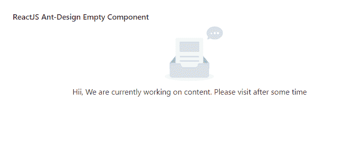

# ReactJS UI Ant 设计空组件

> 原文:[https://www . geeksforgeeks . org/reactjs-ui-ant-design-empty-component/](https://www.geeksforgeeks.org/reactjs-ui-ant-design-empty-component/)

蚂蚁设计库预建了这个组件，也很容易集成。空组件是一个 e 空状态占位符，当没有数据显示给最终用户时使用。我们可以在 ReactJS 中使用以下方法来使用 Ant 设计空组件。

**空道具:**

*   **描述:**用于定义自定义描述。
*   **图像:**用于定义自定义图像。
*   **imageStyle:** 用于传递图像的样式。

**创建反应应用程序并安装模块:**

*   **步骤 1:** 使用以下命令创建一个反应应用程序:

    ```
    npx create-react-app foldername
    ```

*   **步骤 2:** 创建项目文件夹(即文件夹名**)后，使用以下命令移动到该文件夹中:**

    ```
    cd foldername
    ```

*   **步骤 3:** 创建 ReactJS 应用程序后，使用以下命令安装所需的****模块:****

    ```
    **npm install antd**
    ```

******项目结构:**如下图。****

****

项目结构**** 

******示例:**现在在 **App.js** 文件中写下以下代码。在这里，App 是我们编写代码的默认组件。****

## ****App.js****

```
**import React from 'react'
import "antd/dist/antd.css";
import { Empty } from 'antd';

export default function App() {
  return (
    <div style={{
      display: 'block', width: 700, padding: 30
    }}>
      <h4>ReactJS Ant-Design Empty Component</h4>
      <Empty 
        description="Hii, We are currently working on content. 
        Please visit after some time"
      />
    </div>
  );
}**
```

******运行应用程序的步骤:**从项目的根目录使用以下命令运行应用程序:****

```
**npm start**
```

******输出:**现在打开浏览器，转到***http://localhost:3000/***，会看到如下输出:****

********

******参考:**T2】https://ant.design/components/empty/****