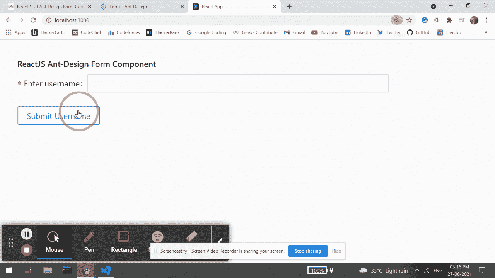

# 重新获取用户界面蚂蚁设计表单组件

> 原文:[https://www . geeksforgeeks . org/reactjs-ui-ant-design-form-component/](https://www.geeksforgeeks.org/reactjs-ui-ant-design-form-component/)

蚂蚁设计库预建了这个组件，也很容易集成。当用户需要创建实例或收集信息时，使用表单组件。我们可以在 ReactJS 中使用以下方法来使用 Ant 设计表单组件。

**形态道具:**

*   **冒号:**用于配置表单项的冒号默认值。
*   **组件:**用于设置表单渲染元素。
*   **字段:**用于表示通过状态管理对表单字段的控制。
*   **表单:**用于表示 Form.useForm()创建的表单控件实例。
*   **初始值:**用于通过表单初始化或重置来设置值。
*   **标签符号:**用于表示所有项目标签的文本对齐。
*   **labelCol:** 用于表示标签布局，类似于< Col >组件。
*   **布局:**用于表示表单布局。
*   **名称:**用于表示表单名称。
*   **保存:**用于保存字段值，即使字段被移除。
*   **要求标记:**用于要求标记样式。
*   **滚动至失败错误:**用于提交时自动滚动至第一个失败的字段。
*   **尺寸:**用于设置字段组件尺寸。
*   **验证消息:**用于验证提示模板。
*   **验证触发器:**用于表示配置字段验证触发器。
*   **wrapperCol:** 用于表示输入控件的布局。
*   **onFieldsChange:** 是字段更新时触发的回调函数。
*   **onFinish:** 是提交表单验证数据成功后触发的回调函数。
*   **onFinishFailed:** 是提交表单验证数据失败后触发的回调函数。
*   **onvaluschange:**是值更新时触发的回调函数。

**形态。物品道具:**

*   **冒号:**与 label 连用，标注文字后是否显示颜色(:)。
*   **依赖项:**用于设置依赖项字段。
*   **extra:** 用于表示额外的提示信息。
*   **getValueFromEvent:** 用于指定如何从事件或其他 *onChange* 参数中获取值。
*   **获取价值道具:**用于获取带有子组件的附加道具。
*   **具有反馈:**用于验证状态，该选项指定验证状态图标。
*   **帮助:**用于表示提示信息。
*   **隐藏:**表示是否隐藏*形态。项目*与否。
*   **htmlFor:** 用于设置子标签 htmlFor。
*   **initialValue:** 用于配置子默认值。
*   **标签:**用于表示标签文本。
*   **标签符号:**用于表示标签的文本对齐。
*   **labelCol:** 用于表示标签的布局。
*   **消息变量:**用于表示默认的验证字段信息。
*   **名称:**用于表示名称。
*   **规格化:**用于在传递到表单实例之前，对组件值进行规格化。
*   **noStyle:** 用作纯场控制。
*   **保存:**用于保存字段值，即使字段被移除。
*   **必选:**用于显示所需样式。它是由验证规则生成的。
*   **规则:**用于表示字段验证的规则。
*   **应更新:**用于自定义字段更新逻辑。
*   **工具提示:**用于配置工具提示信息。
*   **触发器:**用于指示何时采集子节点的值。
*   **验证第一个:**用于指示是否根据该字段的第一个错误规则停止验证。
*   **验证状态:**用于表示验证状态。
*   **validateTrigger:** 用于指示何时验证子节点的值。
*   **valuePropName:** 用于表示子节点的道具。
*   **wrapperCol:** 用于表示输入控件的布局。

**形态。道具列表:**

*   **children:** 是一个渲染函数。
*   **initialValue:** 用于表示配置子默认值。
*   **名称:**用于表示字段名称。
*   **规则:**用于验证规则。

**形式。ErrorList Props:**

*   **错误:**用于表示错误列表。

**形态。提供商道具:**

*   **onFormChange:** 是子窗体字段更新函数时触发的回调函数。
*   **onFormFinish:** 是子窗体提交时触发的回调函数。

**创建反应应用程序并安装模块:**

*   **步骤 1:** 使用以下命令创建一个反应应用程序:

    ```
    npx create-react-app foldername
    ```

*   **步骤 2:** 在创建项目文件夹(即文件夹名**)后，使用以下命令将**移动到该文件夹:

    ```
    cd foldername
    ```

*   **步骤 3:** 创建 ReactJS 应用程序后，使用以下命令安装所需的****模块:****

    ```
    **npm install antd**
    ```

******项目结构:**如下图。****

****

项目结构**** 

******示例:**现在在 **App.js** 文件中写下以下代码。在这里，App 是我们编写代码的默认组件。****

## ****App.js****

```
**import React from 'react'
import "antd/dist/antd.css";
import { Form, Button, Input } from 'antd';

export default function App() {

    return (
        <div style={{
            display: 'block', width: 700, padding: 30
        }}>
            <h4>ReactJS Ant-Design Form Component</h4>
            <Form
                name="basicform"
                onFinishFailed={() => alert('Failed to submit')}
                onFinish={() => alert('Form Submitted')}
                initialValues={{ remember: true }}
            >
             <Form.Item
              label="Enter username"
              name="Username"
              rules={[{ required: true, message: 'Please enter username' }]}
             >
              <Input />
             </Form.Item>
             <Form.Item>
              <Button type="success" htmlType="submit">
               Submit Username
              </Button>
             </Form.Item>
            </Form>
        </div>
    );
}**
```

******运行应用程序的步骤:**从项目的根目录使用以下命令运行应用程序:****

```
**npm start**
```

******输出:**现在打开浏览器，转到***http://localhost:3000/***，会看到如下输出:****

********

******参考:**T2】https://ant.design/components/form/****