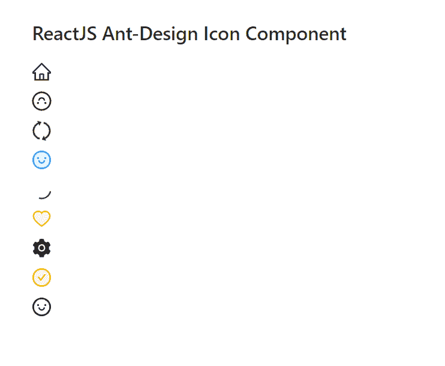

# 反应蚂蚁界面设计图标组件

> 原文:[https://www . geeksforgeeks . org/reactjs-ui-ant-design-icon-component/](https://www.geeksforgeeks.org/reactjs-ui-ant-design-icon-component/)

蚂蚁设计库预建了这个组件，也很容易集成。图标组件非常  有用，因为 图标是每个用户界面应用程序所必需的。我们可以在 ReactJS 中使用以下方法来使用 Ant 设计图标组件。

**常用图标道具:**

*   **类名:**用于表示图标的类名。
*   **旋转:**用于将图标旋转 n 度。
*   **旋转:**用于随动画旋转图标。
*   **风格:**用于将风格道具传递给大小、边框等图标。
*   **双色颜色:**用于双色图标。

**自定义图标道具:**

*   **组件:**用于表示用于根节点的组件。
*   **旋转:**用于将图标旋转 n 度。
*   **旋转:**用于随动画旋转图标。
*   **风格:**用于将风格道具传递给大小、边框等图标。

**自定义字体图标道具:**

*   **extraCommonProps:** 用于定义组件的额外属性。
*   **脚本网址:**用于表示*iconfont.cn*项目生成的网址。

**自定义 SVG 图标命题:**

*   **类名:**用于传递这个元素的类名。
*   **填充:**用于定义 SVG 图标中填充的颜色。
*   **高度:**用于设置 SVG 图标的高度。
*   **样式:**用于将大小、边框等样式道具传递给 SVG 图标。
*   **宽度:**用于设置 SVG 图标的宽度。

**创建反应应用程序并安装模块:**

*   **步骤 1:** 使用以下命令创建一个反应应用程序:

    ```jsx
    npx create-react-app foldername
    ```

*   **步骤 2:** 创建项目文件夹(即文件夹名**)后，使用以下命令移动到该文件夹中:**

    ```jsx
    cd foldername
    ```

*   **步骤 3:** 创建 ReactJS 应用程序后，使用以下命令安装所需的****模块:****

    ```jsx
    **npm install antd
    npm install --save @ant-design/icons**
    ```

******项目结构:**如下图。****

****

项目结构**** 

******示例:**现在在 **App.js** 文件中写下以下代码。在这里，App 是我们编写代码的默认组件。****

## ****App.js****

```jsx
**import React from 'react'
import "antd/dist/antd.css";
import {
  SyncOutlined,
  HeartTwoTone,
  SmileOutlined,
  HomeOutlined,
  LoadingOutlined,
  CheckCircleTwoTone,
  SmileTwoTone,
  SettingFilled,
} from '@ant-design/icons';

export default function App() {

  return (
    <div style={{ display: 'block', width: 700, padding: 30 }}>
      <h4>ReactJS Ant-Design Icon Component</h4>
      <HomeOutlined /> 
      <br />
      <SmileOutlined rotate={180} /> 
      <br />
      <SyncOutlined spin /> 
      <br />
      <SmileTwoTone /> 
      <br />
      <LoadingOutlined /> 
      <br />
      <HeartTwoTone twoToneColor="yellow" /> 
      <br />
      <SettingFilled /> 
      <br />
      <CheckCircleTwoTone twoToneColor="orange" />
      <br />
      <SmileOutlined /> <br />
    </div>
  );
}**
```

******运行应用程序的步骤:**从项目的根目录使用以下命令运行应用程序:****

```jsx
**npm start**
```

******输出:**现在打开浏览器，转到***http://localhost:3000/***，会看到如下输出:****

********

******参考:**T2】https://ant.design/components/icon/****