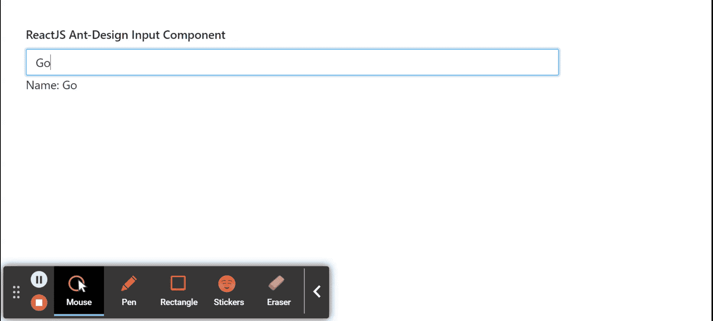

# 重新获取用户界面蚂蚁设计输入组件

> 原文:[https://www . geeksforgeeks . org/reactjs-ui-ant-design-input-component/](https://www.geeksforgeeks.org/reactjs-ui-ant-design-input-component/)

蚂蚁设计库预建了这个组件，也很容易集成。输入组件用于创建一个基本小部件，获取用户输入的是一个文本字段。我们可以在 ReactJS 中使用以下方法来使用 Ant 设计输入组件。

**输入道具:**

*   **addnafter:**用于表示输入字段后显示的标签文本。
*   **添加之前:**用于表示输入字段前显示的标签文本。
*   **allowClear:** 如果设置为 true，则用于移除带有清晰图标的输入内容。
*   **有边框:**表示是否有边框样式。
*   **默认值:**用于表示初始输入内容。
*   **禁用:**用于指示输入是否禁用。
*   **id:** 用于表示输入的 id。
*   **最大长度:**用于表示最大长度。
*   **前缀:**用于表示输入的前缀图标。
*   **大小:**用于表示输入框的大小。
*   **后缀:**用于表示输入的后缀图标。
*   **类型:**用于表示输入的类型。
*   **值:**用于表示输入的内容值。
*   **onChange:** 是用户输入发生变化时触发的回调函数。
*   **onpresenter:**是按回车键时触发的回拨功能。

**输入。文本区道具:**

*   **allowClear:** 如果设置为 true，则用于移除带有清晰图标的输入内容。
*   **自动调整:**用于表示高度自动调整功能。
*   **有边框:**表示是否有边框样式。
*   **默认值:**用于表示初始输入内容。
*   **最大长度:**用于表示最大长度。
*   **showCount:** 表示是否显示文字计数。
*   **值:**用于表示输入的内容值。
*   **onpresenter:**是按回车键时触发的回拨功能。
*   **onResize:** 是发生大小调整时触发的回调函数。

**输入。搜索道具:**

*   **回车按钮:**表示输入后是否显示回车按钮。
*   **加载:**表示是否显示加载效果的搜索框。
*   **onSearch:** 是按回车键或点击搜索图标、清除图标时触发的回拨功能。

**输入。团体道具:**

*   **紧凑:**表示是否使用紧凑风格。
*   **大小:**用于表示包含的输入字段的大小。

**输入。密码道具:**

*   **图标渲染:**用于自定义切换按钮。
*   **可见性切换:**用于指示是否显示切换按钮。

**输入方法:**

*   **模糊():**此功能用于去除焦点。
*   **focus():** 此功能用于获取焦点。

**创建反应应用程序并安装模块:**

*   **步骤 1:** 使用以下命令创建一个反应应用程序:

    ```jsx
    npx create-react-app foldername
    ```

*   **步骤 2:** 创建项目文件夹(即文件夹名**)后，使用以下命令移动到该文件夹中:**

    ```jsx
    cd foldername
    ```

*   **步骤 3:** 创建 ReactJS 应用程序后，使用以下命令安装所需的****模块:****

    ```jsx
    **npm install antd**
    ```

******项目结构:**如下图。****

****

项目结构**** 

******示例:**现在在 **App.js** 文件中写下以下代码。在这里，App 是我们编写代码的默认组件。****

## ****App.js****

```jsx
**import React, { useState } from 'react'
import "antd/dist/antd.css";
import { Input } from 'antd';

export default function App() {

  const [name, setName] = useState('')

  return (
    <div style={{
      display: 'block', width: 700, padding: 30
    }}>
      <h4>ReactJS Ant-Design Input Component</h4>
      <>
        <Input
          placeholder="Enter your Name"
          onChange={(e) => setName(e.target.value)}
        />
      Name: {name}
      </>
    </div>
  );
}**
```

******运行应用程序的步骤:**从项目的根目录使用以下命令运行应用程序:****

```jsx
**npm start**
```

******输出:**现在打开浏览器，转到***http://localhost:3000/***，会看到如下输出:****

********

******参考:**T2】https://ant.design/components/input/****