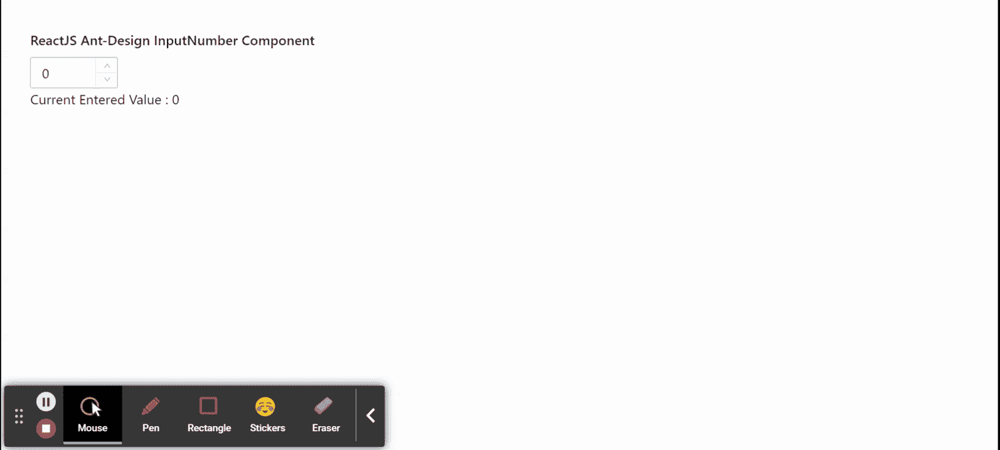

# 重新获取用户界面蚂蚁设计输入数字组件

> 原文:[https://www . geeksforgeeks . org/reactjs-ui-ant-design-input number-component/](https://www.geeksforgeeks.org/reactjs-ui-ant-design-inputnumber-component/)

蚂蚁设计库预建了这个组件，也很容易集成。输入号码组件允许用户借助 a 键盘或鼠标 在 a 一定范围内输入号码。我们可以在 ReactJS 中使用以下方法来使用 Ant 设计输入数字组件。

**输入号码方法:**

*   **blur():** 此方法用于去除元素的焦点。
*   **focus():** 此方法用于获取元素的焦点。

**输入编号属性：**

*   **自动对焦:**用于在安装组件时获得对焦。
*   **加边框:**用于指定是否有边框样式。
*   **十进制分隔符:**用于表示十进制分隔符。
*   **默认值:**用于指定初始值。
*   **禁用:**用于禁用输入。
*   **格式化程序:**用于指定显示值的格式。
*   **键盘:**用于启用键盘行为。
*   **max:** 用于表示最大值。
*   **min:** 用于表示最小值。
*   **解析器:**用于指定从格式化程序提取的值。
*   **精度:**用于表示输入值的精度。
*   **只读:**用于使输入只读。
*   **大小:**用于表示输入框的高度。
*   **步:**用于表示电流值减小或增大的数值。
*   **stringMode:** 用于将值设置为字符串，支持高精度小数。
*   **值:**用于表示当前值。
*   **onChange:** 是值改变时触发的回调函数。
*   **onpresenter:**是用户按回车键时触发的回拨功能。
*   **onStep:** 是用户点击向上或向下按钮时触发的回拨功能。

**创建反应应用程序并安装模块:**

*   **步骤 1:** 使用以下命令创建一个反应应用程序:

    ```
    npx create-react-app foldername
    ```

*   **步骤 2:** 创建项目文件夹(即文件夹名**)后，使用以下命令移动到该文件夹中:**

    ```
    cd foldername
    ```

*   **步骤 3:** 创建 ReactJS 应用程序后，使用以下命令安装所需的****模块:****

    ```
    **npm install antd**
    ```

******项目结构:**如下图。****

****

项目结构**** 

******示例:**现在在 **App.js** 文件中写下以下代码。在这里，App 是我们编写代码的默认组件。****

## ****App.js****

```
**import React, { useState } from 'react'
import "antd/dist/antd.css";
import { InputNumber } from 'antd';

export default function App() {

  // Our state to hold current value of input
  const [currentValue, setCurrentValue] = useState(0)

  return (
    <div style={{ display: 'block', width: 700, padding: 30 }}>
      <h4>ReactJS Ant-Design InputNumber Component</h4>
      <InputNumber min={0} defaultValue={0}
        onChange={(value) => {
          setCurrentValue(value)
        }} /> <br />
      Current Entered Value : {currentValue}
    </div>
  );
}**
```

******运行应用程序的步骤:**从项目的根目录使用以下命令运行应用程序:****

```
**npm start**
```

******输出:**现在打开浏览器，转到***http://localhost:3000/***，会看到如下输出:****

********

******参考:**T2】https://ant.design/components/input-number/****